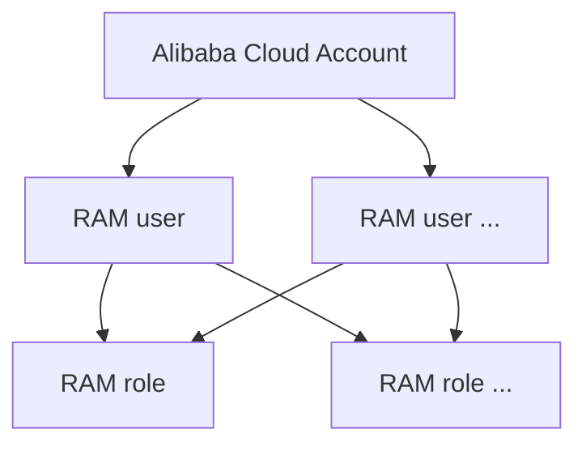
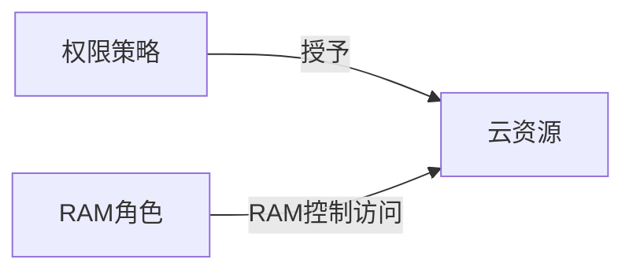
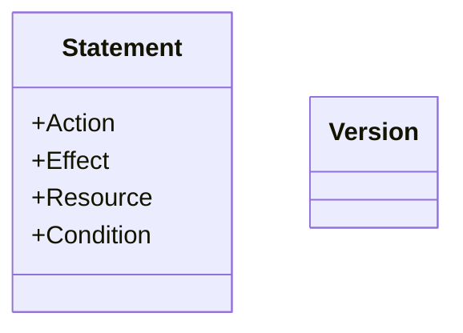

# aliyun RAM

## 概述

访问控制RAM(Role Access Manager)




### 特性

与windows和Linux中的用户组类似。RAM允许在一个阿里云账号下创建并管理多个身份，并允许给单个身份或一组身份分配不同的权限，从而实现不同用户拥有不同资源访问权限的目的

- 集中控制RAM用户及其密钥
- 集中控制RAM用户的访问权限
- 集中控制RAM用户的资源访问方式
- 集中控制云资源
- 单点登录管理

### term

- Alibaba Cloud account：主账号，相当于root用户。默认情况下，资源只能被阿里云账号所访问，任何其他用户访问都需要获得阿里云账号的显式授权。
- Identity：身份，包括RAM用户、用户组和RAM角色。
- Default domain name：默认域名，格式为：`<AccountAlias>.onaliyun.com`。默认域名可作为RAM用户登录或单点登录（SSO）等场景下该阿里云账号的唯一标识符
- Enterprise alias：企业别名，登入后显示企业后缀名
- Domain alias：域别名，如果有公网可用域名，可以使用公网域名访问账号。
- RAM user：RAM用户，主账号创建的子用户。可以使用RAM用户登入，密码由管理用户提供，登入后需要重新设置密码。
- AccessKey：访问密钥，可以通过访问密钥来调用aliyun SDK的api。AccessKey ID用于表示用户，AccessKey Secret用于对称加密。==两者一起使用，如果拿到了两者就等于获取了相对应RAM用户控制台的使用权限。==
- MFA：Multi Factor Authentication，多因素认证
- RAM user group：用户组，与Linux中的类似

- RAM role：RAM角色是一种虚拟的用户，与RAM用户关联。
- SSO：单点登入阿里云账号

## RAM角色

> 信任策略管理中的
>
> ```
> "RAM": [
> "acs:ram::1787466735923101:root"
> ]
> ```
>
> 表示该角色可以被Account ID为1787466735923101下的用户扮演
>
> ==RAM用户想要扮演角色需要添加指定的策略`AliyunSTSAssumeRoleAcce`或是自定义的策略==
>
> https://help.aliyun.com/document_detail/116820.html?spm=a2c4g.11186623.6.592.7d222da7xJr3I5
>
> https://help.aliyun.com/knowledge_detail/39744.html#concept-wsg-bsx-ydb

RAM role 用于扮演RAM user，属于多对一的关系。

- Role ARN：全局资源描述符，相当于ID
- Trusted entity：角色扮演的实体
- Policy：权限策略
- Switch role：实体用户切换到角色
- Role token：角色令牌是一种临时访问密钥。角色身份没有确定的访问密钥，当一个实体要使用角色时，必须通过扮演角色来获取对应角色的令牌

## 权限策略

### 模型

1. 云账号内授权模型


2. 资源组内授权模型



### 权限策略脚本

脚本使用Json格式编写，主要包括如下两个模块。可以使用通配符`*`，`?`。aliyun中有内建的规则。权限策略被授予RAM角色。



- Action：云服务定义的API操作

- Effect：规则采取的机制，是白名单(Allow)还是黑名单(Deny)

- Resource：被授权的具体对象

- Condtiion：限制条件。Conditoin可以使用的值

  https://help.aliyun.com/document_detail/93738.html?spm=a2c4g.11186623.6.605.2b591a35RnU1VM

- Version：值固定为1

