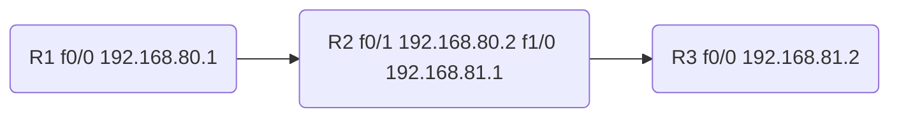

# ARP

ref：

https://zhuanlan.zhihu.com/p/28771785

https://en.m.wikipedia.org/wiki/Address_Resolution_Protocol

[TOC]

已经知道了一个机器（主机或路由器）的IP地址，如何找出其相应的硬件地址？

地址解析协议 ARP 就是用来解决这样的问题的

==ARP的作用==：从网络层使用的 IP 地址，解析出在数据链路层使用的硬件地址。

通信时使用了两个地址：

- IP 地址（网络层地址）
- MAC 地址（数据链路层地址）


### APR要点

- 不管网络层使用什么协议, 在实际网络的链路上传送数据时, 最终还是==必须使用硬件地址==

- 当主机 A 欲向本局域网上的某个主机 B 发送 IP 数据报时，就先在其 ARP 高速缓存中查看有无主机 B 的 IP 地址。
  如有，就可查出其对应的硬件地址，再将此硬件地址写入 MAC 帧，然后通过局域网将该 MAC 帧发往此硬件地址。
  如没有， ARP 进程在本局域网上广播发送一个 ARP 请求分组。收到 ARP 响应分组后，将得到的 IP 地址和硬件地址的映射写入 ARP 高速缓存。

  

### 使用ARP的四种典型情况

- 发送方是主机，要把 IP 数据报发送到本网络上的另一个主机。这时用 ARP 找到目的主机的硬件地址。 
- 发送方是主机，要把 IP 数据报发送到另一个网络上的一个主机。==这时用 ARP 找到本网络上的一个路由器的硬件地址(由路由器执行ARP)。==剩下的工作由这个路由器来完成。 
- 发送方是路由器，要把 IP 数据报转发到本网络上的一个主机。这时用 ARP 找到目的主机的硬件地址。 
- 发送方是路由器，要把 IP 数据报转发到另一个网络上的一个主机。这时用 ARP 找到本网络上另一个路由器的硬件地址。剩下的工作由这个路由器来完成。 

### 应当注意的问题

- ARP 是解决==同一个局域网==上的主机或路由器的 IP 地址和硬件地址的映射问题。
- 如果所要找的主机和源主机不在同一个局域网上，那么就要通过 ARP 找到一个位于本局域网上的某个路由器的硬件地址，然后把分组发送给这个路由器（网关），让这个路由器把分组转发给下一个网络。剩下的工作就由下一个网络来做。


## 例子

参考：

https://www.quora.com/How-does-a-host-know-if-it-has-to-send-the-packet-to-the-switch-or-the-router

https://networkengineering.stackexchange.com/questions/52504/how-does-the-arp-table-work-in-case-of-the-gateway-router#:~:text=The%20usual%20case%20for%20hosts,Then%20it%20sends%20the%20packet.


arp分以下几种情况：

==但是不管怎样本机的subnet mask都会被使用，用于校验dst是否在同一LAN，即判断`目标IP & 本机subnet mask ==本机IP & 本机subnet mask  `==

### 同LAN中2台主机

同一个局域网里面，当PC1需要跟PC2进行通信时，此时PC1是如何处理的？


根据OSI数据封装顺序，发送方会自顶向下（从应用层到物理层）封装数据，然后发送出去，这里以PC1 ping PC2的过程举例==>


PC1封装数据并且对外发送数据时，上图中出现了"failed"，即数据封装失败了，为什么？

我们给PC1指令-"ping ip2"，这就告知了目的IP，此时PC1便有了通信需要的源目IP地址，但是PC1仍然没有通信需要的目的MAC地址。**这就好比我们要寄一个快递，如果在快递单上仅仅写了收件人的姓名（IP），却没有写收件人的地址（MAC），那么这个快递就没法寄出，因为信息不完整。**

那么，现在PC1已经有了PC2的IP地址信息，如何获取到PC2的MAC地址呢？此时，ARP协议就派上用场了。我们接着上面这张图，继续


通过第三和第四步骤，我们看到PC1和PC2进行了一次ARP请求和回复过程，通过这个交互工程，PC1便具备了PC2的MAC地址信息。

接下来PC1会怎么做呢？在真正进行通信之前，PC1还会将PC2的MAC信息放入本地的【ARP缓存表】，表里面放置了IP和MAC地址的映射信息，例如 IP2<->MAC2。接下来，PC1再次进行数据封装，正式进入PING通信，如下


**小结：**经过上面6个步骤的处理，PC1终于把数据包发送出去了，之后便可以进行正常的通信了。看到了吧，ARP的功能和实现过程是如此的简单：它在发送方需要目标MAC地址的时及时出手，通过"一问一答"的方式获取到特定IP对应的MAC地址，然后存储到本地【**ARP缓存表**】，后续需要的话，就到这里查找。


既然是"缓存"表，意味着它有**时效性**，并且==如果电脑或者通信设备重启的话==，这张表就会**清空**；也就是说，如果下次需要通信，又需要进行ARP请求。在我们的windows/macos系统下，可以通过命令行"**arp -a**"查看具体信息=>


#### wiki描述

Two computers in an office (*Computer 1* and *Computer 2*) are connected to each other in a [local area network](https://en.m.wikipedia.org/wiki/Local_area_network) by [Ethernet](https://en.m.wikipedia.org/wiki/Ethernet) cables and [network switches](https://en.m.wikipedia.org/wiki/Network_switch), with no intervening [gateways](https://en.m.wikipedia.org/wiki/Gateway_(telecommunications)) or [routers](https://en.m.wikipedia.org/wiki/Router_(computing)). *Computer 1* has a packet to send to *Computer 2*. Through [DNS](https://en.m.wikipedia.org/wiki/DNS), it determines that *Computer 2* has the IP address *192.168.0.55*.

To send the message, it also requires *Computer 2*'s [MAC address](https://en.m.wikipedia.org/wiki/MAC_address). First, *Computer 1* uses a cached ARP table to look up *192.168.0.55* for any existing records of *Computer 2'*s MAC address (*00:EB:24:B2:05:AC*). If the MAC address is found, it sends an Ethernet [frame](https://en.m.wikipedia.org/wiki/Frame_(networking)) containing the IP packet onto the link with the destination address *00:EB:24:B2:05:AC*. If the cache did not produce a result for *192.168.0.55*, *Computer 1* has to send a broadcast ARP request message (destination *FF:FF:FF:FF:FF:FF* MAC address), which is accepted by all computers on the local network, requesting an answer for *192.168.0.55*.

*Computer 2* responds with an ARP response message containing its MAC and IP addresses. As part of fielding the request, *Computer 2* may insert an entry for *Computer 1* into its ARP table for future use.

*Computer 1* receives and caches the response information in its ARP table and can now send the packet.

### 同LAN中多台主机

上面的图解过程看上去简单又纯粹，好像我们就已经把这个协议的精髓全部get到，但其实，我们只是刚揭开了它的面纱，接下来我们才真正进入正题。例如，上面的图解过程中，整个局域网（LAN）只有PC1和PC2两个主机，所以这个一问一答过程非常的顺畅。

而实际网络中，这个LAN可能有几十上百的主机，那么请问，PC1如何将这个【ARP请求包】顺利的交给PC2，而PC2又如何顺利的把【ARP回应包】返回给PC1? 我们看下面的图：


为了营造出"几十上百"的效果，这里多添加了2个主机进来 ⁄(⁄ ⁄•⁄ω⁄•⁄ ⁄)⁄，并且增加了有线和无线的环境。那么，在多主机环境下，PC1现在发出的ARP请求包，怎么交到PC2手里？

这时，ARP协议就需要采用以太网的"广播"功能：将请求包**以广播的形式**发送，（同一局域网）交换机或WiFi设备（无线路由器）收到广播包时，会将此数据发给同一局域网的其他所有主机。

那么，什么是广播？对于初学者而言，我们只需要知道，大部分的广播包，它们有一个共同特征：**二层封装时目的MAC是全f（ffff.ffff.ffff）或三层封装时目的IP是全1（255.255.255.255）**。可以这样更方便的记住：目的地址最大的，就是广播。而ARP的广播地址是ff:ff:ff:ff:ff:ff

注明：广播根据所在层次可分为二层广播(ffff:ffff:ffff:ffff)和三层广播（255.255.255.255），根据发生范围可分为本地广播和定向广播，小伙伴们有兴趣可以自己再去拓展下。

接下来我们来看下这个ARP广播请求包接下来是如何工作的？


根据上图我们看到，PC1发送的请求广播包同时被其他主机收到，然后PC3和PC4收到之后（发现不是问自己）则丢弃。**而PC2收到之后，根据请求包里面的信息（有自己的IP地址），判断是给自己的，所以不会做丢弃动作，而是返回ARP回应包。**

ARP请求是通过广播方式来实现的，那么，PC2返回ARP回应包，是否也需要通过广播来实现呢？答案是否定的。**大部分网络协议在设计的时候，都需要保持极度克制，不需要的交互就砍掉，能合并的信息就合并，能不用广播就用单播，以此让带宽变得更多让网络变得更快。**

那么，ARP回应包是如何处理的？这里需要特别关注ARP请求包的内容，在上面的图解里面，ARP请求包的完整信息是：我的IP地址是IP1，MAC地址是MAC1，请问谁是PC2，你的IP2对应的MAC地址是多少？

简单来说，**ARP请求首先有"自我介绍"，然后才是询问**。这样的话，PC2在收到请求之后，就可以将PC1的IP和MAC映射信息存储在本地的【ARP缓存表】，既然知道PC1在哪里，就可以返回ARP单播回应包。


这张图我们需要得到两个信息：①被询问者PC2先生成了ARP映射信息，然后才是询问者PC1；②PC3和PC4等其他主机，无法收到这个ARP回应包，因为是单播形式。


**小结：**ARP协议通过"一问一答"实现交互，但是"问"和"答"都有讲究，"问"是通过广播形式实现，"答"是通过单播形式。

### 目的IP不同LAN

https://networkengineering.stackexchange.com/questions/52504/how-does-the-arp-table-work-in-case-of-the-gateway-router#:~:text=The%20usual%20case%20for%20hosts,Then%20it%20sends%20the%20packet.

## 抓包

现有链路如下，均配置静态路由，以下均不考虑有neighbor table（如果有neighbor table 就不会发送arp包）



分别在 R1 f0/0，R2 f1/0 抓包

### 192.168.80.1 ping 192.168.80.2

```
R1#show ip arp
Protocol  Address          Age (min)  Hardware Addr   Type   Interface
Internet  192.168.80.1            -   c401.7c16.0000  ARPA   FastEthernet0/0
```

ping 和 R1 f0/0 在同一LAN中的R2 f1/0，第一次因为没有neighbor table，所以需要做arp后才能发ICMP包

```
R1#ping 192.168.80.2

Type escape sequence to abort.
Sending 5, 100-byte ICMP Echos to 192.168.80.2, timeout is 2 seconds:
.!!!!
Success rate is 80 percent (4/5), round-trip min/avg/max = 32/55/64 ms
```

收到arp reply后会记录在neighbor table中

```
R1#show ip arp      
Protocol  Address          Age (min)  Hardware Addr   Type   Interface
Internet  192.168.80.1            -   c401.7c16.0000  ARPA   FastEthernet0/0
Internet  192.168.80.2            1   c402.7c2b.0010  ARPA   FastEthernet0/0
```

只能在R1 f0/0上抓到和arp相关的两个包


第一个包向 L2 广播地址 ff:ff:ff:ff:ff:ff 发送广播包，报文内容为源IP/MAC，目的IP/MAC(目前还不知道目的MAC所以是00:00:00:00:00:00)。==LAN中所有的host(包括同LAN中的router或者L3 switch)都可以收到广播地址发送的arp请求==


第二个包是目的IP的端口返回的，告诉192.168.80.1，192.168.80.2的MAC是 c4:02:7c:2b:00:10。同时192.168.80.2所在的机器会把192.168.80.1对应的MAC记录在neighbor table中


```
R2#show ip arp 
Protocol  Address          Age (min)  Hardware Addr   Type   Interface
Internet  192.168.80.1            8   c401.7c16.0000  ARPA   FastEthernet1/0
Internet  192.168.80.2            -   c402.7c2b.0010  ARPA   FastEthernet1/0
```

 [trace.pcapng](../../../appendix/trace.pcapng) 

### 192.168.80.1 ping 192.168.81.2

重启上个例子中的机器，清空R1 neighbor table

```
R1#show ip arp
Protocol  Address          Age (min)  Hardware Addr   Type   Interface
Internet  192.168.80.1            -   c401.7c16.0000  ARPA   
```

```
R2#show ip arp
Protocol  Address          Age (min)  Hardware Addr   Type   Interface
Internet  192.168.81.1            -   c402.7c2b.0001  ARPA   FastEthernet0/1
Internet  192.168.80.1            1   c401.7c16.0000  ARPA   FastEthernet1/0
Internet  192.168.80.2            -   c402.7c2b.0010  ARPA   FastEthernet1/0
```

```
R1#ping 192.168.81.2

Type escape sequence to abort.
Sending 5, 100-byte ICMP Echos to 192.168.81.2, timeout is 2 seconds:
.!!!!
Success rate is 80 percent (4/5), round-trip min/avg/max = 64/85/92 ms
```

R1 f0/0 口抓包只会显示和上个例子中相同的数据包，因为在这个例子中192.168.80.2也是网关，所以在比较目的IP和当前IP不是一个LAN的情况下，是会向广播地址询问网关的MAC


然后由网关继续递归（这里只有一跳就到达了）


R1并不会记录R3 f0/1 的MAC，因为ARP只能在LAN中使用

```
R1#show ip arp    
Protocol  Address          Age (min)  Hardware Addr   Type   Interface
Internet  192.168.80.1            -   c401.7c16.0000  ARPA   FastEthernet0/0
Internet  192.168.80.2           12   c402.7c2b.0010  ARPA   FastEthernet0/0
```

但是R3 f0/1 的MAC会出现在R2中，因为R3和R2有互联的LAN

```
R2#show ip arp
Protocol  Address          Age (min)  Hardware Addr   Type   Interface
Internet  192.168.81.1            -   c402.7c2b.0001  ARPA   FastEthernet0/1
Internet  192.168.80.1           15   c401.7c16.0000  ARPA   FastEthernet1/0
Internet  192.168.80.2            -   c402.7c2b.0010  ARPA   FastEthernet1/0
Internet  192.168.81.2           12   c403.7f92.0000  ARPA   FastEthernet0/1
```

