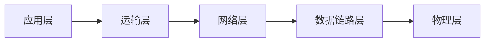

# DNS/域名

> HTTP是应用层协议




[TOC]

## 概述

每个应用层协议都是为了解决某一类应用问题，而问题的解决又往往是通过位于不同主机中的多个应用进程之间的通信和协同工作来完成的。==应用层的具体内容就是规定应用进程在通信时所遵循的协议。==

应用层的许多协议都是基于客户服务器方式。客户(client)和服务器(server)都是指通信中所涉及的两个应用进程。客户服务器方式所描述的是进程之间服务和被服务的关系。客户是服务请求方，服务器是服务提供方。  

## 域名解析系统DNS

### 概述

许多应用层软件经常直接使用域名系统 ==DNS (Domain Name System)==，但计算机的用户只是间接而不是直接使用域名系统

互联网采用层次结构的命名树作为主机的名字，并使用分布式的域名系统 DNS。

域名到 IP 地址的解析是由若干个域名服务器程序完成的。域名服务器程序在专设的结点上运行，运行该程序的机器称为域名服务器。  

### 域名结构

- 互联网采用了层次树状结构的命名方法。

- 任何一个连接在互联网上的主机或路由器，==都有一个唯一的层次结构的名字，即域名。==

- 域名的结构由标号序列组成，各标号之间用点隔开：

  `...三级域名.二级域名.顶级域名`

- 域名只是个逻辑概念，并不代表计算机所在的物理地点
- 域名中的“点”和点分十进制 IP 地址中的“点”并无一一对应的关系。点分十进制 IP 地址中一定是包含三个“点”，但每一个域名中“点”的数目则不一定正好是三个。 

#### 顶级域名/TLD(Top Level Domain)

> 顶级域名 == 一级域名

1. 国家级域名

	.cn 表示中国，
	.us 表示美国，
	.uk 表示英国，等等。
2. 通用顶级域名

```
最早的顶级域名是：
.com	（公司和企业）
.net	（网络服务机构
.org	（非赢利性组织）
.edu	（美国专用的教育机构）
.gov	（美国专用的政府部门）
.mil	（美国专用的军事部门）
.int	（国际组织）
新增加了下列的通用顶级域名 
.aero 	（航空运输企业）
.biz	（公司和企业）
.cat	（加泰隆人的语言和文化团体）
.coop	（合作团体）
.info	（各种情况）
.jobs	（人力资源管理者）
.mobi	（移动产品与服务的用户和提供者）
.museum （博物馆）
.name	（个人）
.pro	（有证书的专业人员）
.travel	（旅游业） 
（国际组织）
	
```

3. 基础结构域名 (infrastructure domain)

```
用于反向域名解析，因此又称为反向域名。 
```


例如www.baidu.com.   ,注意后面有一个点，表示根，浏览器自动替我们完成

#### 主域名

主域名每一个虚拟主机账号都需要一个主域名才能进行浏览。通常我们向GoDaddy或是PChome购买的就是这种（顶级域名+二级域名），如「bettywutalk.com」、「bettywutalk.org」、「bettywutalk.com.tw」。

#### 根域名

根域名又称裸域，通常由顶级域名和二级域名组成，用以代表整个网站位置的代称。可以在根域名下建立各种不同的子域名，域名的层级由右向左逐级降低，就像资料夹的结构。

#### 子域名

子域名是一个另外的网页，有独立不同的内容，但不是一个新的域名。子域名无需申请，当你登记了你自己的域名后，就可以在自己的域名前加上任何子域名。主要用来卓一些跟主网站区分的功能，如母公司下独立运营的部门

例如

- 子網域：[tw.dictionary.search.yahoo.com](http://tw.dictionary.search.yahoo.com/) (頂級網域：tw ; 四級域名：dictionary ; 三級域名：search)
- 根網域：[yahoo.com](http://yahoo.com/)
  
- 子網域：www.example.com (三級域名：www)
- 根網域：example.com
  
- 子網域：[www.blog.google.com](https://www.blog.google/) (四級域名：www，三級域名：blog)
- 根網域：[google.com](https://www.blog.google/)

> 参考：
>
> https://bettywutalk.com/blog/domains/


例如`www.baidu.com`是主机名，其中`baidu.com`是主域名，`com`是顶级域名，`baidu`是二级域名，==www子域名，用户可以自定义==

例如http://locahost/test中，localhost就是主机名

## 域名服务器

==一个服务器所负责管辖的（或有权限的）范围叫做区 (zone)。==

各单位根据具体情况来划分自己管辖范围的区。但在一个区中的所有节点必须是能够连通的。

==每一个区设置相应的权限域名服务器==，用来保存该区中的所有主机的域名到 IP 地址的映射。

DNS 服务器的管辖范围不是以“域”为单位，而是以“区”为单位


### 根域名服务器

- 根域名服务器是最高层次的域名服务器，也是最重要的域名服务器。==所有的根域名服务器都知道所有的顶级域名服务器的域名和 IP 地址==

- ==不管是哪一个本地域名服务器，若要对互联网上任何一个域名进行解析，只要自己无法解析，就首先求助于根域名服务器。==

- 在互联网上共有 13 个不同 IP 地址的根域名服务器，它们的名字是用一个英文字母命名，从 a  一直到 m（前 13 个字母）。

  

==根域名服务器共有 13 套装置，不是 13 个机器。==

到2016年2月，全世界已经在 588 个地点安装了根域名服务器，==使世界上大部分 DNS 域名服务器都能就近找到一个根域名服务器==

> 根域名服务器并不直接把域名直接转换成 IP 地址。==在使用迭代查询时，根域名服务器把下一步应当找
>   的顶级域名服务器的 IP 地址告诉本地域名服务器。==

### 本地域名服务器

- 当一个主机发出 DNS 查询请求时，这个查询请求报文就发送给本地域名服务器。
- 每一个互联网服务提供者 ISP，或一个大学，甚至一个大学里的系，都可以拥有一个本地域名服务器。
- 这种域名服务器有时也称为默认域名服务器。

## 域名解析过程

- ==主机向本地域名服务器的查询一般都是采用递归查询。==如果主机所询问的本地域名服务器不知道被查询域名的 IP 地址，那么本地域名服务器就以 DNS 客户的身份，向其他根域名服务器继续发出查询请求报文。

- ==本地域名服务器向根域名服务器的查询通常是采用迭代查询==。当根域名服务器收到本地域名服务器的迭代查询请求报文时，要么给出所要查询的 IP 地址，要么告诉本地域名服务器：“你下一步应当向哪一个域名服务器进行查询”。然后让本地域名服务器进行后续的查询。

  

> 每个域名服务器都维护一个高速缓存，存放最近用过的名字以及从何处获得名字映射信息的记录

## 代理服务器

代理服务器又称为万维网高速缓存，它可以代表浏览器发出HTTP请求，我们常用的VPS就是一台代理服务器

1. 浏览器访问互联网的服务器时，要先与校园网的高速缓存建立TCP连接，并向高速缓存发出HTTP请求报文。
2. 若高速缓存已经存放入所请求的对象，则将此对象放入HTTP响应报文中返回给浏览器
3. 否则，高速缓存就代表发出请求的用户浏览器，与互联网上的源点服务器建立TCP连接，并发送HTTP请求报文
4. 源点服务器将所在的对象放在HTTP响应报文中返回给校园网的高速缓存
5. 高速缓存收到此对象后，先复制在本地存储器中（为今后使用），然后再将该对象放入在HTTP响应报文中，通过已建立的TCP连接，返回给请求该对象的浏览器

## 统一资源定位符 URL

==使用统一资源定位符 URL (Uniform Resource Locator)==来标志万维网上的各种文档。

### URL一般形式

由以冒号隔开的两大部分组成，并且在 URL 中的字符对大写或小写没有要求。


- 端口：默认端口为80，通常可以省略
- 路径：省略路径项，默认访问index.html或者是default.html，==如果是文件夹访问该文件夹下的index.html或是default.html==，如果不存在就会404

例如：

```http
mysql://localhost:3306/gedu?useUnicode=true&characterEncoding=utf-8&serverTimezone=Asia/Shanghai
```

有些浏览器为了方便用户，在输入URL时，==可以把最前面的“http://”甚至把主机名最前面的“www”省略==，然后浏览器替用户把省略的字符添上。

