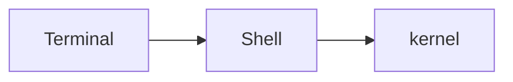

# Shell 简介

参考：

http://c.biancheng.net/view/706.html

http://c.biancheng.net/cpp/view/6995.html

https://einverne.github.io/post/2019/01/login-shell-vs-non-login-shell.html

https://program-think.blogspot.com/2019/11/POSIX-TUI-from-TTY-to-Shell-Programming.html?q=bash&scope=all

> 回车/换行
>
> - 回车(carriage return，CR，简称\r)，将“打印头”复位(移到"打印纸"地左边)
>
> - 换行(line feed，LF，简称\n)，将“打印头”往下移一行

在linux扩展名并不影响文件，所以`.sh`并无实际意义，只是为望名生意

## 概述

**Kernel VS Shell**

由于安全、复杂、繁琐等原因，用户不能直接接触内核**kernel**（也没有必要），需要另外再开发一个程序，让用户直接使用这个程序；该程序的作用就是接收用户的操作（点击图标、输入命令），并进行简单的处理，然后再传递给内核，这样用户就能间接地使用操作系统内核了。

用户界面和命令行就是这个另外开发的程序，就是这层“代理”。在Linux下，这个命令行程序叫做 **Shell**。

==Shell 是一个应用程序，它连接了用户和 Linux 内核，让用户能够更加高效、安全、低成本地使用 Linux 内核，这就是 Shell 的本质。==

**Built-in VS external**

在 Shell 中输入的命令，有一部分是 Shell 本身自带的，这叫做[内置命令](http://c.biancheng.net/view/1136.html)；有一部分是其它的应用程序（一个程序就是一个命令），这叫做外部命令。

Shell 本身支持的命令并不多，功能也有限，但是 Shell 可以调用其他的程序，每个程序就是一个命令，这使得 Shell 命令的数量可以无限扩展，其结果就是 Shell 的功能非常强大，完全能够胜任 Linux 的日常管理工作，如文本或字符串检索、文件的查找或创建、大规模软件的自动部署、更改系统设置、监控服务器性能、发送报警邮件、抓取网页内容、压缩文件等。


用户通过Shell操作进程


## Shell的类别

- sh

  sh 的全称是 Bourne shell，由 AT&T 公司的 Steve Bourne开发，为了纪念他，就用他的名字命名了。sh 是 UNIX 上的标准 shell，很多 UNIX 版本都配有 sh。sh 是第一个流行的 Shell。

- csh

  sh 之后另一个广为流传的 shell 是由柏克莱大学的 Bill Joy 设计的，这个 shell 的语法有点类似C语言，所以才得名为 C shell ，简称为 csh。

- tcsh

  tcsh 是 csh 的增强版，加入了命令补全功能，提供了更加强大的语法支持。

- ash

  一个简单的轻量级的 Shell，占用资源少，适合运行于低内存环境，但是与下面讲到的 bash shell 完全兼容

- bash

  ==bash shell 是 Linux 的默认 shell==

  bash 由 GNU 组织开发，保持了对 sh shell 的兼容性，是各种 Linux 发行版默认配置的 shell。

  > bash 兼容 sh 意味着，针对 sh 编写的 Shell 代码可以不加修改地在 bash 中运行。

  尽管如此，bash 和 sh 还是有一些不同之处：

  - 一方面，bash 扩展了一些命令和参数；
  - 另一方面，bash 并不完全和 sh 兼容，它们有些行为并不一致，但在大多数企业运维的情况下区别不大，特殊场景可以使用 bash 代替 sh。

## 查看Shell

Shell 是一个程序，一般都是放在`/bin`或者`/user/bin`目录下，当前 Linux 系统可用的 Shell 都记录在`/etc/shells`文件中。`/etc/shells`是一个纯文本文件，你可以在图形界面下打开它，也可以使用 cat 命令查看它。

```
[root@chz local]# cat /etc/shells 
/bin/sh
/bin/bash
/usr/bin/sh
/usr/bin/bash
/bin/tcsh
/bin/csh
```

==在现代的 Linux 上，sh 已经被 bash 代替，`/bin/sh`往往是指向`/bin/bash`的符号链接。==

如果你希望查看当前 Linux 的默认 Shell，那么可以输出 SHELL 环境变量

```
[root@chz local]# echo $SHELL
/bin/bash
```

## 交互式VS非交互式

- 交互式shell：指的是在终端有交互的模式，用户输入命令，并在回车后立即执行的shell。
- 非交互式shell：指的是bash shell以命令脚本的形式

## 内部命令VS外部命令

- 内部命令：内置在shell中命令，执行不会产生子进程

- 外部命令：某个【可执行文件】，会产生子进程

我们可以通过`whereis 命令名称`来判断，某个命令是否为“外部命令”

如果某个命令能找到对应的可执行文件，就是"外部命令"，反之就是“内部命令”

## Shell VS Terminal

在linux中，Shell可以与Terminal一一对应，也可以是一个Shell的子Shell

Terminal(tty)

- GUI软件界面，接收输入，显示输出

Shell

- 操作计算机内核，可以理解为Terminal与kernel的代理



## 空格

Bash 使用空格（或 Tab 键）区分不同的参数。

```
$ command foo bar
```

上面命令中，`foo`和`bar`之间有一个空格，所以 Bash 认为它们是两个参数。

如果参数之间有多个空格，Bash 会自动忽略多余的空格。

```
$ echo this is a     test
this is a test
```

上面命令中，`a`和`test`之间有多个空格，Bash 会忽略多余的空格。

## 引号

使用简单的文本和字符串时，单引号和双引号都不会有任何区别

```
#!/bin/bash  

# String in single quote  
echo 'Hello User'  
echo  
# String in double quote  
echo "we are learn from yiibai.com"
```

- 单引号

  ==单引号用于保留字符的字面含义，各种特殊字符在单引号里面，都会变为普通字符==，比如星号（`*`）、美元符号（`$`）、反斜杠（`\`）等。

  ```
  $ echo '*'
  *
  
  $ echo '$USER'
  $USER
  
  $ echo '$((2+2))'
  $((2+2))
  
  $ echo '$(echo foo)'
  $(echo foo)
  ```

  上面命令中，单引号使得 Bash 扩展、变量引用、算术运算和子命令，都失效了。如果不使用单引号，它们都会被 Bash 自动扩展。

  ==由于反斜杠在单引号里面变成了普通字符，所以如果单引号之中，还要使用单引号，不能使用转义==，需要在外层的单引号前面加上一个美元符号（`$`），然后再对里层的单引号转义。

  ```
  # 不正确
  $ echo it's
  
  # 不正确
  $ echo 'it\'s'
  
  # 正确
  $ echo $'it\'s'
  ```

  不过，更合理的方法是改在双引号之中使用单引号。

  ```
  $ echo "it's"
  it's
  ```

- 双引号

  双引号比单引号宽松，大部分特殊字符在双引号里面，都会失去特殊含义，变成普通字符。

  ```
  $ echo "*"
  *
  ```

  上面例子中，通配符`*`是一个特殊字符，放在双引号之中，就变成了普通字符，会原样输出。这一点需要特别留意，这意味着，双引号里面不会进行文件名扩展。

  但是，三个特殊字符除外：美元符号（`$`）、反引号（==`==）和反斜杠（`\`）。这三个字符在双引号之中，依然有特殊含义，会被 Bash 自动扩展。

  ```
  $ echo "$SHELL"
  /bin/bash
  
  $ echo "`date`"
  Mon Jan 27 13:33:18 CST 2020
  ```

  上面例子中，美元符号（`$`）和反引号（```）在双引号中，都保持特殊含义。美元符号用来引用变量，反引号则是执行子命令。

  ```
  $ echo "I'd say: \"hello!\""
  I'd say: "hello!"
  
  $ echo "\\"
  \
  ```

  上面例子中，反斜杠在双引号之中保持特殊含义，用来转义。所以，可以使用反斜杠，在双引号之中插入双引号，或者插入反斜杠本身。

  换行符在双引号之中，会失去特殊含义，Bash 不再将其解释为命令的结束，只是作为普通的换行符。所以可以利用双引号，在命令行输入多行文本。

  ```
  $ echo "hello
  world"
  hello
  world
  ```

  上面命令中，Bash 正常情况下会将换行符解释为命令结束，但是换行符在双引号之中就失去了这种特殊作用，只用来换行，所以可以输入多行。`echo`命令会将换行符原样输出，显示的时候正常解释为换行。

  ==双引号的另一个常见的使用场合是，文件名包含空格。这时就必须使用双引号，将文件名放在里面。==

  ```
  $ ls "two words.txt"
  ```

  上面命令中，`two words.txt`是一个包含空格的文件名，否则就会被 Bash 当作两个文件。

  双引号会原样保存多余的空格。

  ```
  $ echo "this is a     test"
  this is a     test
  ```

  双引号还有一个作用，就是保存原始命令的输出格式。

  ```
  # 单行输出
  $ echo $(cal)
  一月 2020 日 一 二 三 四 五 六 1 2 3 ... 31
  
  # 原始格式输出
  $ echo "$(cal)"
        一月 2020
  日 一 二 三 四 五 六
            1  2  3  4
   5  6  7  8  9 10 11
  12 13 14 15 16 17 18
  19 20 21 22 23 24 25
  26 27 28 29 30 31
  ```

  上面例子中，如果`$(cal)`不放在双引号之中，`echo`就会将所有结果以单行输出，丢弃了所有原始的格式。

## 分号

分号（`;`）是命令的结束符，使得一行可以放置多个命令，上一个命令执行结束后，再执行第二个命令。

```
$ clear; ls
```

上面例子中，Bash 先执行`clear`命令，执行完成后，再执行`ls`命令。

==注意，使用分号时，第二个命令总是接着第一个命令执行，不管第一个命令执行成功或失败。==

## && ||

短路逻辑符

- `&&`

  ```
  Command1 && Command2
  ```

  如果command1成功继续运行command2，如果失败则不运行

- `||`

  ```
  Command1 || Command2
  ```

  如果command1成功不运行command2，如果失败运行command2

## 执行

- `/bin/sh test.sh`

- `/bin/bash test.sh`

- `./test.sh`

  ```
  [root@cyberpelican opt]# chmod +x test.sh 
  [root@cyberpelican opt]# ./test.sh
  ```

  
