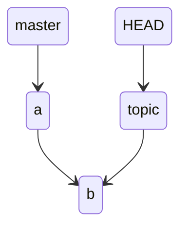
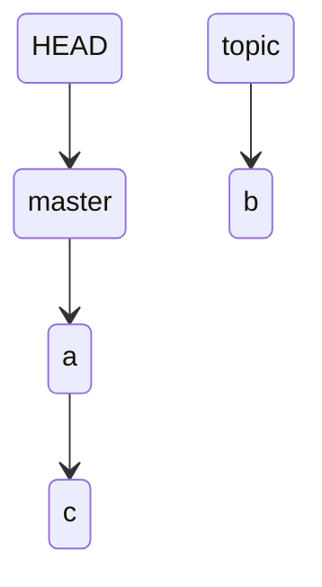

# git branch

ref

https://git-scm.com/docs/git-branch

https://git-scm.com/book/en/v2/Git-Branching-Branches-in-a-Nutshell

## Digest

syntax

```
git branch [options] [branch]
```

用于查询，在创建或者删除 branches

## Optional args

- `--list`

  显示当前本地所有的 branches，如果 `git branch` 没有使用任何 arguments 默认会使用该参数


- `-r | --remotes`

  显示所有 remote tracking branches

- `-d | --delete <branch>`

  删除 branch，只有 branch 被 merge 后才可以

- `-D <branch>`

  强制删除 branch，等价与 `--delete --force`

- `-m | --move <branch> <newbranch>`

  对 branch 重命名

- `-M <branch> <newbranch>`

  强制删除，等价与 `--move --force`

- `-c | --copy <branch>`

  复制 branch

- `-r | --remote`

  显示 remote-tracking branches，即 remote repository 有的 branches

- `-v | -vv`

  以 verbose 的形式输出

## Branches

在了解什么是 Branches 前，需要先看一下 Git 是怎么存储数据的。Git 最大的特性就是使用 snapshot 替代直接存储数据

当使用 `git commit` 时会创建并存储一个 commit object，包含

- author’s name and email address
- the message that you typed
- a pointer to the snapshot of the content you staged
- and pointers to the commit or commits that directly came before this commit (its parent or parents)

假设现在你使用如下命令

```
$ git add README test.rb LICENSE
$ git commit -m 'Initial commit'
```

那么 Git 就会创建一个 tree object, 包含 add 的三个文件作为子叶, 然后生成一个包含指向 tree object 指针的 commit object


例如 `98ca9` 是 commit object, `92ec2` 是 tree object, 三个 bolb 分别代表 add 的三个文件

如果做了一些修改并 commit 后，后一个 commit object 中的 parent 指针会指向前一个 commit object 的地址


branch 其实就是一个指向 commit object 的 moveable pointer，只有当你 commit 的时候才会生成 branch, 同时会生成一个对应 branch 的 pointer 指向 last commit，如果你每 commit 一次，对应 branch 的 pointer 也会自动的向前移动。即 branch 对应的 pointer（为了方便记忆将其称为 branch pointer）指向 latest commit。Git 一般默认的 initBranch 是 master


假设现在创建了一个 testing 分支

```
$ git branch testing
```

那么就会新增加一个 testing branch pointer


但是 Git 怎么知道你现在处在的分支的呢？因为有一个特殊的 pointer 叫做 HEAD, 表示你当前所处的分支，指向当前的 branch pointer


因为你并没有切换分支，当前还在 master 分支，所以只是创建了一个新的分支和新的分支指针，你可以使用如下命令来查看分支指针的指向

```
$ git log --oneline --decorate
f30ab (HEAD -> master, testing) Add feature #32 - ability to add new formats to the central interface
34ac2 Fix bug #1328 - stack overflow under certain conditions
98ca9 Initial commit
```

当你切换分支时

```
$ git checkout testing
```

HEAD pointer 就会指向 testing branch pointer


如果在 testing branch 做了一次 commit

```
$ vim test.rb
$ git commit -a -m 'made a change'
```

testing branch pointer 就会向前，HEAD pointer 也会随着当前的 branch pointer 向前而向前，但是 master branch pointer 是不会移动的。因为 branch 之间是隔离的


当切换分支到 master 

```
$ git checkout master
```

 HEAD 会指向 master branch pointer


同时会将 master branch pointer 指向的 snapshot 中对应 working direcotry 的内容 reverted 到当面的 working direcotry

在当前 masster 分支 commit

```
$ vim test.rb
$ git commit -a -m 'made other changes'
```

如果在当前分支做了 commit ，就会导致 divergence，也就无法使用 fast-forward merge


你可以使用如下命令来查看是否有 divergence

```
$ git log --oneline --decorate --graph --all
* c2b9e (HEAD, master) Made other changes
| * 87ab2 (testing) Made a change
|/
* f30ab Add feature #32 - ability to add new formats to the central interface
* 34ac2 Fix bug #1328 - stack overflow under certain conditions
* 98ca9 initial commit of my project
```

## Divergence

假设现在只有一个 branch master, 做了一次 commit

```
(base) cpl in /tmp/test on master ● λ git add a
(base) cpl in /tmp/test on master ● ● λ git commit -m "a"
[master (root-commit) 2b70ec0] a
 1 file changed, 6 insertions(+)
 create mode 100644 a
```

在当前 branch 创建了一个 topic branch，并切换到 topic branch，然后做一次 commit

```
(base) cpl in /tmp/test on master ● λ git checkout -b topic
Switched to a new branch 'topic'
(base) cpl in /tmp/test on topic ● λ git add b
(base) cpl in /tmp/test on topic ● ● λ git commit -m "b"
[topic 2938149] b
 1 file changed, 7 insertions(+)
 create mode 100644 b
```

这样并不会导致 Divergence

```
(base) cpl in /tmp/test on topic ● λ git log --all --graph --abbrev-commit --oneline
* 2938149 (HEAD -> topic) b
* 2b70ec0 (master) a
```

当前状态如下，可以发现 a 和 b 是在一条线上的



切换到 master branch 然后做一次 commit

```
(base) cpl in /tmp/test on topic ● λ git checkout master
Switched to branch 'master'
(base) cpl in /tmp/test on master ● λ git add c
(base) cpl in /tmp/test on master ● ● λ git commit -m "c"
[master 6c8adb1] c
 1 file changed, 1 insertion(+)
 create mode 100644 c
```

就可以发现出现 divergence

```
 (base) cpl in /tmp/test on master ● λ git log --all --graph --abbrev-commit --oneline
* 6c8adb1 (HEAD -> master) c
| * 2938149 (topic) b
|/  
* 2b70ec0 a
```

当前状态如下



