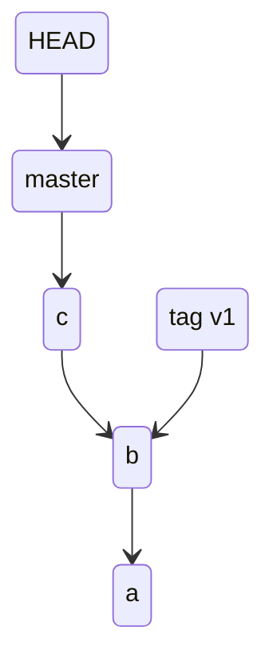
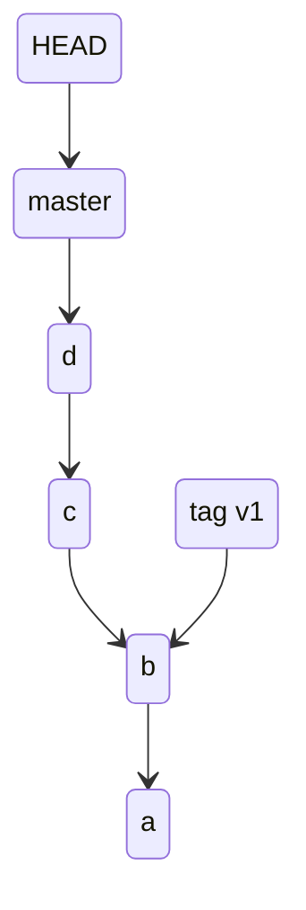
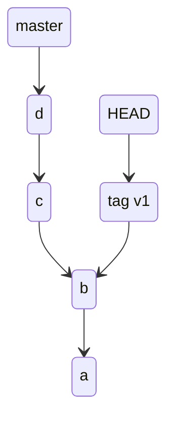
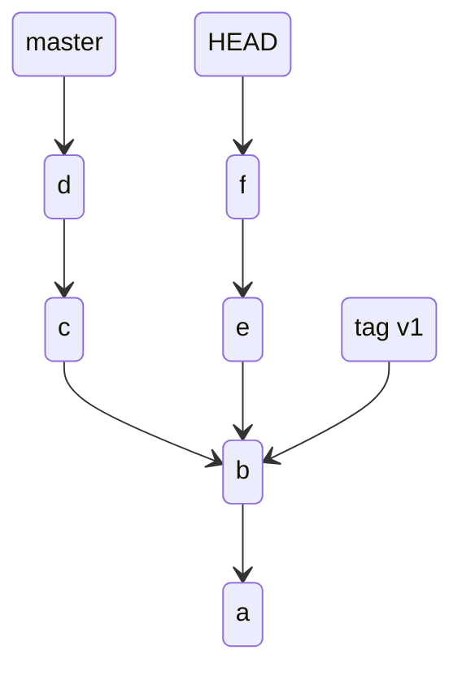

# git checkout

ref

https://git-scm.com/docs/git-checkout

## Digest

syntax

```
git checkout [options] [branch | commit]
```

git branch 一般用于切换分支

例如 `git branch master` 会将当前使用的分支替换到 master，即 HEAD 指针移动到 master branch poniter (也是对应分支最新的 commit)

```
(base) cpl in /tmp/gitignore on main λ git br -vv
* main 4488915 [origin/main] Merge pull request #3567 from aaronfranke/godot
  test 4488915 Merge pull request #3567 from aaronfranke/godot
```

其中的 `*` 就表示当前指向的 branch，`4488915` 表示当前指向 branch 对应 commit 的 hash，`[origin/main]` 表示对应的 remote-tracking branch

## Optional args

- `-b <new-branch>`

  创建新的 branch 并切换到该分支

- `--detach <commit>`

  切换到指定的 commit 而不是分支

  ```
  (base) cpl in /tmp/test on master λ git lg1
  * 82744b2 - (10 minutes ago) d - 4liceh  (HEAD -> master)
  * 47b80e9 - (14 minutes ago) c - 4liceh 
  * d4ee2d6 - (15 minutes ago) b - 4liceh  (tag: v1)
  * a186afd - (15 minutes ago) a - 4liceh %
  (base) cpl in /tmp/test on master λ git checkout --detach 47b80e9
  HEAD is now at 47b80e9 c
  (base) cpl in /tmp/test on master~1 λ git lg1
  * 82744b2 - (16 minutes ago) d - 4liceh  (master)
  * 47b80e9 - (19 minutes ago) c - 4liceh  (HEAD)
  * d4ee2d6 - (20 minutes ago) b - 4liceh  (tag: v1)
  * a186afd - (20 minutes ago) a - 4liceh
  ```

## Staging area

假设现在新增了一个 test 文件，并执行了 `git add test`

```
(base) cpl in /tmp/gitignore on main λ git st
On branch main
Your branch is up to date with 'origin/main'.

Untracked files:
  (use "git add <file>..." to include in what will be committed)
        test

nothing added to commit but untracked files present (use "git add" to track)
                                                                                                                                                         
(base) cpl in /tmp/gitignore on main ● λ git add test
```

然后`git checkout test`, staging area 的状态是什么样的呢？

```
(base) cpl in /tmp/gitignore on main ● λ git checkout test
A       test
Switched to branch 'test'
                                                                                                                                                         
(base) cpl in /tmp/gitignore on test ● λ git st
On branch test
Changes to be committed:
  (use "git restore --staged <file>..." to unstage)
        new file:   test

```

staging area 会和切换分支前的状态一样，即表示 staging area 不会随着切换分支而改变，或保留在 “原” staging area，即可将 staging area 理解成 “公用区间”

## Working directory

staginig area 不会随着分支的切换而改变，那么 working directory 呢？

```
root@v2:/home/ubuntu/test# git br
* master
  test
root@v2:/home/ubuntu/test# ls
file1  file2
root@v2:/home/ubuntu/test# git co test
Switched to branch 'test'
root@v2:/home/ubuntu/test# ls
file1
```

working directory 是会随着 branch 的变化而改变的

## Detached HEAD

HEAD 是一个指针，通常指向当前分支的 branch pointer，但是有一种特殊的情况 HEAD 可以指向非 branch pointer。这种情况被称为 detached HEAD

在 detached HEAD 的状态下任何修改的内容都不会对已经提交的 commit 做出影响

假设当前分支状态如下

```
(base) cpl in /tmp/test on master ● λ git lg1
* 47b80e9 - (3 seconds ago) c - 4liceh  (HEAD -> master)
* d4ee2d6 - (50 seconds ago) b - 4liceh  (tag: v1)
* a186afd - (57 seconds ago) a - 4liceh
```



现在 git 增加了一个 commit d, 那么 master branch pointer 就会移动到 commit d，同时 HEAD 也会随着当前 branch pointer 移动而移动

```
(base) cpl in /tmp/test on master λ git lg1
* 82744b2 - (3 seconds ago) d - 4liceh  (HEAD -> master)
* 47b80e9 - (4 minutes ago) c - 4liceh 
* d4ee2d6 - (4 minutes ago) b - 4liceh  (tag: v1)
* a186afd - (4 minutes ago) a - 4liceh
```



假设现在执行如下命令

```
(base) cpl in /tmp/test on master λ git checkout v1 
Note: switching to 'v1'.
You are in 'detached HEAD' state. You can look around, make experimental
changes and commit them, and you can discard any commits you make in this
state without impacting any branches by switching back to a branch.
If you want to create a new branch to retain commits you create, you may
do so (now or later) by using -c with the switch command. Example:
  git switch -c <new-branch-name>
Or undo this operation with:
  git switch -
```

就会进入到 detached HEAD 状态

```
(base) cpl in /tmp/test on tags/v1 λ git lg1
* 82744b2 - (2 minutes ago) d - 4liceh  (master)
* 47b80e9 - (6 minutes ago) c - 4liceh 
* d4ee2d6 - (6 minutes ago) b - 4liceh  (HEAD, tag: v1)
* a186afd - (6 minutes ago) a - 4liceh
```



这时分别commit e 和 f

```
(base) cpl in /tmp/test on 9ed0f5b λ git lg1
* 9ed0f5b - (1 second ago) f - 4liceh  (HEAD)
* 8840ca9 - (8 seconds ago) e - 4liceh 
| * 82744b2 - (8 minutes ago) d - 4liceh  (master)
| * 47b80e9 - (11 minutes ago) c - 4liceh 
|/  
* d4ee2d6 - (12 minutes ago) b - 4liceh  (tag: v1)
* a186afd - (12 minutes ago) a - 4liceh
```

这里可以看到 HEAD 指针指向了 commit f



这时如果使用了 `git checkout master` 就会将 commit e 和 f 直接丢弃掉

```
(base) cpl in /tmp/test on 9ed0f5b λ git checkout master 
Warning: you are leaving 2 commits behind, not connected to
any of your branches:
  9ed0f5b f
  8840ca9 e
If you want to keep them by creating a new branch, this may be a good time
to do so with:
 git branch <new-branch-name> 9ed0f5b
Switched to branch 'master'
(base) cpl in /tmp/test on master λ git lg1
* 82744b2 - (10 minutes ago) d - 4liceh  (HEAD -> master)
* 47b80e9 - (14 minutes ago) c - 4liceh 
* d4ee2d6 - (15 minutes ago) b - 4liceh  (tag: v1)
* a186afd - (15 minutes ago) a - 4liceh
```

如果想要保留当前内容就需要创建一个分支或者 tag

```
$ git checkout -b foo  # or "git switch -c foo"  (1)
$ git branch foo                                 (2)
$ git tag foo                                    (3)
```

以上 3 种方法都可以保留 commit e 和 f

