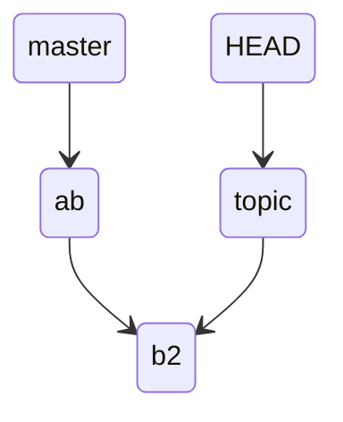
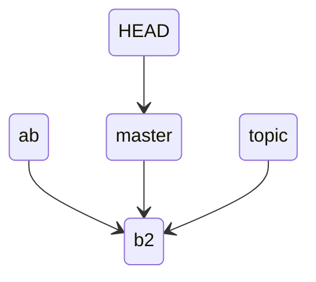
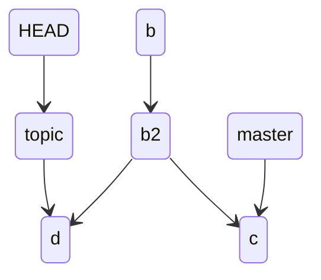
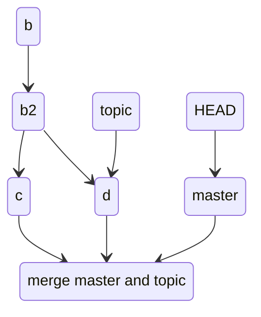

# git merge

ref
[https://git-scm.com/docs/git-merge](https://git-scm.com/docs/git-merge)
[https://git-scm.com/book/en/v2/Git-Branching-Basic-Branching-and-Merging](https://git-scm.com/book/en/v2/Git-Branching-Basic-Branching-and-Merging)
[https://www.atlassian.com/git/tutorials/using-branches/git-merge#:~:text=Fast%20Forward%20Merge,to%20the%20target%20branch%20tip.](https://www.atlassian.com/git/tutorials/using-branches/git-merge#:~:text=Fast%20Forward%20Merge,to%20the%20target%20branch%20tip.)
[https://stackoverflow.com/questions/29673869/what-is-git-fast-forwarding](https://stackoverflow.com/questions/29673869/what-is-git-fast-forwarding)

## Digest
syntax
```
git merge 
```
主要用于 branch 之间的 merge 操作
假设分别有 2 个 branch，当前处在 master branch
```
λ ~/test/ topic* git log --all --graph
* commit 987c6c2c27c9c7ca133ea8dcb7b95f6313521c50 (master)
| Author: Your Name <you@example.com>
| Date:   Fri Mar 31 18:16:22 2023 +0800
| 
|     f
| 
* commit b308e152cdea31c578d3bae159ad59994b093c13
| Author: Your Name <you@example.com>
| Date:   Fri Mar 31 18:16:16 2023 +0800
| 
|     e
|   
| * commit f63c52a5d2d542b8e2c245bebbb19e82bd6d9e02 (HEAD -> topic)
| | Author: Your Name <you@example.com>
| | Date:   Fri Mar 31 18:15:59 2023 +0800
| | 
| |     d
| | 
| * commit 4a965cfbbd9c1c374fa7422dd8e5b3d7a8b6f947
|/  Author: Your Name <you@example.com>
|   Date:   Fri Mar 31 18:15:50 2023 +0800
|   
|       c
| 
* commit c8dfd8c9e0258b563fcf8a159666e707fd0fa5b0
| Author: Your Name <you@example.com>
| Date:   Fri Mar 31 18:15:14 2023 +0800
| 
|     b
| 
* commit 7dfde0561ccf51333e93f58d5f6bde73572f608b
  Author: Your Name <you@example.com>
  Date:   Fri Mar 31 18:14:52 2023 +0800
  
      a
```
现在需要将 topic branch merge into master
```
λ ~/test/ topic* git checkout master
Switched to branch 'master'
                                                                                                                                                                                                                                     
λ ~/test/ master* git merge topic
Merge made by the 'recursive' strategy.
 c | 1 +
 d | 1 +
 2 files changed, 2 insertions(+)
 create mode 100644 c
 create mode 100644 d
λ ~/test/ master* ls
a  b  c  d  e  f  g
```
那么 merge 后的状态如下，topic 和 master merge 实际会做一次 commit 生成新的 b0deaac15cd4be605dcb06227efc98401c8fa931 记录
```
λ ~/test/ master* git log --all --graph
*   commit b0deaac15cd4be605dcb06227efc98401c8fa931 (HEAD -> master)
|\  Merge: 987c6c2 f63c52a
| | Author: Your Name <you@example.com>
| | Date:   Mon Apr 3 14:29:21 2023 +0800
| | 
| |     Merge branch 'topic'
| | 
| * commit f63c52a5d2d542b8e2c245bebbb19e82bd6d9e02 (topic)
| | Author: Your Name <you@example.com>
| | Date:   Fri Mar 31 18:15:59 2023 +0800
| | 
| |     d
| | 
| * commit 4a965cfbbd9c1c374fa7422dd8e5b3d7a8b6f947
| | Author: Your Name <you@example.com>
| | Date:   Fri Mar 31 18:15:50 2023 +0800
| | 
| |     c
| | 
* | commit 987c6c2c27c9c7ca133ea8dcb7b95f6313521c50
| | Author: Your Name <you@example.com>
| | Date:   Fri Mar 31 18:16:22 2023 +0800
| | 
| |     f
| | 
* | commit b308e152cdea31c578d3bae159ad59994b093c13
|/  Author: Your Name <you@example.com>
|   Date:   Fri Mar 31 18:16:16 2023 +0800
|   
|       e
| 
* commit c8dfd8c9e0258b563fcf8a159666e707fd0fa5b0
| Author: Your Name <you@example.com>
| Date:   Fri Mar 31 18:15:14 2023 +0800
| 
|     b
| 
* commit 7dfde0561ccf51333e93f58d5f6bde73572f608b
  Author: Your Name <you@example.com>
  Date:   Fri Mar 31 18:14:52 2023 +0800
  
      a
```
## Optional args

- `--abort`

  取消当前的 merge 操作

- `--commit | --no-commit`

  merge 的时候是否做 commit

- `--stat | --summary`

  merge 完成后是否显示 dffstat 

- `-v | --verbose`
- `-S | --gpg-sign=keyid`

## Pre-Merge Checks
不管是执行 `git merge` 还是 `git pull` 都会校验 local uncommitted changes 是否和 `git merge` 或者 `git pull` 内容出现重叠覆盖。如果出现重叠覆盖 git 不会做任何操作
如果当前本地的 HEAD 指针和 remote HEAD 指针一致，就会提示 "Already up to date"
## Fast-Forward Merge
当前需要被 merge 的 commit object 是当前 HEAD 指针指向的 commit object 的 ancestor 时，git 就会选择 Fast-Forward Merge。一般出现在 `git pull` 对 tracking 的分支做更新时出现
简单的理解就是当前 commit object 和需要合并的 commit object 在一条线上时，git 会采用 Fast-Forward Merge，==将 HEAD 指针直接指向更新后的节点==。可以使用 `git log --graph --all --abbrev-commit` 来校验是否在一条线上

假设现在有一个分支 master，提出了 a b 两个文件

```
(base) cpl in /tmp/test on master ● λ git add a b
(base) cpl in /tmp/test on master ● λ git commit -m "a b"
[master (root-commit) 2f0f9af] a b
 2 files changed, 7 insertions(+)
 create mode 100644 a
 create mode 100644 b
```
a b 内容分别如下

```
(base) cpl in /tmp/test on master λ cat a 
a
(base) cpl in /tmp/test on master λ cat b
1
3
5
6
8
9
```

现在创建一个 topic 分支，修改文件 b，并 add commit

```
(base) cpl in /tmp/test on master λ git checkout -b topic
Switched to a new branch 'topic'
(base) cpl in /tmp/test on topic λ cat b
2
4
6
8
9
(base) cpl in /tmp/test on topic ● λ git add b
(base) cpl in /tmp/test on topic ● λ git commit -m "b2"
[topic 5260ecb] b2
 1 file changed, 2 insertions(+), 3 deletions(-)
```

当前的状态如下



现在 merge master 和 topic，这时 git 就会使用 fast-forward merge

```
(base) cpl in /tmp/test on master λ git merge topic 
Updating 2f0f9af..5260ecb
Fast-forward
 b | 5 ++---
 1 file changed, 2 insertions(+), 3 deletions(-)
```
这里也是只是将分支的指针移动了
```
(base) cpl in /tmp/test on master λ git log --abbrev-commit --all --graph --oneline
* 5260ecb (HEAD -> master, topic) b2
* 2f0f9af a b
```
当前状态如下



但是目录和文件内容已经改变了

```
(base) cpl in /tmp/test on master λ ls
 a   b
(base) cpl in /tmp/test on master λ cat b
2
4
6
8
9
```
## True Merge
当前 HEAD 指针指向的 commit object 和需要合并的分支 commit object，不在一条线上，即出现 divergence。会采用 True Merge

在上一个例子分别修改文件 b 并 commit 一次

```
 (base) cpl in /tmp/test on master λ cat b
2
4
6
8
9
edit-content from master branch
(base) cpl in /tmp/test on master λ git add b
(base) cpl in /tmp/test on master ● λ git commit -m "c"
[master a1c4351] c
 1 file changed, 1 insertion(+)
 (base) cpl in /tmp/test on topic λ cat b
2
4
6
8
9
edit-content from topic branch
(base) cpl in /tmp/test on topic λ git add b
(base) cpl in /tmp/test on topic ● λ git commit -m "d"
[topic 0b86cc2] d
 1 file changed, 1 insertion(+)
```

日志如下

```
(base) cpl in /tmp/test on topic λ git log --abbrev-commit --all --graph --oneline
* 0b86cc2 (HEAD -> topic) d
| * a1c4351 (master) c
|/  
* 5260ecb b2
* 2f0f9af a b
```

当面状态如下，在 b2 出现 divergence



现在想要将 master 和 topic 分支指针指向的 commit object 合并

```
(base) cpl in /tmp/test on topic λ git checkout master 
Switched to branch 'master'
                                                                                                                                                         
(base) cpl in /tmp/test on master λ git merge topic 
Auto-merging b
CONFLICT (content): Merge conflict in b
Automatic merge failed; fix conflicts and then commit the result.
```
这时可以看到 b 文件出现冲突，需要手动修改

```
(base) cpl in /tmp/test on master ● ● performing a merge λ cat b      
2
4
6
8
9
<<<<<<< HEAD
edit-content from master branch
=======
edit-content from topic branch
>>>>>>> topic
(base) cpl in /tmp/test on master ● ● performing a merge λ vim b
(base) cpl in /tmp/test on master ● ● performing a merge λ cat b      
2
4
6
8
9
edit-content from master and topic branch
```

修改完成后需要使用 add 并 commit，才完成真正的 merge

```
(base) cpl in /tmp/test on master ● ● performing a merge λ git add b
(base) cpl in /tmp/test on master ● performing a merge λ git commit -m "merge master and topic"
[master 042e4fb] merge master and topic
```

查看日志

```
(base) cpl in /tmp/test on master λ git log --abbrev-commit --all --graph --oneline
*   042e4fb (HEAD -> master) merge master and topic
|\  
| * 0b86cc2 (topic) d
* | a1c4351 c
|/  
* 5260ecb b2
* 2f0f9af a b
```

可以看到分支向前走了一个 commit 记录，当前状态如下



## How Conflicts Are Presented
当使用 `git merge` 或者 `git pull` 时，如果需要合并的部分有重叠 git 就会提示需要人工合并或者直接放弃合并的操作
例如

当前有两个分支 main 和 topic

```
(base) cpl in /tmp/test on topic λ git lg
* 85048ef - (3 seconds ago) topic b - cyberPelican (HEAD -> topic)
* 038f625 - (2 minutes ago) d - cyberPelican
* 6e5f3ac - (3 minutes ago) c - cyberPelican
| * 94715fe - (57 seconds ago) master b - cyberPelican (main)
|/  
* fa5e06f - (4 minutes ago) b - cyberPelican
* b38d959 - (5 minutes ago) a - cyberPelican%
```

两个分支都有文件 b，但是里面的内容不同

```
(base) cpl in /tmp/test on topic λ cat b
this is the topic b
                                                                                                                                                         
(base) cpl in /tmp/test on topic λ git checkout main 
Switched to branch 'main'
                                                                                                                                                         
(base) cpl in /tmp/test on main λ cat b
this is the master b
```

如果此时需要合并就会出现冲突

```
(base) cpl in /tmp/test on main λ git merge topic 
Auto-merging b
CONFLICT (content): Merge conflict in b
Automatic merge failed; fix conflicts and then commit the result.
                                                                                                                                                         
(base) cpl in /tmp/test on main ● ● performing a merge λ
```

需要手动解决冲突

```
<<<<<<< HEAD
this is the master b
=======
this is the topic b
>>>>>>> topic
```

`<<<<<<<` 至 `=======` 是本端的内容，`=======` 至 `>>>>>>>` 是对端的内容即被合并的分支
