# git merge

ref
[https://git-scm.com/docs/git-merge](https://git-scm.com/docs/git-merge)
[https://git-scm.com/book/en/v2/Git-Branching-Basic-Branching-and-Merging](https://git-scm.com/book/en/v2/Git-Branching-Basic-Branching-and-Merging)
[https://www.atlassian.com/git/tutorials/using-branches/git-merge#:~:text=Fast%20Forward%20Merge,to%20the%20target%20branch%20tip.](https://www.atlassian.com/git/tutorials/using-branches/git-merge#:~:text=Fast%20Forward%20Merge,to%20the%20target%20branch%20tip.)
[https://stackoverflow.com/questions/29673869/what-is-git-fast-forwarding](https://stackoverflow.com/questions/29673869/what-is-git-fast-forwarding)

## Digest
syntax
```
git merge 
```
主要用于 branch 之间的 merge 操作
假设分别有 2 个 branch，当前处在 master branch
```
λ ~/test/ topic* git log --all --graph
* commit 987c6c2c27c9c7ca133ea8dcb7b95f6313521c50 (master)
| Author: Your Name <you@example.com>
| Date:   Fri Mar 31 18:16:22 2023 +0800
| 
|     f
| 
* commit b308e152cdea31c578d3bae159ad59994b093c13
| Author: Your Name <you@example.com>
| Date:   Fri Mar 31 18:16:16 2023 +0800
| git add assets/
|     e
|   
| * commit f63c52a5d2d542b8e2c245bebbb19e82bd6d9e02 (HEAD -> topic)
| | Author: Your Name <you@example.com>
| | Date:   Fri Mar 31 18:15:59 2023 +0800
| | 
| |     d
| | 
| * commit 4a965cfbbd9c1c374fa7422dd8e5b3d7a8b6f947
|/  Author: Your Name <you@example.com>
|   Date:   Fri Mar 31 18:15:50 2023 +0800
|   
|       c
| 
* commit c8dfd8c9e0258b563fcf8a159666e707fd0fa5b0
| Author: Your Name <you@example.com>
| Date:   Fri Mar 31 18:15:14 2023 +0800
| 
|     b
| 
* commit 7dfde0561ccf51333e93f58d5f6bde73572f608b
  Author: Your Name <you@example.com>
  Date:   Fri Mar 31 18:14:52 2023 +0800
  
      a
```
现在需要将 topic branch merge into master
```
λ ~/test/ topic* git checkout master
Switched to branch 'master'
                                                                                                                                                                                                                                     
λ ~/test/ master* git merge topic
Merge made by the 'recursive' strategy.
 c | 1 +
 d | 1 +
 2 files changed, 2 insertions(+)
 create mode 100644 c
 create mode 100644 d
λ ~/test/ master* ls
a  b  c  d  e  f  g
```
那么 merge 后的状态如下，topic 和 master merge 实际会做一次 commit 生成新的 b0deaac15cd4be605dcb06227efc98401c8fa931 记录
```
λ ~/test/ master* git log --all --graph
*   commit b0deaac15cd4be605dcb06227efc98401c8fa931 (HEAD -> master)
|\  Merge: 987c6c2 f63c52a
| | Author: Your Name <you@example.com>
| | Date:   Mon Apr 3 14:29:21 2023 +0800
| | 
| |     Merge branch 'topic'
| | 
| * commit f63c52a5d2d542b8e2c245bebbb19e82bd6d9e02 (topic)
| | Author: Your Name <you@example.com>
| | Date:   Fri Mar 31 18:15:59 2023 +0800
| | 
| |     d
| | 
| * commit 4a965cfbbd9c1c374fa7422dd8e5b3d7a8b6f947
| | Author: Your Name <you@example.com>
| | Date:   Fri Mar 31 18:15:50 2023 +0800
| | 
| |     c
| | 
* | commit 987c6c2c27c9c7ca133ea8dcb7b95f6313521c50
| | Author: Your Name <you@example.com>
| | Date:   Fri Mar 31 18:16:22 2023 +0800
| | 
| |     f
| | 
* | commit b308e152cdea31c578d3bae159ad59994b093c13
|/  Author: Your Name <you@example.com>
|   Date:   Fri Mar 31 18:16:16 2023 +0800
|   
|       e
| 
* commit c8dfd8c9e0258b563fcf8a159666e707fd0fa5b0
| Author: Your Name <you@example.com>
| Date:   Fri Mar 31 18:15:14 2023 +0800
| 
|     b
| 
* commit 7dfde0561ccf51333e93f58d5f6bde73572f608b
  Author: Your Name <you@example.com>
  Date:   Fri Mar 31 18:14:52 2023 +0800
  
      a
```
## Optional args

- `--abort`

  取消当前的 merge 操作

- `--commit | --no-commit`

  merge 的时候是否做 commit

- `--stat | --summary`

  merge 完成后是否显示 dffstat 

- `-v | --verbose`
- `-S | --gpg-sign=keyid`

## Fast-Forward Merge
当前需要被 merge 的 commit object 是当前 HEAD 指针指向的 commit object 的 ancestor 时( 被 merge 的记录比 HEAD 指针指向的记录 “新” )，git 就会选择 Fast-Forward Merge。一般出现在 `git pull` 对 tracking 的分支做更新时出现
简单的理解就是当前 commit object 和需要合并的 commit object 在一条线上时( 没有 Divergence )，git 会采用 Fast-Forward Merge，==将 HEAD 指针直接指向新的 commit object==

可以使用 `git log --graph --all --abbrev-commit` 来校验是否在一条线上

假设现在有一个分支 master，提出了 a b 两个文件

```
(base) cpl in /tmp/test on master ● λ git add a b
(base) cpl in /tmp/test on master ● λ git commit -m "a b"
[master (root-commit) 2f0f9af] a b
 2 files changed, 7 insertions(+)
 create mode 100644 a
 create mode 100644 b
```
a b 内容分别如下

```
(base) cpl in /tmp/test on master λ cat a 
a
(base) cpl in /tmp/test on master λ cat b
1
3
5
6
8
9
```

现在创建一个 topic 分支，修改文件 b，并 add commit

```
(base) cpl in /tmp/test on master λ git checkout -b topic
Switched to a new branch 'topic'
(base) cpl in /tmp/test on topic λ cat b
2
4
6
8
9
(base) cpl in /tmp/test on topic ● λ git add b
(base) cpl in /tmp/test on topic ● λ git commit -m "b2"
[topic 5260ecb] b2
 1 file changed, 2 insertions(+), 3 deletions(-)
```

当前的状态如下

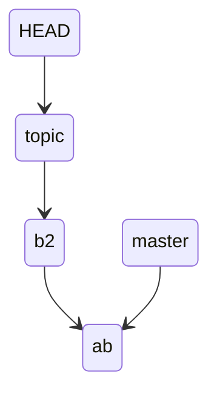

现在 merge master 和 topic，这时 git 就会使用 fast-forward merge

```
(base) cpl in /tmp/test on master λ git merge topic 
Updating 2f0f9af..5260ecb
Fast-forward
 b | 5 ++---
 1 file changed, 2 insertions(+), 3 deletions(-)
```
这里也是只是将分支的指针移动了
```
(base) cpl in /tmp/test on master λ git log --abbrev-commit --all --graph --oneline
* 5260ecb (HEAD -> master, topic) b2
* 2f0f9af a b
```
当前状态如下

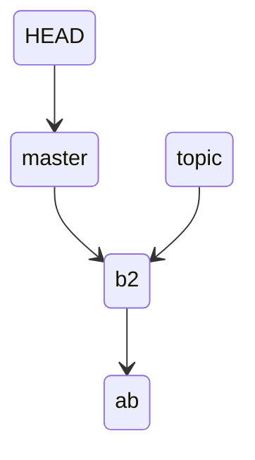

但是目录和文件内容已经改变了

```
(base) cpl in /tmp/test on master λ ls
 a   b
(base) cpl in /tmp/test on master λ cat b
2
4
6
8
9
```
b 中的内容和 topic branch 中的 b 一样，因为并没有出现 divergence，所以 b2 是最新的 commit object

## True Merge

### Two Ways Merge

当前 HEAD 指针指向的 commit object 和需要合并的分支 commit object，不在一条线上，即出现 divergence。会采用 Two way Merge

假设当前状态如下

```
(base) cpl in /tmp/test on topic λ git lg1
* e0dc6b6 - (2 seconds ago) d - 4liceh  (HEAD -> topic)
| * 0f17575 - (21 seconds ago) c - 4liceh  (master)
|/  
* 2d32120 - (27 minutes ago) b - 4liceh 
* b3a2933 - (27 minutes ago) a - 4liceh
```

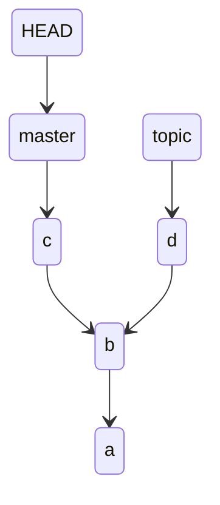

现在需要合并 master 和 topic 分支

```
(base) cpl in /tmp/test on topic λ git switch -
Switched to branch 'master'
(base) cpl in /tmp/test on master λ git merge topic 
Merge made by the 'ort' strategy.
 d | 0
 1 file changed, 0 insertions(+), 0 deletions(-)
 create mode 100644 d
```

日志如下

```
(base) cpl in /tmp/test on master λ git lg1
*   e0719f4 - (31 seconds ago) Merge branch 'topic' - 4liceh  (HEAD -> master)
|\  
| * e0dc6b6 - (3 minutes ago) d - 4liceh  (topic)
* | 0f17575 - (3 minutes ago) c - 4liceh 
|/  
* 2d32120 - (30 minutes ago) b - 4liceh 
* b3a2933 - (30 minutes ago) a - 4liceh
```

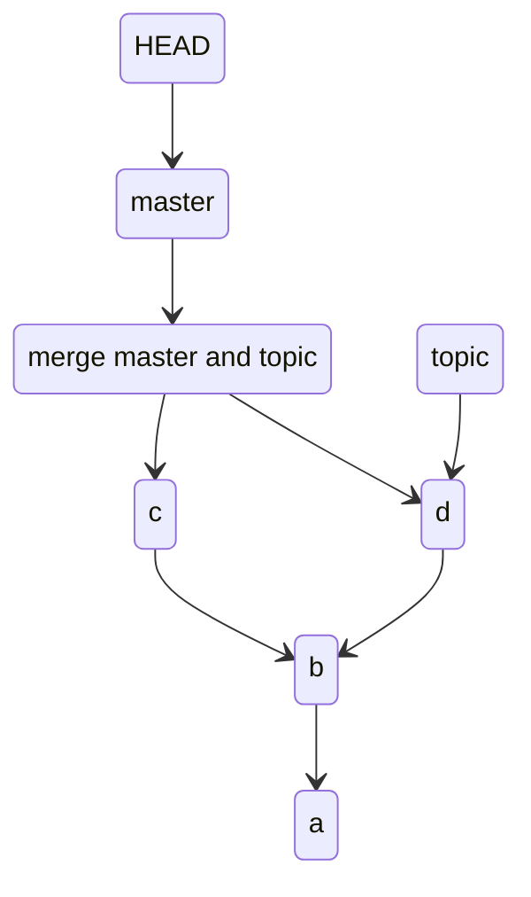

可以看到 merge 后实际是向前做了一次 git commit，master 分支中的内容也改变了

```
(base) cpl in /tmp/test on master λ ls
 a   b   c   d
```

### Three Ways Merge

如果出现三分支合并，操作也是类似的，两两合并

假设当前状态如下

```
(base) cpl in /tmp/test on master ● λ git lg1
* e781902 - (16 seconds ago) d - 4liceh  (t2)
| * b9c7a45 - (65 seconds ago) e - 4liceh  (HEAD -> master)
|/  
| * bdaa6c7 - (2 minutes ago) f - 4liceh  (t1)
| * 72b99e8 - (2 minutes ago) c - 4liceh 
|/  
* 7c8888d - (2 minutes ago) b - 4liceh 
* f7b3d4d - (3 minutes ago) a - 4liceh
```


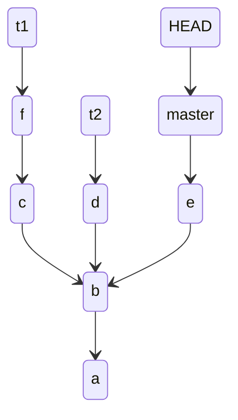

需要将 t1,t2 合并至 master

先将 t1 merge 至 master

```
(base) cpl in /tmp/test on t1 ● λ git switch master
(base) cpl in /tmp/test on master ● λ git merge t1
Merge made by the 'ort' strategy.
 c | 1 +
 f | 1 +
 2 files changed, 2 insertions(+)
 create mode 100644 c
 create mode 100644 f
```

日志如下

```
(base) cpl in /tmp/test on master ● ● λ git lg1
*   251b2f0 - (3 minutes ago) Merge branch 't1' - 4liceh  (HEAD -> master)
|\  
| * bdaa6c7 - (6 minutes ago) f - 4liceh  (t1)
| * 72b99e8 - (6 minutes ago) c - 4liceh 
* | b9c7a45 - (5 minutes ago) e - 4liceh 
|/  
| * e781902 - (4 minutes ago) d - 4liceh  (t2)
|/  
* 7c8888d - (6 minutes ago) b - 4liceh 
* f7b3d4d - (6 minutes ago) a - 4liceh
```

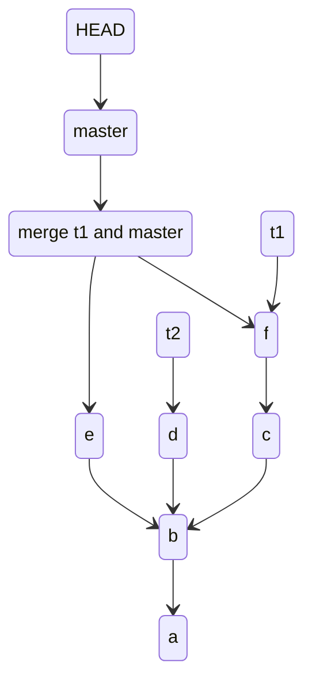

然后将 t2 merge 至 master

```
(base) cpl in /tmp/test on master ● λ git merge t2
Merge made by the 'ort' strategy.
 d | 1 +
 1 file changed, 1 insertion(+)
 create mode 100644 d
```

日志如下

```
(base) cpl in /tmp/test on master ● λ git lg1
*   083067f - (16 seconds ago) Merge branch 't2' - 4liceh  (HEAD -> master)
|\  
| * e781902 - (2 minutes ago) d - 4liceh  (t2)
* |   251b2f0 - (31 seconds ago) Merge branch 't1' - 4liceh 
|\ \  
| * | bdaa6c7 - (4 minutes ago) f - 4liceh  (t1)
| * | 72b99e8 - (4 minutes ago) c - 4liceh 
| |/  
* / b9c7a45 - (3 minutes ago) e - 4liceh 
|/  
* 7c8888d - (4 minutes ago) b - 4liceh 
* f7b3d4d - (4 minutes ago) a - 4liceh 
```

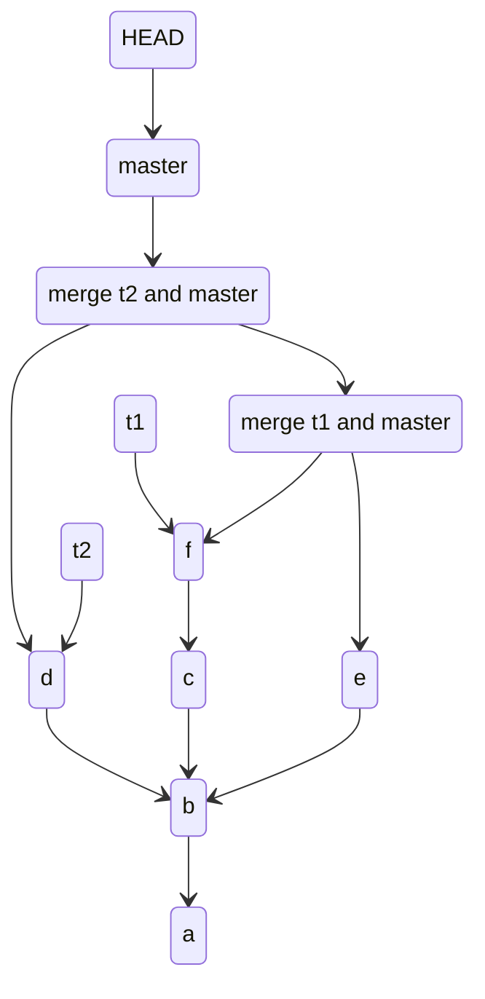


### Multi Ways Merge

如果出现多分支，且在分支上有分支。只想合并分支上的分支到 master，也是一样的

假设当前状态如下

```
(base) cpl in /tmp/test on master λ git lg1
* 81ad93a - (17 seconds ago) g - 4liceh  (t2)
| * d60bdfd - (33 seconds ago) h - 4liceh  (t3)
|/  
* e781902 - (28 minutes ago) d - 4liceh 
| * b9c7a45 - (29 minutes ago) e - 4liceh  (HEAD -> master)
|/  
| * bdaa6c7 - (30 minutes ago) f - 4liceh  (t1)
| * 72b99e8 - (30 minutes ago) c - 4liceh 
|/  
* 7c8888d - (31 minutes ago) b - 4liceh 
* f7b3d4d - (31 minutes ago) a - 4liceh %
```


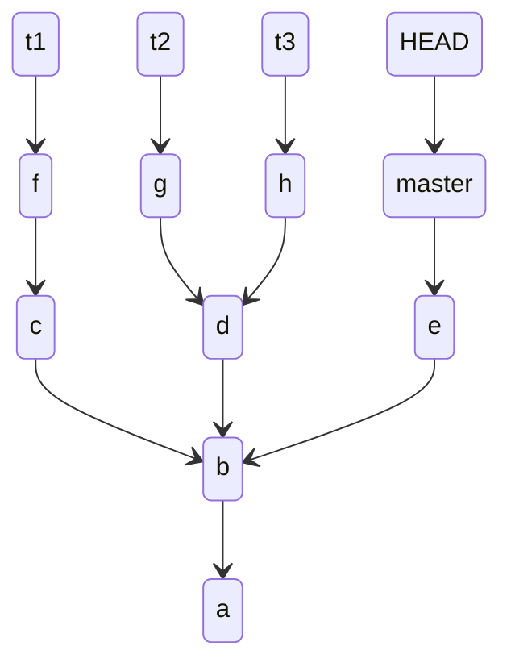

现在只想合并 t3 和 master

```
(base) cpl in /tmp/test on master λ git merge t3
Merge made by the 'ort' strategy.
 d | 1 +
 h | 1 +
 2 files changed, 2 insertions(+)
 create mode 100644 d
 create mode 100644 h
```

日志如下

```
(base) cpl in /tmp/test on master λ git lg1
*   e1dd8c5 - (6 seconds ago) Merge branch 't3' - 4liceh  (HEAD -> master)
|\  
| * d60bdfd - (88 seconds ago) h - 4liceh  (t3)
* | b9c7a45 - (30 minutes ago) e - 4liceh 
| | * 81ad93a - (72 seconds ago) g - 4liceh  (t2)
| |/  
| * e781902 - (29 minutes ago) d - 4liceh 
|/  
| * bdaa6c7 - (31 minutes ago) f - 4liceh  (t1)
| * 72b99e8 - (31 minutes ago) c - 4liceh 
|/  
* 7c8888d - (31 minutes ago) b - 4liceh 
* f7b3d4d - (32 minutes ago) a - 4liceh
```

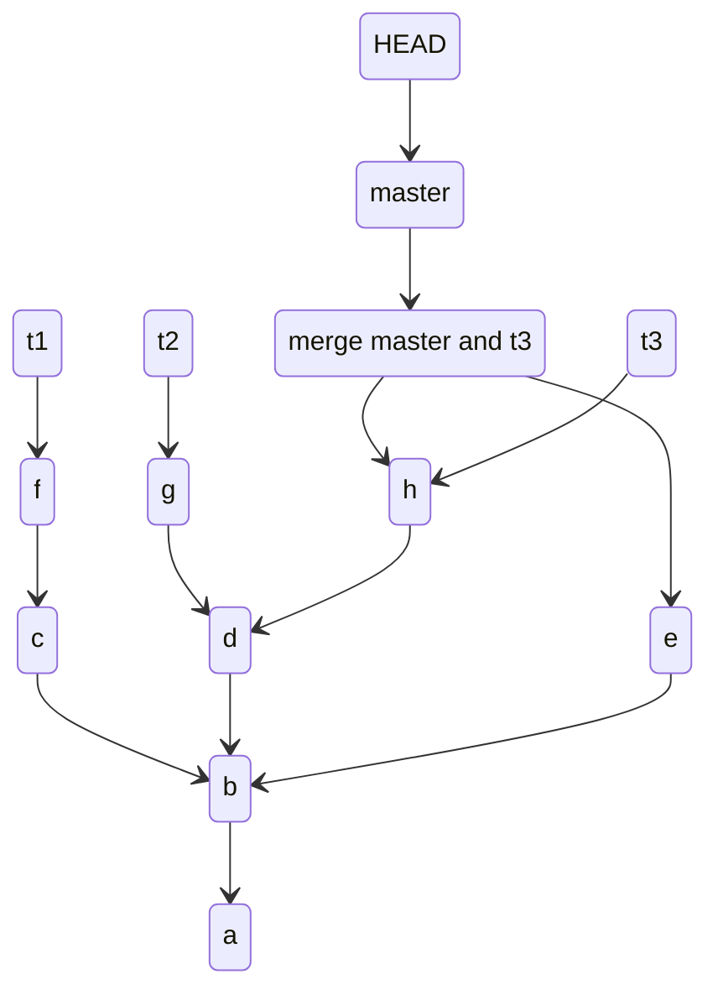


## How Conflicts Are Presented

> 只会出现在 True Merge 的情况下 ( 有 Divergence 时 )，Fast-Forward Merge 不会出现冲突

当使用 `git merge` 或者 `git pull` 时，如果需要合并的部分不完全相同， git 就会提示需要人工合并或者直接选择放弃合并的操作
例如

当前状态如下，topic 和 master 都在自己的分支中创建了一个文件 c 并 commit, 部分内容不同

```
(base) cpl in /tmp/test on master ● λ git add a
(base) cpl in /tmp/test on master ● ● λ git commit -m"a"
(base) cpl in /tmp/test on master ● λ git add b
(base) cpl in /tmp/test on master ● λ git commit -m"b"
(base) cpl in /tmp/test on master λ git switch -C topic
(base) cpl in /tmp/test on topic λ cat c
1
3
5
6
8
9
(base) cpl in /tmp/test on topic ● λ git add c
(base) cpl in /tmp/test on topic ● λ git commit -c "topic c"    
(base) cpl in /tmp/test on topic λ ls
 a   b   c      
(base) cpl in /tmp/test on topic λ git switch master 
(base) cpl in /tmp/test on master λ ls
 a   b
(base) cpl in /tmp/test on master λ cat c   
2
4
6
8
9
(base) cpl in /tmp/test on master λ git add c
(base) cpl in /tmp/test on master ● λ git commit -m "master c"
(base) cpl in /tmp/test on master λ ls
 a   b   c
```

日志如下

```
(base) cpl in /tmp/test on master λ git lg1
* 86277f4 - (4 minutes ago) master c - 4liceh  (HEAD -> master)
| * c092171 - (4 minutes ago) topic c - 4liceh  (topic)
|/  
* 2d32120 - (5 minutes ago) b - 4liceh 
* b3a2933 - (5 minutes ago) a - 4liceh
```

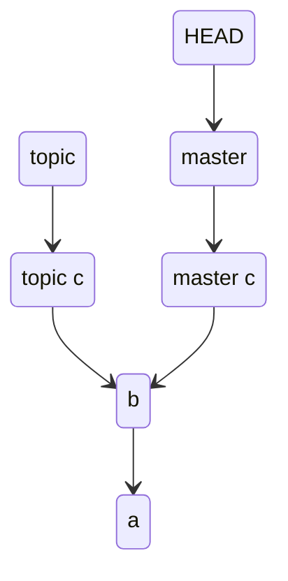

现在需要和并 master 和 topic 分支

```
(base) cpl in /tmp/test on master λ git merge topic 
Auto-merging c
CONFLICT (add/add): Merge conflict in c
Automatic merge failed; fix conflicts and then commit the result.
```

因为两个分支都有文件 c，但是里面对应位置的内容不同。合并时 git 会将两个分支中的冲突的内容都加入到文件 c，由用户自行解决冲突

```
(base) cpl in /tmp/test on master ● ● performing a merge λ cat c
<<<<<<< HEAD
2
4
=======
1
3
5
>>>>>>> topic
6
8
9
```

`<<<<<<<` 至 `=======` 是本端冲突的内容，例子中为 `2 4`；`=======` 至 `>>>>>>>` 是被合并分支中冲突的内容，例子中为 `1 3 5`。其余部分为相同内容，例子中为 `6 8 9`

修改文件 c

```
(base) cpl in /tmp/test on master ● ● performing a merge λ cat c
1
2
3
4
5
6
8
9
```

因为 merge 是需要向前 commit 一个记录的，所以这里需要执行 add 和 commit 操作，才能完成 merge。如果这时要想取消 merge, 可以使用 `git merge --abort`

```
(base) cpl in /tmp/test on master ● ● performing a merge λ git add c
(base) cpl in /tmp/test on master ● performing a merge λ git commit -m "merge master and topic"
[master 60596f0] merge master and topic
```

操作完成后，日志如下

```
(base) cpl in /tmp/test on master λ git lg1
*   60596f0 - (39 seconds ago) merge master and topic - 4liceh  (HEAD -> master)
|\  
| * c092171 - (10 minutes ago) topic c - 4liceh  (topic)
* | 86277f4 - (10 minutes ago) master c - 4liceh 
|/  
* 2d32120 - (11 minutes ago) b - 4liceh 
* b3a2933 - (11 minutes ago) a - 4liceh
```

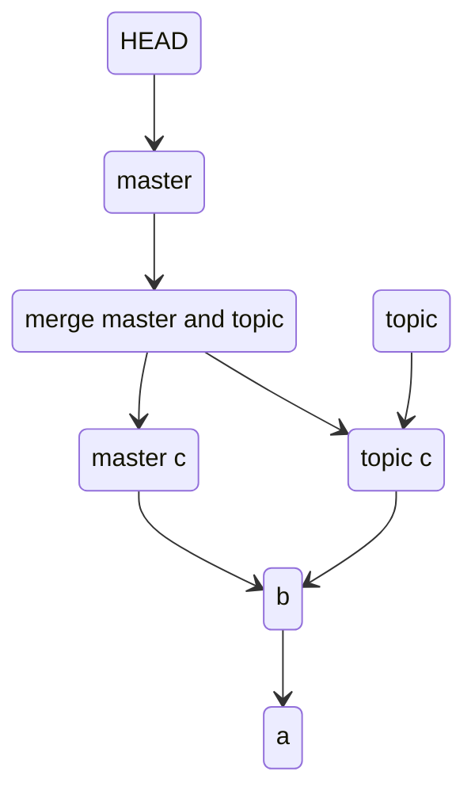

