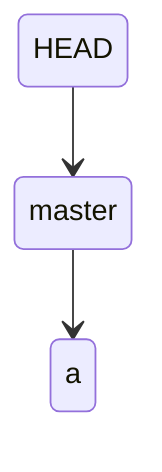
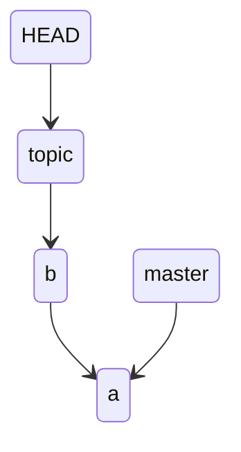
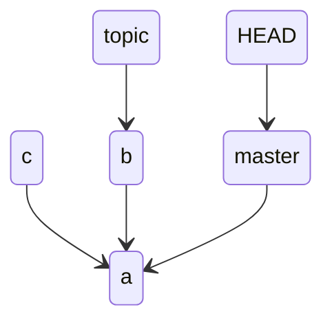

# git - Branches

## Digest

branches 是 git 中最重要逻辑区域

## Branches

在了解什么是 branches 前，需要先看一下 git 是怎么存储数据的。git 最大的特性就是使用 snapshot 替代直接存储数据

当使用 `git commit` 时会创建并存储一个 commit object，包含

- author’s name and email address
- the message that you typed
- a pointer to the snapshot of the content you staged
- pointers to the commit or commits that directly came before this commit (its parent or parents)

假设现在你使用如下命令

```
$ git add README test.rb LICENSE
$ git commit -m 'Initial commit'
```

那么 git 就会创建

- 一个 tree object

  当前目录中所有追踪的文件构成的一个树结构对象，每个子叶包含一个指向 blob (对应文件)的指针 或者 是指向 subtree (对应目录)的指针

- 三个 blobs

  包含当前目录中所有 tracked 文件的内容，本例子中即为 `README`, `test.rb`, `LICENSE`

- 一个 commit object

  


例如 `98ca9` 是 commit object, `92ec2` 是 tree object, 三个 bolb 分别代表 add 的三个文件

如果做了一些修改并 commit 后，后一个 commit object 中的 parent 指针会指向前一个 commit object 的地址


上图中串行的 commit object 所处的逻辑区域就是一个 branch，snapshot 对应 tree object

==简单的理解 branch 其实就是一个指向 last commit object 的 moveable pointer(reference) 移动所形成的轨迹。==如果你每 commit 一次，对应的 moveable pointer 也会移动

在 git 中默认的 initBranch 是 master

### Local branches

Local branches 是指只在本地的 branches，通过 local reference 来追踪

```
(base) cpl in /tmp/gitignore on main λ git branch -vv
* main 4488915 [origin/main] Merge pull request #3567 from aaronfranke/godot
  test 4488915 Merge pull request #3567 from aaronfranke/godot
```

例如上述 `test` 和 `main` 都是 local branches，对应的 local reference 分别是 `test` 和 `main`

### Remote branches

Remote branches 是指在 remote repository 中的 branches


例如上图中红框部分就是对应 `github/gitignore` 的 remote branches

如果 remote repository 被克隆到本地， git 通过 remote-tacking branches ( 直接理解成 remote references 即指针)来跟踪 remote branches。可以使用 `git remote show <remote>` 来查看

```
gh repo clone github/gitignore && cd gitignore

(base) cpl in /tmp/gitignore on main λ git remote show origin 
* remote origin
  Fetch URL: git@github.com:github/gitignore.git
  Push  URL: git@github.com:github/gitignore.git
  HEAD branch: main
  Remote branches:
    add-metadata            tracked
    annotating-visualstudio tracked
    ghfw                    tracked
    main                    tracked
    old-ghfw                tracked
    reduce-noise            tracked
    rmw-universe            tracked
    rmw-universe-2022       tracked
  Local branch configured for 'git pull':
    main merges with remote main
  Local ref configured for 'git push':
    main pushes to main (up to date
```

## Divergence

Divergence 指的是分支出现分叉的情况。如果分支出现分叉就不能使用 fast-forward merge；如果分支中相同的文件修改了相同的部分出现冲突，在合并时还需要手动解决冲突才能合并

例如

现在只有一个 branch master, 做了一次 commit

```
(base) cpl in /tmp/test on master ● λ git add a
(base) cpl in /tmp/test on master ● ● λ git commit -m "a"
[master (root-commit) 2b70ec0] a
 1 file changed, 6 insertions(+)
 create mode 100644 a
```



在当前 branch 创建了一个 topic branch，并切换到 topic branch，然后做一次 commit

```
(base) cpl in /tmp/test on master ● λ git checkout -b topic
Switched to a new branch 'topic'
(base) cpl in /tmp/test on topic ● λ git add b
(base) cpl in /tmp/test on topic ● ● λ git commit -m "b"
[topic 2938149] b
 1 file changed, 7 insertions(+)
 create mode 100644 b
```

这样并不会导致 Divergence

```
(base) cpl in /tmp/test on topic ● λ git log --all --graph --abbrev-commit --oneline
* 2938149 (HEAD -> topic) b
* 2b70ec0 (master) a
```

当前状态如下，可以发现 a 和 b 是在一条线上的



切换到 master branch 然后做一次 commit

```
(base) cpl in /tmp/test on topic ● λ git checkout master
Switched to branch 'master'
(base) cpl in /tmp/test on master ● λ git add c
(base) cpl in /tmp/test on master ● ● λ git commit -m "c"
[master 6c8adb1] c
 1 file changed, 1 insertion(+)
 create mode 100644 c
```

就可以发现出现 divergence

```
 (base) cpl in /tmp/test on master ● λ git log --all --graph --abbrev-commit --oneline
* 6c8adb1 (HEAD -> master) c
| * 2938149 (topic) b
|/  
* 2b70ec0 a
```

当前状态如下



## Example

不考虑 remote branches 的情况，假设当前状态如下

有一个 master branch，同时 master branch local reference 指向的 last commit object hash 为 f30ab；HEAD reference 指向 master branch local reference，作用这里先暗下不表


现在创建了一个 testing 分支

```
$ git branch testing
```

那么就会新增加一个 testing branch local reference，指向当前 branch 的 latest commit object, 此时 branch working direcotry 中的内容和对应的 branch 中的一样


但是 git 怎么知道你现在处在的分支的呢？这就需要使用 HEAD 这个特殊的 reference，指向当前的 branch reference


因为你并没有切换分支，当前还在 master 分支，所以 HEAD 还是指向 master local reference 。即 `git branch <new branch>` 只是创建了一个新的分支和新的分支指针，你可以使用如下命令来查看分支指针的指向

```
$ git log --oneline --decorate
f30ab (HEAD -> master, testing) Add feature #32 - ability to add new formats to the central interface
34ac2 Fix bug #1328 - stack overflow under certain conditions
98ca9 Initial commit
```

当你切换分支时

```
$ git checkout testing
```

HEAD 就会指向 testing branch local reference


如果在 testing branch 做了一次 commit

```
$ vim test.rb
$ git commit -a -m 'made a change'
```

testing branch local reference 就会向前，HEAD 也会随着当前的 branch local reference 向前而向前，但是 master branch local reference 是不会移动的。因为 branch 之间是隔离的


当切换分支到 master 

```
$ git checkout master
```

 HEAD 会指向 master branch local reference


同时会将 master branch local reference 指向的 snapshot 中对应 working direcotry 的内容 reverted 到当面的 working direcotry

在当前 masster 分支 commit

```
$ vim test.rb
$ git commit -a -m 'made other changes'
```

如果在当前分支做了 commit ，就会导致 divergence，也就无法使用 fast-forward merge


你可以使用如下命令来查看是否有 divergence

```
$ git log --oneline --decorate --graph --all
* c2b9e (HEAD, master) Made other changes
| * 87ab2 (testing) Made a change
|/
* f30ab Add feature #32 - ability to add new formats to the central interface
* 34ac2 Fix bug #1328 - stack overflow under certain conditions
* 98ca9 initial commit of my project
```


**references**

1. https://git-scm.com/book/en/v2/Git-Branching-Remote-Branches
2. https://git-scm.com/docs/git-branch
3. https://git-scm.com/book/en/v2/Git-Branching-Branches-in-a-Nutshell