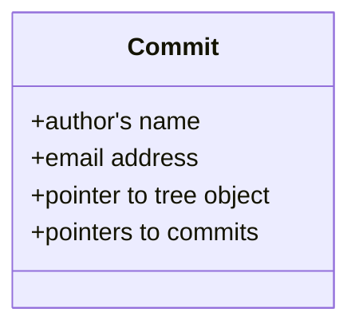
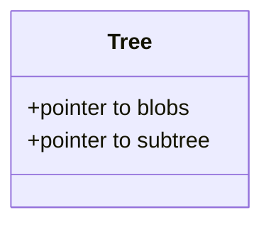
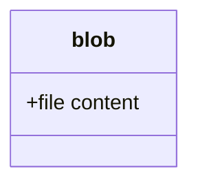

# git - Object

## Digest

在 git 中所有的内容都存储在一个类似链表树结构的结构体中

## Commit object

黄色部分，每次 `git commit` 创建的对象，包含

- authors’s name and email address 

  commiter 的名字和邮箱地址

- the message that you typed

  `commit -m` 显示的信息 

- a pointer to the snapshot of the content you staged

  一个指向 tree object 的指针

- pointers to the commit or commits that directly came before this commit (its parent or parents) 

  多个指向父级 commit object 的指针

部分成员变量并没有在 源码 中看到

https://github.com/git/git/blob/master/commit.h

## Tree object

绿色部分，当前目录中所有追踪的文件构成的一个树结构对象，每个子叶包含一个指向 blob (对应文件)的指针 或者 是指向 subtree (对应目录)的指针

https://github.com/git/git/blob/master/tree.h

## Blob object

对应白色部分，包含当前目录中所有 tracked 文件的内容

https://github.com/git/git/blob/master/blob.h

**referneces**

1. https://git-scm.com/book/en/v2/Git-Internals-Git-Objects
2. https://git-scm.com/book/en/v2/Git-Branching-Branches-in-a-Nutshell