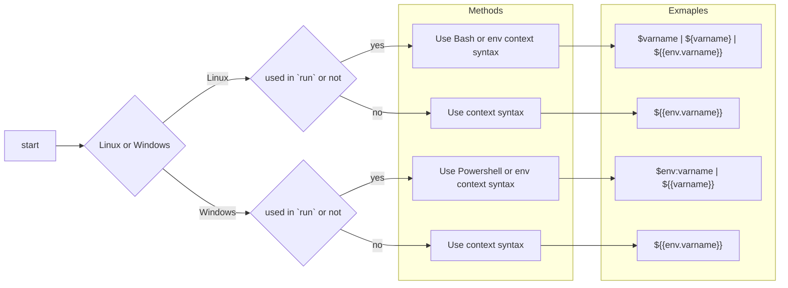

# Github-Actions 03 - Variables

## 0x01 Overview

> [!warning]
> github action variables 默认会以明文的方式暴露在 build ouput 中，如果需要存储 密码/密钥 之类的变量参考 [Using secrets in GitHub Actions - GitHub Docs](https://docs.github.com/en/actions/security-guides/using-secrets-in-github-actions)
> 也可以参考 [Github-Actions 04 - Sensitive Variables](Github-Actions%2004%20-%20Sensitive%20Variables.md)

github workflows 也可以通过 variables 存储变量，有 2 种形式的 variables

> [!NOTE] Title
> 在定义变量时，不能使用也不能 override 默认的 envrioments
> 如果想要列出默认的 enviroments 可以在 yml 中定义 `run: env` 来查看，或者看文档[^2]

1. environment variables，变量只对当前 workflow 生效，通过 `env` 定义
2. configuration variables 变量对多个 workflows 生效，通过 定义

## 0x02 Environment variables

通过 `env` 定义变量，变量只对当前 workflow 生效。根据定义的位置不同，作用域也不同

1. `job.<job_id>.env` 只在 job_id 中生效
2. `job.<job_id>.step[*].env` 只在 job_id.step[\*] 中生效

例如
```yml
name: Greeting on variable day

on:
  workflow_dispatch

env:
  DAY_OF_WEEK: Monday

jobs:
  greeting_job:
    runs-on: ubuntu-latest
    env:
      Greeting: Hello
    steps:
      - name: "Say Hello Mona it's Monday"
        run: echo "$Greeting $First_Name. Today is $DAY_OF_WEEK!"
        env:
          First_Name: Mona
```

按照变量定义的位置，以及 runner 的不同，获取变量的方式不同



## 0x03 Configuration variables

通过 github web 配置的方式来定义，作用域不同，配置的方式也不同

有 3 个作用域
1. organization，对所有 orgnaization 下的 workflows 都生效，范围最广。配置方法[^3]
2. repository，对当前 repository 下的 workflows 都生效，范围中等。配置方法[^4]
3. environment，对当前 workflow 生效，范围最小。配置方法[^5]

按照变量定义的位置，以及 runner 的不同，获取变量的方式不同


有几点需要注意
1. 如果在不同作用域中存在相同变量名的变量，会使用范围较小的
2. 变量和大多编程语言中的一样，但是不能以 `GITHUB_` 开头，且变量在同作用域中必须唯一
3. 可以直接通过 `${{var.varname}}` 来调用 configuration variables，也可以将 configuration variables 赋值给 environment variables，然后通过 `${{env.varname}}` 或者是 `${varname} | $varname` 来调用

## 0x04 Using context to access variables

environment variables 和 configuration variables 都可以通过 context 来获取，但是 context 有区别
- environment variables 通过 `${{env.varname}}` 来获取
- configuration vairables 通过 `${{var.varname}}` 来获取

### 0x04a ${{env.varname}}

用于获取 environment variables

虽然在 `run: ` 中可以通过 bash syntax 或者是 env context 来获取变量，但是 2 者不同
> The difference is that the context will be interpolated and replaced by a string before the job is sent to a runner.

例如

```yaml
name: Conditional env variable

on: workflow_dispatch

env:
  DAY_OF_WEEK: Monday

jobs:
  greeting_job:
    runs-on: ubuntu-latest
    env:
      Greeting: Hello
    steps:
      - name: "Say Hello Mona it's Monday"
        if: ${{ env.DAY_OF_WEEK == 'Monday' }}
        run: echo "$Greeting $First_Name. Today is $DAY_OF_WEEK!"
        env:
          First_Name: Mona
```

在 `if: ` 中 `${{` 和 `}}` 并不是必须的，但是为了方便记忆，推荐还是带上

### 0x04b ${{var.varname}}

用于获取 configuration variables，如果没有配置 configuration environments，默认为空值

```yaml
on:
  workflow_dispatch:
env:
  # Setting an environment variable with the value of a configuration variable
  env_var: ${{ vars.ENV_CONTEXT_VAR }}

jobs:
  display-variables:
    name: ${{ vars.JOB_NAME }}
    # You can use configuration variables with the `vars` context for dynamic jobs
    if: ${{ vars.USE_VARIABLES == 'true' }}
    runs-on: ${{ vars.RUNNER }}
    environment: ${{ vars.ENVIRONMENT_STAGE }}
    steps:
    - name: Use variables
      run: |
        echo "repository variable : $REPOSITORY_VAR"
        echo "organization variable : $ORGANIZATION_VAR"
        echo "overridden variable : $OVERRIDE_VAR"
        echo "variable from shell environment : $env_var"
      env:
        REPOSITORY_VAR: ${{ vars.REPOSITORY_VAR }}
        ORGANIZATION_VAR: ${{ vars.ORGANIZATION_VAR }}
        OVERRIDE_VAR: ${{ vars.OVERRIDE_VAR }}
        
    - name: ${{ vars.HELLO_WORLD_STEP }}
      if: ${{ vars.HELLO_WORLD_ENABLED == 'true' }}
      uses: actions/hello-world-javascript-action@main
      with:
        who-to-greet: ${{ vars.GREET_NAME }}

```

## 0x05 Default variables[^2]

> The default environment variables that GitHub sets are available to every step in a workflow.

default variables 对所有 workflows 都生效，不能通过 `${{env.varname}}` 或者是 `${{var.varname}}` 的方式获取

例如 `GITHUB_REF` 需要通过 `${{ github.ref }}` 来获取，`RUNNER_OS` 通过 `${{runner.os}}` 来获取

一些有用的参数，解释看文档
1. `GITHUB_ACTION_REPOSITORY`
2. `GITHUB_BASE_REF`
3. `RUNNER_ARCH`
4. `RUNNER_OS`

---
*Value your freedom or you will lose it, teaches history. Don't bother us with politics, respond those who don't want to learn.*

**references**

[^1]:[Essential features of GitHub Actions - GitHub Docs](https://docs.github.com/en/actions/learn-github-actions/essential-features-of-github-actions)
[^2]:[Variables - GitHub Docs](https://docs.github.com/en/actions/learn-github-actions/variables#default-environment-variables)
[^3]:[Variables - GitHub Docs](https://docs.github.com/en/actions/learn-github-actions/variables#creating-configuration-variables-for-an-organization)
[^4]:[Variables - GitHub Docs](https://docs.github.com/en/actions/learn-github-actions/variables#creating-configuration-variables-for-a-repository)
[^5]:[Variables - GitHub Docs](https://docs.github.com/en/actions/learn-github-actions/variables#creating-configuration-variables-for-an-environment)

