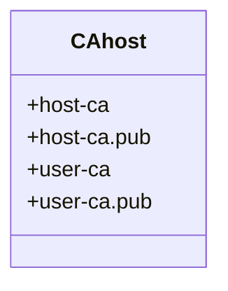

# SSH 证书校验

## 概述

### 非证书登入 VS 证书登入

- 非证书登入的缺点

  1. 密码登入繁琐，且不安全存在暴力破解的危险
  2. 密钥登入管理繁琐，服务器需存储客户机(员工)的公钥和指纹，这对多用户、多服务器的大型机构很不方便，如果员工离职，需要将它的公钥从每台服务器上删除。

- 证书登入

  证书登入就是解决上面的缺点而设计的。它引入一个证书颁发机构CA(Certificate Authority)，对信任的服务器颁发服务器证书，对信任的用户颁发证书。

  登入是，用户和服务器不需要提前知道彼此的公钥，只需要交换各自的证书，验证是否可信即可。

  证书登入的主要优点

  1. 用户和服务器不用交换公钥，这更容易管理，也具有更好的可扩展性。
  2. 证书可以设置到期时间，而公钥没有到期时间。针对不同的情况，可以设置有效期很短的证书，进一步提高安全性。

## 证书登入的流程

1. 生成证书（==证书唯一，这样就避免伪造的问题==）
   - 用户和服务器都将自己的公钥发送给CA
   - CA使用用户的公钥，生成证书，发送给用户
   - CA使用服务器的公钥，生成证书，发送给服务器
2. 用户登入服务器时，SSH自动将用户证书发送给服务器
3. 服务器检查用户证书是否有效，以及是否有CA颁发。证实以后就可以信任用户
4. SSH自动将服务器证书发送给用户
5. 用户检查服务器证书是否有效，以及是否有CA颁发。证实以后，就可以信任服务器。
6. 双发建立连接，服务器允许用户登入

## 生成CA密钥

证书登入的前提是，必须有一个CA，而CA本质上就是一对密钥，跟其他密钥没有不同，CA就用这对密钥去签发证书。

虽然 CA 可以用同一对密钥签发用户证书和服务器证书，==但是出于安全性和灵活性，最好用不同的密钥分别签发。==所以，CA 至少需要两对密钥，一对是签发用户证书的密钥，假设叫做`user_ca`，另一对是签发服务器证书的密钥，假设叫做`host_ca`。



生成密钥对不一定通过`ssh-keygen`同样的也可以通过`GPG`

1. 生成服务器签发证书密钥对

   ```
   ssh-keygen -t rsa -b 4096 -f ~/.ssh/host_ca -C host_ca
   ```

   - `-t`：rsa缺省值
   - `-b`：指定生成密钥的长度
   - `-f`：指定生成密钥的路径和名字，需要修改，否则默认为`id_rsa`
   - `-C`：生成commet

2. 生成用户签发密钥对

   ```
   ssh-keygen -t rsa -b 4096 -f ~/.ssh/user_ca -C user_ca
   ```

现在有四把密钥，分别对应签发服务器用户的密钥。同时服务器和用户的公钥需要上传到CA

> 注意这里使用`scp`命令来拷贝公钥，防止出现无法找到或无法执行文件的错误出现

## CA签发服务器证书

1. 上传服务器公钥到CA(192.168.80.143)

   ```
   root in ~/.ssh λ ssh-copy-id root@192.168.80.143
   ```

2. 生成服务器证书

   ```
   [root@ssh-server .ssh]# ssh-keygen -s "~/.ssh/host_ca" -I host_ca -h -n 192.168.80.200 -V +72w "~/.ssh/host_key.pub"
   Enter passphrase: 
Signed host key /root/.ssh/host_key-cert.pub: id "host_ca" serial 0 for 192.168.80.200 valid from 2020-12-29T13:15:00 to 2022-05-17T13:16:55
   ```
   
   - `-s`：指定签发证书的CA私钥
   - `-I`：指定key ID
   - `-h`：指定生成的证书是服务器证书，而不是用户证书
   - `-n`：指定证书用于的主机或域名
   - `-V`：指定有效期限
   - `host_key.pub`：指定服务器的公钥

会生成一个`host_key-cert.pub`文件，即服务器的证书

3. 查看生成的证书

   ```
   [root@ssh-server .ssh]# ssh-keygen -L -f host_key-cert.pub 
   host_key-cert.pub:
           Type: ssh-rsa-cert-v01@openssh.com host certificate
           Public key: RSA-CERT SHA256:13l7ndxFGBZk/shhFsAyxBI6dKEz5dEzFlIcpgrgALo
           Signing CA: RSA SHA256:gLc56ouH3TC2taKlNpAQnv5D0bj0tU2o1Kqffz7V/BQ
           Key ID: "host_ca"
           Serial: 0
           Valid: from 2020-12-29T13:15:00 to 2022-05-17T13:16:55
           Principals: 
                   192.168.80.200
           Critical Options: (none)
           Extensions: (none)
   ```

4. 为了安全，设置正确权限

   ```
   [root@ssh-server .ssh]# chmod 600 host_key-cert.pub
   ```

## CA签发用户证书

与签发服务器证书的过程相同，首先拷贝公钥到CA服务器

```
PS C:\Users\82341\.ssh> scp .\id_rsa.pub root@192.168.80.143:~/.ssh/user_key.pub
root@192.168.80.143's password:
id_rsa.pub                                                                            100%  564   323.5KB/s   00:00
```

签发证书

```
[root@ssh-server .ssh]# ssh-keygen -s user_ca -I user_ca -n 192.168.80.1 -V +1w user_key.pub
Enter passphrase: 
Signed user key user_key-cert.pub: id "user_ca" serial 0 for 192.168.80.1 valid from 2020-12-29T13:33:00 to 2021-01-05T13:34:34
```

查看证书

```
[root@ssh-server .ssh]# ssh-keygen -L -f user_key-cert.pub 
user_key-cert.pub:
        Type: ssh-rsa-cert-v01@openssh.com user certificate
        Public key: RSA-CERT SHA256:Os1lyg33jPv45H1yAlXf9jmNNJyDVPET2O3uHJST8ic
        Signing CA: RSA SHA256:9MR4ehsAqrIiabNl4Xxbev8NwlhGodJl4DT6rQoK0Hc
        Key ID: "user_ca"
        Serial: 0
        Valid: from 2020-12-29T13:33:00 to 2021-01-05T13:34:34
        Principals: 
                192.168.80.1
        Critical Options: (none)
        Extensions: 
                permit-X11-forwarding
                permit-agent-forwarding
                permit-port-forwarding
                permit-pty
                permit-user-rc
```

## 服务器安装证书

==为了让服务器和用户信任CA签发证书，还需要安装CA签发证书的公钥。==

### 安装服务器证书

1. 将生成的服务器证书拷贝到服务器

   ```
   [root@ssh-server .ssh]# scp host_key-cert.pub root@192.168.80.200:/etc/ssh
   The authenticity of host '192.168.80.200 (192.168.80.200)' can't be established.
   ECDSA key fingerprint is SHA256:PrhyiqAgi2qz/sy2rmpB/r21Rj3i3mQkJ8ZrlpI7pW8.
   ECDSA key fingerprint is MD5:cf:7e:83:5e:63:1e:95:c3:51:b6:45:c3:53:83:2f:df.
   Are you sure you want to continue connecting (yes/no)? yes
   Warning: Permanently added '192.168.80.200' (ECDSA) to the list of known hosts.
    __             _                   
   /   \/|_  _  __|_) _  |  o  _  _ __ 
   \__ / |_)(/_ | |  (/_ |  | (_ (_|| |
   
   root@192.168.80.200's password: 
   host_key-cert.pub                             100% 2192     2.5MB/s   00:00   
   ```

2. 持久配置`/etc/sshd_config`

   ```
   HostCertificate /etc/ssh/host_key-cert.pub
   ```

3. 重启sshd

   ```
   root in /etc/ssh λ systemctl restart ssh 
   ```

### 安装用户证书

1. 将用户公钥拷贝到服务器

   ```
   [root@ssh-server .ssh]# scp user_ca.pub root@192.168.80.200:/etc/ssh
    __             _                   
   /   \/|_  _  __|_) _  |  o  _  _ __ 
   \__ / |_)(/_ | |  (/_ |  | (_ (_|| |
   
   root@192.168.80.200's password: 
   user_ca.pub                                   100%  733   856.3KB/s   00:00    
   ```

2. 持久配置`etc/sshd_config`

   ```
   TrustedUserCAKeys /etc/ssh/user_ca.pub
   ```

3. 重启sshd


