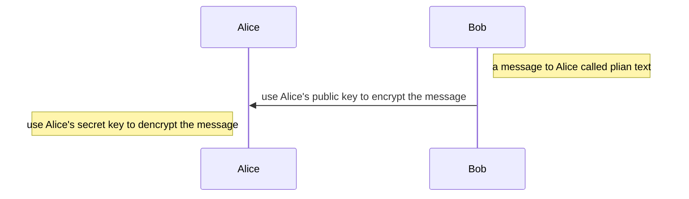
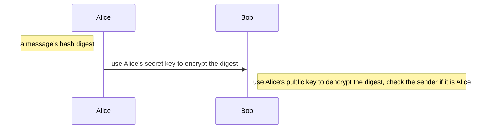

# Symmetric Encryption & Asymmetric Encryption

ref

https://www.keyfactor.com/resources/what-is-pki/

https://www.cryptomathic.com/news-events/blog/symmetric-key-encryption-why-where-and-how-its-used-in-banking

https://www.trentonsystems.com/blog/symmetric-vs-asymmetric-encryption

## Digest

在密码学中有 2 中常见的模式，对称加密和非对称加密根据不同的场景我们可以选择不同的加密模式和算法

## Symmetric Encryption

Symmetric Encryption 中文也叫对称加密，即加密密钥和解密密钥是相同的

主要过程如下：

 加密和解密用的密钥K (key) 是一串秘密的字符串（即比特串）。
明文通过加密算法 E  和加密密钥 K  变成密文：
$$
Y=E_k(X)
$$
接收端利用解密算法 D 运算和解密密钥 K 解出明文 X。解密算法是加密算法的逆运算。
$$
D_k(E_k(X))=X
$$

对称加密有一个问题，就是密钥需要通过什么方式传输或者和对端协商。如果一旦密钥被第 3 方拦截，那么就可以破解所有相关的信息，那么这个加密系统就是不可靠的

### Common algorithms

- AES (Advanced Encryption Standard)，如果需要使用对称加密通常使用 AES 因为比 DES 和 IDEA 更安全  
- DES (Data Encryption Standard)  
- IDEA (International Data Encryption Algorithm)  
- Blowfish (Drop-in replacement for DES or IDEA)  
- RC4 (Rivest Cipher 4)  
- RC5 (Rivest Cipher 5)  
- RC6 (Rivest Cipher 6)

## Asymmetric Encryption

Asymmetric Encryption 非对称加密，就能很好的解决对称加密的问题

首先非对称加密会生成 2 个不同的 cryptographic keys -- a private key ( 私钥 ) and a public key（公钥）

- 公钥是公开的信息，任何人都可以获取。通过公钥对明文加密

- 私钥是私有的信息，需要妥善保管( ==但是也可以在多台主机之间共享== )。通过私钥对使用公钥加密的内容解密

- 公钥都由私钥决定，但是不能根据公钥计算出私钥

主要过程如下：

假设 PKB 为 B 的公钥
假设 SKB 为 B 的私钥

发送者 A 用 B 的公钥 PKB 对明文 X 加密（E 运算）后，在接收者 B 用自己的私钥 SKB 解密（D 运算），即可恢复出明文：
$$
E_{PK_B}(X)= Y
$$

$$
D_{SK_B}(Y) = X
$$

$$
D_{SK_B}(E_{PK_B}) = X
$$

$$
E_{PK_B}(D_{SK_B}(X)) = X
$$

==如果某一信息用私有密钥加密，那么，它必须用公开密钥解密。这通常也被称为数字签名==

### Digital signature

数字签名必须保证以下 3 点

(1) 报文鉴别——接收者能够核实发送者对报文的签名（证明来源）
(2) 报文的完整性——发送者事后不能抵赖对报文的签名（防否认）
(3) 不可否认——接收者不能伪造对报文的签名（防伪造）

非对称加密可以完美实现上述的几点

- 因为除 A 外没有别人能具有 A 的私钥，所以除 A 外没有别人能产生这个密文。因此 B 相信报文 X 是 A 签名发送的。
- 若 A 要抵赖曾发送报文给 B，B 可将明文和对应的密文出示给第三者。第三者很容易用 A 的公钥去证实 A 确实发送 X 给 B。
- 反之，若 B 将 X 伪造成 X‘，则 B 不能在第三者前出示对应的密文。这样就证明了 B 伪造了报文。  

### Encrption vs Signature

加密：所有人都可以通过 Alice’s publick key 向 Alice 发送信息

==人们也可以使用secret key对plain text加密，但是这一般没有意义，等于持有对方publick key的都可以获知plain text，相同做宣告==

签名：Alice 使用Alice’s secret key 给出一段 hash digest，接受方使用 Alice’s public key 校验是不是 Alice 本人发出的

### Common algorithms

- Rivest Shamir Adleman (RSA) 
- Digital Signature Standard (DSS) 包含 DSA, 一般只用于签名
- Digital Signature Algorithm (DSA) 
- Elliptical Curve Cryptography (ECC) 比 RSA 更快更高效
- Diffie-Hellman exchange method

## Symmetric Encryption VS Asymmetric Encryption

- 安全角度

  对称加密和非对称加密加密算法如果需要暴力破解一般不现实。但是对称加密的密钥分发给对方这样就不安全，非对称加密不需要将解密的密钥分发给对方( ==但是公钥同样需要分发，这也是非对称加密的缺陷，在 PKI 中会被解决== )

- 加密与解密速度

  对称加密优于非对称加密

- 功能

  非对称加密支持签名和加密解密，但是对称加密只支持加密解密(其实逻辑上一样)