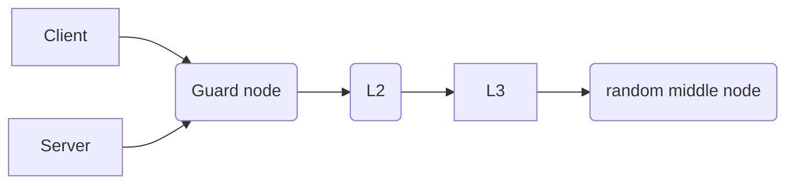

# tor 

参考:

https://medium.com/@phoebecross/using-tor-in-china-1b84349925da

https://program-think.blogspot.com/2020/08/Tor-Triple-Proxy.html

https://www.anquanke.com/post/id/194480

https://obfuscation.github.io/

http://666666666tjjjeweu5iikuj7hkpke5phvdylcless7g4dn6vma2xxcad.onion/?c=845951

tor 提供分布式网络服务器(relay as well as onion routers)。==tor默认只作为client，如果想要作为tor提供relay可以设置ORPort==

## terms

- .onion

  `.onion`是一个特殊的顶级域名也被叫做hidden service，只能通过tor的网络连接。

- circuit

  tor network

- exit node

  tor network的出口节点

- pluggable transports 

  在网络受限区域使用PT混淆流量

## 安装包

1. tor-browser 基于firefox图形化界面的捆绑包。只能对web代理。内置firefox可以清除浏览器指纹。
2. tor-cli 没有图形化界面，可以对web也可以代理本地软件。通过包管理器安装。

## tor-cli

tor-cli使用配置文件，可以由`--optionName optionvalue`来对配置文件中的参数==覆写==。默认使用`/etc/tor/torrc`作为全局配置文件，`$HOME/.torrc`作为用户配置文件。可以使用`-F`来制定其他的配置文件

### command-line options

- `--verify-cofig`

  校验配置文件是否正确

- `--quiet | --hush`

  使用quiet参数tor不会输出日志，使用`hush`参数tor只会输出错误和警告信息

- `--list-fingerprint`
- `--service install [--options <cli> <options>]`

- `--service remove | start | stop`

- `--keygen [--newpass]`

  为relay生成identity key，或是签名秘钥

## configuration directives

配置文件一行为一个选项，可以通过`%include`导入额外的配置文件，文件路径支持wildcards。可以通过`+`prefix对参数append，例如`SocksPort 9100`会替代默认的9050端口，但是可以通过`+SocksPort 9050`来添加额外的端口，如果想要清空一个参数可以添加`\`prefix

### general option

- AvoidDiskWirtes 0 | 1

  减少对磁盘IO写操作，在RAM比较小的机器上是否有用

- BandwidthRate N | RelayBandwidthRate

  tor最大比特率，relay的最大比特率

- CachDiretory DIR | DataDirectory 

  cache存储的位置，如果没有设定默认使用DataDirectory(tor存放的数据，默认`~/.tor`)

- DataDirectoryGroupReadable 0 | 1

  是否允许filesystem group读取数据

- `Connlimit <NUM>`

  tor启动是会尽可能的向OS获取多的fd，可以通过该参数指定tor能使用的最大fd，可以通过`ulimit -n`来查看。如果系统的值小于Connlimit，tor无法启动

- ConstrainedSockets 0 | 1

  限制sockets的buffers size，如果出现`Error creating network socket: No buffer space available`的错误，可以通过设置该参数来解决。也可以通过设置内核的net.ipv4.tcp_mem的值。最好不要使用该参数，除非出现问题。另外查看ConstrainedSockSize

- CountPrivateBandwidth 0 | 1

  对私有地址和远程地址进行限速

- DisableAllswap 0 | 1

  锁定swap

> tor会优先经过代理在连接网桥

- `HTTPProxy <host[:port]>`

  tor的SSL请求都进过http代理，如果服务器开启权鉴需要指定HTTPProxyAuthenticator。同理HTTPSProxy

- `Socks5Proxy <host:[port]>`

  tor的SSL请求都经过socks代理

- TCPProxy protocal host:port

  使用指定协议的代理tor的SSL请求

- `KeepalivePeriod <NUM>`

  保持firewalls的连接，每秒发送的keepalive，默认5min

- Log [minServerity] {[stderr | stdout | syslog] | [file]} 

  tor日志输出，等级包括debug,info,notice,warn,err。可以指定日志存储位置

- `SyslogIdentityTag <tag>`

  当tor日志添加进syslog中时会带有tag

- `OutboundBindAddress <IP>`

  让本地的出口地址都是指定IP，当有多张NIC时可以使用

- `OutboundBindAddressOR <IP>`

  让relay和指定IP连接作为原IP

- ==RephistTrackTime N seconds|minutes|hours|days|weeks==

  告诉权威或其他节点，节点信息在指定时间内没有变更可以丢弃。默认24h

- ==RunAsDaemon 0|1==

  是否以守护进程的方式运行tor

- ==SafeLogging 0|1|relay==

  是否屏蔽日志敏感信息，默认1

- User

  tor启动时使用的用户

- ClientTransportPlugin transport socks4|socks5 IP:PORT

  CilentTransportPlugin tarnsport exec path-to-binary

  ==连接网桥时使用的代理==

  ```
  ClientTransportPlugin meek_lite,obfs2,obfs3,obfs4,scramblesuit exec ./TorBrowser/Tor/PluggableTransports/obfs4proxy
  ```

  ==transport 通常为meek或obfs4==

### cilent options

只能在客户端上设置的参数，不能出现在relay中。circuit(网络链路)，padding(额外的流量)

- ConnectionPadding 0|1|auto

  是否防御流量分析

- ReducedConnectionPadding 0 | 1

  SSL连接是否长连接

- CircuitPadding 0 | 1

  tor是否对circuit添加额外的traffic，当主机bandwidth比较贵可以使用该参数

- ReduceCircutPadding 0 | 1

  是否使用低开销的算法对流量修改

- ==ClientDnsRejectInternalAddress 0 | 1==

  是否信任内网的DNS服务器，默认1

- ClinetOnly 0 | 1

  只作为Client，不会作为relay默认0

- ==ClientRejectInternalAddress 0 | 1==

  是否代理内网到内网的请求，默认

- ClientUseIPv4 | ClientUseIPv6

  以何种形式连接到servers或entry nodes，两个选项不兼容0 | 1

- DNSPort [address:]port 

  指定tor使用的dns服务器

- EnforceDistincSubnets 0 | 1

  tor是否允许circuit中出现同一网段的IP，默认1

- FascistFirewall 0 | 1

  如果为1，tor默认只允许80和443作为目的端口(可以通过ReachableAddress修改)，但是不允许当前主机作为服务器

- `ReachableAddresses IP[/mask][:port]...`

  只有FascistFirewall启用是才生效，表示允许连接的端口

  ```
  #means that your firewall allows connections to #everything inside net 99, rejects port 80 #connections to net 18, and accepts connections to #port 80 otherwise
  ReachableAddresses 99.0.0.0/8, reject 18.0.0.0/8:80, accept *:80
  ```

  默认`accept *:*`

- ReachableDirAddresses | ReachableORAddresses

- HTTPTunnelPort [address:]port|auto

  使用HTTP代理客户端的请求

- `LongLivePorts <ports>`

  服务器上长连接的端口，默认没有80和443

- `MapAddress <address newaddress>`

  访问address，tor的出口地址为newaddress，支持wildcards。类似于静态路由

- NATDPort [address:]port | auto

  指定natd服务的地址

- NewCircuitPeriod NUM

  多长时间重新生成一条新的circuit

- SafeSocks 0|1

  是否允许使用不安全的socks，默认0

- WarnPlaintextPorts ports...

  向ports当发送明文密码时，tor会警告，默认23，109，110，143

- RejectPlaintextPorts ports...

  向ports当发送明文密码时，tor拒绝连接

- SocksPolicy policy...

  决定谁能连接到socksport和dnsport

  ```
  SOCKSPolicy accept 192.168.0.0/16
  SOCKSPolicy accept6 FC00::/7
  SOCKSPolicy reject *
  ```

- ==SocksPort [address:]port  [flags] [isolation flags]==

  socks监听的端口，默认9050端口。默认使用IsolateClientAddr，不会将circuits分享给其他地址。==具体isolation flags和flags查看manual page==。flags从左到右执行，如果出现冲突使用最后一个参数。

- TarckHostExits host,.domain,...

  连接host或.domain(裸域和根域)使用上一次使用的exit node

- UseBriges 0 | 1

  是否使用网桥，并且将网桥作为entry guards 和 direcotry gurads。==当本地网络被禁止连接到tor时可以使用该参数配合Bridge==

- ==Bridge [transport] IP:ORPort [fingerprint]==

  使用指定的relay作为bridge，连接cilent和tor network

  ```
  Bridge obfs4 88.193.235.54:52313 13499A6677D38C132DB84A5BCC841A61210B2491 cert=0TC1Ul9jW1nCALKm5pKYcrrKoZm/ttDvbMsf0qJ9SyhhHSlXwpbrJUeFYiHAtjptMRpAXw iat-mode=0
  ```

- UseEntryGuards 0|1

  是否使用long-term entry servers

- VirtualAddrNetworkIPv4 IPv4Address/bits

  tor可以分配的网段，例如使用MapAddress

### ciruit timeout options

- CircuitsAvailableTimeout num

  circuit存活的时间

- CircuitBuildTimeout num

  构建circuit的有效时间，默认60s

- CircuitsStreamTimeout num

  放弃一个circuit，使用另外一个circuit。==当网络非常慢的时候可以设置该值为60==

- SocksTimeout num

  socks超时时间，默认2min

### dormant mode options

tor的冬眠模式，不会自动构建circuits和拿去服务器信息，可以减少耗电和网络带宽

- DormantCanceledByStartup 0 | 1

  当tor以active mode退出时，下次使用tor还是会以active mode启动；如果以dormant mode退出，下次使用tor会以dormant mode启动。可以使用该参数强制以active mode启动tor

- DormantOnFirstStartup 0 |1

  以dormant mode启动tor，知道用户使用tor请求才会进入active mode，默认0

- DormantClientTimeout N minutes|hours|days|weeks

  多长时间后进入dormant mode默认24h

### node selection options

修改tor client或是tor service匿名性。推荐使用黑名单的方式。tor 网络模型：



Guard node是first hop的节点，L2和L3分别对应HSLayer2Nodes和HSLayer3Nodes

- ==EntryNodes node...==

  在normal circuits中使用的first hop，node由identitiy fingerprints 或country codes(必须在curly braces中，例如`{cn}`使用ISO3166 codes)组成。如果使用了bridge，bridge作为first hop。ExcludeNodes会覆写该参数。==tor会从GeoIPfile中查看contry codes，默认`/usr/share/tor`==

- ==ExcludeNodes node...==

  在构建circuit时避免使用的node。例如避免不安全节点

  ```
  ExcludeNodes  {cn},{hk},{mo}
  ```

- ExcludeExitNodes node...

  不被作为exit node的node

- ExitNodes node...

  作为exit node的node。如果在ExludeExitNodes列出太多节点或是在ExitNodes中列出太少节点，会导致不能正常使用web(exit node可能不具备访问80和433的能力)

- GeoIPExcludeUnkown 0 | 1 | auto

  值为auto时如果country code不可识别时在ExcludeNodes和ExcludeExitNodes中保留，如果为1排除不可识别country code

- HSLayer2Nodes node...

  作为secode hop的nodes，可以防止中间node出现问题。同理的还有HSLayer3Nodes

- ==StrictNodes 0 | 1==

  0表示如果tor需要执行relay reachablility self-test必须使用excluded nodes时, tor还是会使用这个节点。如果为1就强制不使用excluded node

### server options

- ORPort

## 连接

### tor-browser

使用socks代理的同时，最好使用`https://bridges.torproject.org/`根据代理IP获取bridge作为连接，而不是使用`meek-azure`，说实话azure的CDN在国内并不快。可以通过`https://check.torproject.org/`来校验是否连接tor network

### tor-cli

https://tor.stackexchange.com/questions/14469/where-can-i-find-meek-servers

https://tor.stackexchange.com/questions/14170/in-china-meek-azure-and-meek-amazon-can-not-be-used-the-following-is-the-log

可以参考`/sharing/apps/tor-browser_en-US/Browser/TorBrowser/Data/Tor/torrc`配置。==目前还有运行成功==

```
User tor
SOCKSPort 9050
Log notice file /tmp/tor-notices.log
DataDirectory /var/lib/tor
RunAsDaemon 1
#ExcludeNodes {cn},{hk},{mo}
#StrictNodes 1

#可以使用本地代理，也可以使用meek-azure来连接tor。或者同时使用，双重代理
UseBridges 1
ClientTransportPlugin meek exec /sharing/apps/tor-browser_en-US/Browser/TorBrowser/Tor/PluggableTransports/obfs4proxy
Bridge meek 0.0.2.0:2 url=https://meek.azureedge.net/ front=ajax.aspnetcdn.com

Socks5Proxy 127.0.0.1:1089
```

the bridge addrss can be anything expect for `0.0.0.*`or port 0 because those are used internally by tor. url says where you traffic is really going to a bridge, usually a CDN. The last part font is the fake domain that you use. 

