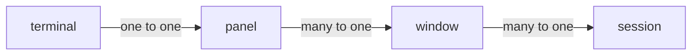

# Tmux Overview

## Overview

> **tmux** is a terminal multiplexer: it enables a number of terminals to be created, accessed, and controlled from a single screen. 
>
> When  **tmux**  is  started,  it creates a new **session** with a single **window** and displays it on screen.  A status line at the bottom of the screen shows information on the current session and is used to enter interactive commands.

tmux 可以让一个 screen 显示多个 ternimals 的工具

## Components

Tmux 中主要有几个组件

1. terminal
2. panel
3. window
4. session

$$
terminal \in panel \in window \in session
$$

对应的逻辑关系如下

- terminal 几乎等价与 panel，panel 有 panel border
- 一个 window 内可以有多个不同的 panel
- 一个 session 内可以有多个不同的 window

| Term           | Description                                                  |
| -------------- | ------------------------------------------------------------ |
| Client         | Attaches a tmux session from an outside terminal such as *xterm(1)* |
| Session        | Groups one or more windows together                          |
| Window         | Groups one or more panes together, linked to one or more sessions |
| Pane           | Contains a terminal and running program, appears in one window |
| Active pane    | The pane in the current window where typing is sent; one per window |
| Current window | The window in the attached session where typing is sent; one per session |
| Last window    | The previous current window                                  |
| Session name   | The name of a session, defaults to a number starting from zero |
| Window list    | The list of windows in a session in order by number          |
| Window name    | The name of a window, defaults to the name of the running program in the active pane |
| Window index   | The number of a window in a session's window list            |
| Window layout  | The size and position of the panes in a window               |

## Status line

当启动 Tmux 后会显示一条 status line

上图表示

- 启动了一个 session 0
- session 0 中包含 3 个 window

## Trouble shooting

- ['tmux-256color': unknown terminal type.](https://unix.stackexchange.com/questions/1045/getting-256-colors-to-work-in-tmux)

**references**

[^1]: https://github.com/tmux/tmux/wiki/Getting-Started#sessions-windows-and-panes

