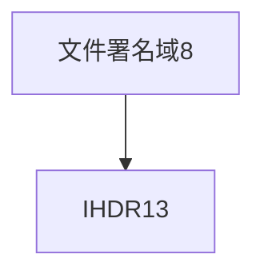

# PNG 文件格式

参考：

https://blog.mythsman.com/post/5d2d62b4a2005d74040ef7eb/

https://3gstudent.github.io/3gstudent.github.io/%E9%9A%90%E5%86%99%E6%8A%80%E5%B7%A7-%E5%88%A9%E7%94%A8PNG%E6%96%87%E4%BB%B6%E6%A0%BC%E5%BC%8F%E9%9A%90%E8%97%8FPayload/

https://blog.csdn.net/satanzw/article/details/38757121?utm_term=png%E4%BA%8C%E8%BF%9B%E5%88%B6%E6%A0%BC%E5%BC%8F&utm_medium=distribute.pc_aggpage_search_result.none-task-blog-2~all~sobaiduweb~default-0-38757121&spm=3001.4430

PNG图片由==文件署名和数据块==组成

## 文件署名域

8字节的PNG文件署名域用来识别该文件是不是PNG文件。该域的值是：

| 十进制数 | 十六进制数 |
| -------- | ---------- |
| 137      | 89         |
| 80       | 50         |
| 78       | 4e         |
| 71       | 47         |
| 13       | 0d         |
| 10       | 0a         |
| 26       | 1a         |
| 10       | 0a         |

## 数据块

有两种数据块，一种是==关键数据块(critical chunk)==，必须要有；另一种叫做==辅助数据块(ancillary chunks)。==

每个数据块都由下表所示的4个域组成

| 名称                          | 字节数   | 说明                                                   |
| ----------------------------- | -------- | ------------------------------------------------------ |
| Length(长度)                  | 4字节    | 指定数据块中数据域的长度，其长度不超过$(2^{31}-1)$字节 |
| Chunk Type Code(数据块类型码) | 4字节    | 数据块类型码由ASCII字母(A-Z和a-z)组成                  |
| Chunk Data(数据块实际内容)    | 可变长度 | 存储按照Chunk Type Code指定的数据                      |
| CRC(循环冗余检测)             | 4字节    | 存储用来检测是否有错误的循环冗余码                     |

其中CRC(cyclic redundancy check)域中的值是对Chunk Type Code域和Chunk Data域中的数据进行计算得到的，可以看做一种校验码。

### 关键数据块

关键数据块中又分为4种标准数据块

#### 文件头数据块IHDR(header chunk)

它包含有PNG文件中存储的图像数据的基本信息，并要作为第一个数据块出现在PNG数据流中，而且一个PNG数据流中只能有一个IHDR。

文件头数据块的Chunk Data有13字节，组成结构如下：

| 域的名称           | 字节数  | 说明                                                         |
| ------------------ | ------- | ------------------------------------------------------------ |
| Width              | 4 bytes | 图像宽度，以像素为单位                                       |
| Height             | 4 bytes | 图像高度，以像素为单位                                       |
| Bit depth          | 1 byte  | 图像深度：索引彩色图像：1，2，4或8 ;灰度图像：1，2，4，8或16 ;真彩色图像：8或16 |
| ColorType          | 1 byte  | 颜色类型：0：灰度图像, 1，2，4，8或16;2：真彩色图像，8或16;3：索引彩色图像，1，2，4或84：带α通道数据的灰度图像，8或16;6：带α通道数据的真彩色图像，8或16 |
| Compression method | 1 byte  | 压缩方法(LZ77派生算法)                                       |
| Filter method      | 1 byte  | 滤波器方法                                                   |
| Interlace method   | 1 byte  | 隔行扫描方法：0：非隔行扫描;1： Adam7(由Adam M. Costello开发的7遍隔行扫描方法) |

