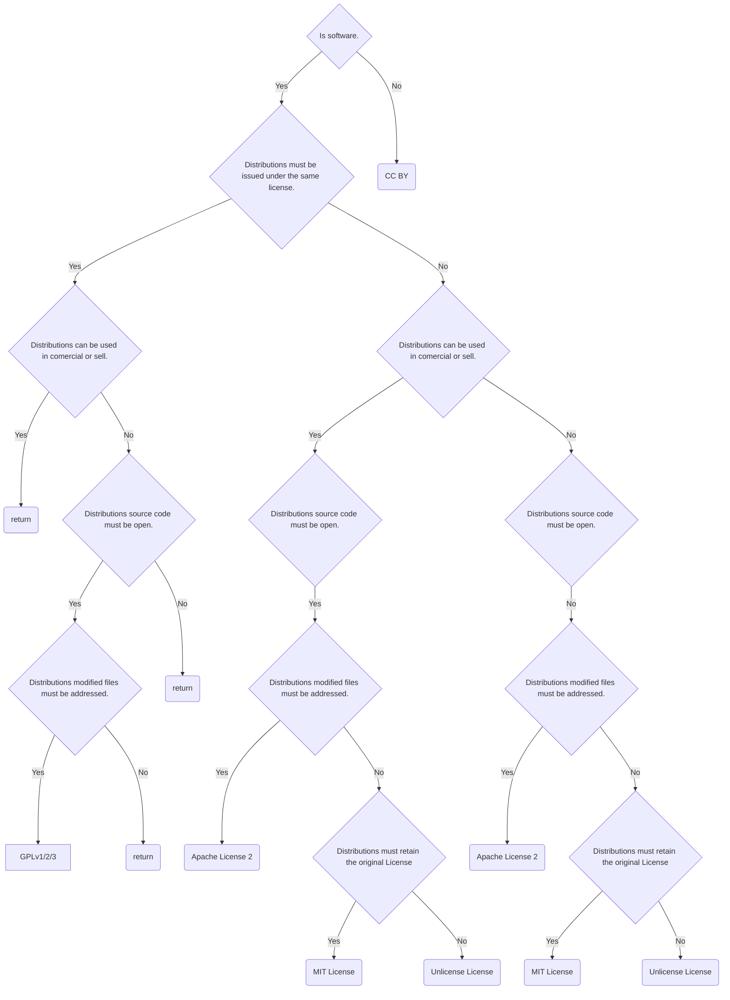

# How to Choose Licenses

## 0x01 Preface

创建过 Github repository 的同学一定会注意到 Choose a license 这一选项

你可能会一头雾水，license 是什么？ 但是出现在 repository 初始化的过程中，那么显然这是一个非常重要的选项。那么什么是 license 呢？ 我们为什么要选择使用 license 呢？ 

## 0x02 The Origination of License

在介绍 license 前就必须先了解 license 出现的背景

传统的 Property [^1]是一种物理意义上的财产，例如你购买的房子、汽车、股票等等。而 Intellectual Property(abbrv IP)，中文也被称为知识产权，是一种逻辑意义上的财产(人的智力成果)，例如 patent(专利)，copyright(版权)，trademark(商标) 等等。相对应的由知识产权法为其提供法律保障，也可以说知识产权法限制了使用者(recipient)对 IP 的权限

在 1980s United State 将软件视为文学作品，划分到了 copyright 的范围内。所以相对应的软件也受知识产权法以及版权法的保护。这也导致了软件开发者的内部分裂

- 一部分倾向于通过知识产权法和版权法以限制使用者对软件的自由使用(包括修改，分享等等)。这种软件也被称为 Proprietary Software[^3](Proprietary Software 可以是开源的，且不一定是收费的，不要和 Commercial Software 以及 Business Software 混淆)
- 一部分倾向于通过知识产权法和版权法以授予使用者对软件的自由使用(包括修改，分享等等)。这种软件也被称为 Free Software[^7]

> 引用自 GPLv3 中的定义[^16]
> 
> There are four freedoms that every user should have:
> 
> 1. the freedom to use the software for any purpose,
> 
> 2. the freedom to change the software to suit your needs,
> 
> 3. the freedom to share the software with your friends and neighbors, and
> 
> 4. the freedom to share the changes you make.
> 
> When a program offers users all of these freedoms, we call it free software.

这也间接或直接的导致了 Proprietary Software 的大规模出现 ，这引起了诸如 Richard Stallman[^4] 等一众大佬的不满。所以 Stallman 在 1983 年发起了 GNU Project[^5] 为了给软件使用者可以自由使用以及分享学习软件的权力(大名鼎鼎的 Linux 正是 GNU 在中的一个项目，所以也被称为 GNU/Linux)，后在 1985 年成立了 Free Software Foundation(FSF)[^6] 以支持 GUN Project

### 0x02a GPLv1

Stallman 为 GUN Project 中所有的软件定下了一个规则，这个规则被称为 GUN Project Public Lisence(GPLv1)[^8]。也是最早出现的 License(只针对 software 这一领域)

主要内容如下，具体请看 FSF GPLv1

0. This License Agreement applies to any program or other work which contains a notice placed by the copyright holder saying it may be distributed under the terms of this General Public License.  The "Program", below, refers to any such program or work, and a "work based on the Program" means either the Program or any work containing the Program or a portion of it, either verbatim or with modifications.  Each licensee is addressed as "you".
	
	适用于所有使用 GPLv1 的应用或者是作品。Program 代表使用了 GPLv1 的软件，You 代表每个 licensee(许可人即使用者)
	
1. You may copy and distribute verbatim copies of the Program's source code as you receive it, in any medium, provided that you conspicuously and appropriately publish on each copy an appropriate copyright notice and disclaimer of warranty; keep intact all the notices that refer to this General Public License and to the absence of any warranty; and give any other recipients of the Program a copy of this General Public License along with the Program. You may charge a fee for the physical act of transferring a copy.
	
	使用者可以通过任何介质拷贝或者分享源码，但是需要显式地标识版权以及免责声明。如果分享给其他使用者，需要保证 GPLv1 一并给其他使用者。你也可以针对 physical act of transferring a copy(例如从 Github 上 mihomo 的源码拷贝到 flash driver 中)收取费用
	
2. You may modify your copy or copies of the Program or any portion of it, and copy and distribute such modifications under the terms of Paragraph 1 above, provided that you also do the following:
	
	使用者可以对程序做出修改。在拷贝或者分享了修改后的程序时，需要遵守第一条条款，以及如下几条规则
	
	-  a) cause the modified files to carry prominent notices stating that you changed the files and the date of any change; and
		
		显著的标识修改的文件以及修改的日期
		
	-  b) cause the whole of any work that you distribute or publish, that in whole or in part contains the Program or any part thereof, either with or without modifications, to be licensed at no charge to all third parties under the terms of this General Public License (except that you may choose to grant warranty protection to some or all third parties, at your option).
		
		你分享的程序，无论是否有修改，都免费授权给第三方(除非你自己选择为此担保)
		
	-  c) If the modified program normally reads commands interactively when run, you must cause it, when started running for such interactive use in the simplest and most usual way, to print or display an announcement including an appropriate copyright notice and a notice that there is no warranty (or else, saying that you provide a warranty) and that users may redistribute the program under these conditions, and telling the user how to view a copy of this General Public License.
		
		如果修改的程序是一个交互式运行的，需要打印一个版权声明，以及不提供担保的声明，且告诉用户该如何查看 GPLv1
		
	 -  d) You may charge a fee for the physical act of transferring a copy, and you may at your option offer warranty protection in exchange for a fee.
		
		 你可以对修改后的程序收取 physical act of transferring a copy 费用，也可以为程序提供担保以收取费用
	
3. You may copy and distribute the Program (or a portion or derivative of it, under Paragraph 2) in object code or executable form under the terms of Paragraphs 1 and 2 above provided that you also do one of the following:
	
	使用者也可以通过二进制可执行的方式分享修改过的程序，但是需要满足如下条件之一
	
	 - a) accompany it with the complete corresponding machine-readable source code, which must be distributed under the terms of Paragraphs 1 and 2 above; or,
		 随附源码。且要遵守第一条和第二条条款
		
	 - b) accompany it with a written offer, valid for at least three years, to give any third party free (except for a nominal charge for the cost of distribution) a complete machine-readable copy of the corresponding source code, to be distributed under the terms of Paragraphs 1 and 2 above; or,
		随附一份 3 年有效期的声明，并向任何第三方提供一份源码。且要遵守第一条和第二条条款
		
	- c) accompany it with the information you received as to where the corresponding source code may be obtained.  (This alternative is allowed only for noncommercial distrib
		
		随附可以从何处获取源码(只允许非商业)
	
4. You may not copy, modify, sublicense, distribute or transfer the Program except as expressly provided under this General Public License. Any attempt otherwise to copy, modify, sublicense, distribute or transfer the Program is void, and will automatically terminate your rights to use the Program under this License.  However, parties who have received copies, or rights to use copies, from you under this General Public License will not have their licenses terminated so long as such parties remain in full compliance.
	
	只能通过本 License 规定的方式 拷贝，修改，转授权，分发或转让程序
	
5. By copying, distributing or modifying the Program (or any work based on the Program) you indicate your acceptance of this license to do so, and all its terms and conditions.
	
	只要 拷贝，分发或者修改程序，就默认你接受本 License
	
6. Each time you redistribute the Program (or any work based on the Program), the recipient automatically receives a license from the original licensor to copy, distribute or modify the Program subject to these terms and conditions.  You may not impose any further restrictions on the recipients' exercise of the rights granted herein.
	
	每次再分发程序时，会从原始程序接受本 License(即修改后的程序 License 必须是 GPLv1)，你不能附加额外的限制
	
7. The Free Software Foundation may publish revised and/or new versions of the General Public License from time to time.  Such new versions will be similar in spirit to the present version, but may differ in detail to address new problems or concerns.
	
	FSF 可以修改或者发布新的 GPL
	
8. If you wish to incorporate parts of the Program into other free programs whose distribution conditions are different, write to the author to ask for permission.  For software which is copyrighted by the Free Software Foundation, write to the Free Software Foundation; we sometimes make exceptions for this.  Our decision will be guided by the two goals of preserving the free status of all derivatives of our free software and of promoting the sharing and reuse of software generally.
	
	如果要和其他不同 License 的软件一起使用本软件，需要向作者请示
	

*简单的理解 GPLv1 要求软件必须开源，并且免费，允许使用者修改以及再分发。分发的软件必须使用 GPLv1 License，所以也必须开源，免费，允许使者修改以及在分发*

## 0x03 Open Source

但是也有人认为 Stallman 对 free software 的看法过激了，过于强调软件的自由了(Linus 本人也认为 FSF 过激，不过是对 GPLv3 的看法)。为此 Eric Raymond 等一众大佬，从权衡自由和商业目的出发创造了 Open Source software[^10] 这一词以反对 Free Software 

### 0x03a Open Source Definition

Open Source 的定义最早起源自 Debian Free Software Guidlines。经过时间的洗礼，一共有十条准则[^13]被沉淀下来，也被称为 OSD

1. Free Redistribution
	
	The license shall not restrict any party from selling or giving away the software as a component of an aggregate software distribution containing programs from several different sources. The license shall not require a royalty or other fee for such sale.
	
	License 规定软件可以自由的分发销售，同时 License 要求针对这种销售的行为不收取任何费用
	
2. Source Code
	
	The program must include source code, and must allow distribution in source code as well as compiled form. Where some form of a product is not distributed with source code, there must be a well-publicized means of obtaining the source code for no more than a reasonable reproduction cost, preferably downloading via the Internet without charge. The source code must be the preferred form in which a programmer would modify the program. Deliberately obfuscated source code is not allowed. Intermediate forms such as the output of a preprocessor or translator are not allowed.
	
	程序的分发必须要包含源码，且允许衍生作品以编译后的形式分发(衍生作品可以不需要包含源码)。如果程序的分发没有包含源码，必须要提供可以获取源码的地址。程序必须通过源码修改，不能混淆代码
	
3. Derived Works
	
	The license must allow modifications and derived works, and must allow them to be distributed under the same terms as the license of the original software.
	
	License 必须允许修改和衍生的作品，且允许按照原程序的 License 进行分发
	
4. Integrity of The Author’s Source Code
	
	The license may restrict source-code from being distributed in modified form only if the license allows the distribution of “patch files” with the source code for the purpose of modifying the program at build time. The license must explicitly permit distribution of software built from modified source code. The license may require derived works to carry a different name or version number from the original software.
	
	License 可以限制如果要再分发，必须要附带补丁的源码。License 必须要允许可以使用修改后的源码进行分发。License 可以要求衍生作品不能和原程序使用相同的名字和版本
	
5. No Discrimination Against Persons or Groups
	
	The license must not discriminate against any person or group of persons.
	
	License 不能歧视任何群体
	
6. No Discrimination Against Fields of Endeavor
	
	The license must not restrict anyone from making use of the program in a specific field of endeavor. For example, it may not restrict the program from being used in a business, or from being used for genetic research.
	
	License 不得歧视任何领域
	
7. Distribution of License
	
	The rights attached to the program must apply to all to whom the program is redistributed without the need for execution of an additional license by those parties.
	
	License 所赋予的权力不能有额外的 License 所限制
	
8. License Must Not Be Specific to a Product
	
	The rights attached to the program must not depend on the program’s being part of a particular software distribution. If the program is extracted from that distribution and used or distributed within the terms of the program’s license, all parties to whom the program is redistributed should have the same rights as those that are granted in conjunction with the original software distribution.
	
	赋予程序的权力不依赖程序的任何一个分发。如果程序是从一个分发中的提取并使用的或者使用了分发的 License，程序有所有原 License 所赋予的权力
	
9. License Must Not Restrict Other Software
	
	The license must not place restrictions on other software that is distributed along with the licensed software. For example, the license must not insist that all other programs distributed on the same medium must be open source software.
	
	License 不能对其他使用了相同的 License 的程序做限制。例如，如果程序是 open source 的，License 不能要求其他程序是 open source 的
	
10. License Must Be Technology-Neutral
	
	No provision of the license may be predicated on any individual technology or style of interface.
	
	License 不能要求使用特定的技术或者风格
	

只要符合 OSD 准则的软件就被视为 Open Source Software。简单的说具备 Open source 的软件不仅仅要公开源码，还需要允许使用者修改代码以及再分发，且允许在分发的程序不必公开源码，包括商业使用(意味着允许收费)

所有满足 OSD 标准的 License 都记录在 [OSI](https://opensource.org/licenses)，常见的 License 有(具体可以选中 POPULAR/STRONG COMMUNITY 过滤)

- Appache 2.0
- GPLv1
- GPLv2
- GPLv3
- MIT
- Unlicense

你可能很奇怪为什么 GPLv1 也被 OSI 认为是满足 OSD 的 License？ Open Source 不是为了反对 FSF 过激的理念而出现的吗？ GPLv1 不是要求分发的软件必须使用 GPLv1 吗？

但你仔细对比 OSD 中第三条款和 GPLv1 中第六条款

OSD 3th clause

> The license must allow modifications and derived works, and must allow them to be distributed under the same terms as the license of the original software.

GPLv1 6th clause

> Each time you redistribute the Program (or any work based on the Program), the recipient automatically receives a license from the original licensor to copy, distribute or modify the Program subject to these terms and conditions.  You may not impose any further restrictions on the recipients' exercise of the rights granted herein.

你就会发现 OSD 中是 must allow。所以再分发的程序，可以不使用原来的 License，也可以使用原来的 License，所以 GPLv1 完全满足

## 0x04 What is License

好了在了解了 License 的起源以及 Open Source 后，显然可以得出 License 的定义

*License 就是赋予使用者在知识产权法下权力的条款*

## 0x05 Copyright VS Copyleft

在介绍了这么多内容后，你当然也有必要知道 copyright 和 copyleft 是什么，因为这也涉及到 License 的类型

> A copyright is a type of intellectual property that gives its owner the exclusive legal right to copy, distribute, adapt, display, and perform a creative work, usually for a limited time.

copyright 就是一种权力，他授予了作者对自己创作的作品(例如 小说，音乐，软件，艺术作品)有 copy, distribute, adapt, display 以及 perform 的权力。相应的使用者受 copyright 的限制

>  We call this copyleft: the software is copyrighted, but instead of using those rights to restrict users like proprietary software does, we use them to ensure that every user has freedom.[^16]

copyright 限制了使用者对软件的使用，而 copyleft 是为了确保使用者对软件自由使用的权限

## 0x06 Types of License

虽然 Free Software 和 Open Source Software 有区别，但是 2 者的目标均是为 Free and Open Source Software(FOSS)[^10] 提供支持，而 OSD 定义包含了 Free Software 想要表达的含义。所以两者的 License 被统称为 Open Source License，也是最常见的 software License。但是 License 不仅限于 software 领域，也包含非软件领域。例如一些文档项目([system-design-primer](https://github.com/donnemartin/system-design-primer),[build-your-own-x](https://github.com/codecrafters-io/build-your-own-x)) 的 cc License

所以将 License 分为 2 类以方便记忆

1. Software License
2. Non-Software License

### 0x06a Software License

Software License 又可以按照是否满足 OSD 分为 2 类

1. Open Source License
2. Custom License

#### Open Source License

根据 OSD 第二条款和第三条款中定义的，根据是否要求分发程序开源以及使用原程序 License 可以分为 2 类 

1. Copyleft License[^15]

2. Permissive License

##### Copyleft License

要求分发程序必须开源以及使用和原程序相同的 License

常见的 License 有

1. GPLv1 (GUN Gernel Public License Version 1)
2. GPLv2 (GUN Gernel Public License Version 2)
3. GPLv3 (GUN Gernel Public License Version 3)
4. LGPL (GUN Lesser Gernel Public License)
5. AGPL (Affero Generl Public License)
6. EPL (Eclipse Public License)

##### Permissive License

分发的程序无需开源也无需使用和原程序相同的 License

常见的 License 有

1. MIT License
2. Apache License 2.0
3. BSD License
4. ISC License
5. MIT-0 License
6. Unlicense
7. Microsoft Public License

#### Custom License

既然有这些 "Predefined Licenses"，那就肯定会有其他大佬不满足这些预设的 License

例如 [Postgresql](https://github.com/postgres/postgres?tab=License-1-ov-file) 就使用了 PostgreSQL Global Development Group 和 The Regents of the University of California 定义的 License

也是因为 Postgresql 允许商用以及不开源，也有了这些垃圾国产数据库

### 0x06b Non-software License

最常见的就是 [Creative Commons License](https://creativecommons.org/share-your-work/cclicenses/)

#### Creative Commons License

Creative Commons License 可以针对所有 copyright 范围内的作品包括程序，但是程序一般选择使用 Software License 内容更细分

常见的 License 有，可以参考 [About CC Licenses - Creative Commons](https://creativecommons.org/share-your-work/cclicenses/)

1. CC BY 4.0
2. CC BY-SA
3. CC BY-NC
4. CC BY-NC-SA
5. CC BY-ND
6. CC BY-NC-ND
7. CC0

## 0x06 Common Used License And Brief

### 0x06a GPLv2

[GPLv2](https://www.gnu.org/licenses/old-licenses/gpl-2.0.html) 是 Copyleft License， 大体逻辑上和 GPLv1 相同，但是对一些条款在细节上进行了补全

列举几点

1. GPLv2 明确了 License 涵盖的范围为 copying，distribution，modification 这类动作。例如运行程序不在涵盖范围内，除非程序基于运行的结果(clause 0)
2. GPLv2 明确了可以为程序提供担保以获取费用(clause 1)
3. GPLv2 补充了针对使用第三方源码的情况，要求使用到的第三方源码也要强制开源(clause 3)
4. GPLv2 明确了不接受 License 的情况(clause 5)
5. GPLv2 补充了 court judgment 中如果指控和 License 中规定的情况相反，法官也不能免除你不遵守 License 中的规定(clause 7)
6. GPLV2 补充了某些程序只在特定地理国家使用的情况，应该需要声明(clause 8) 

#### Brief

*软件必须开源，并且免费，允许使用者修改、复制以及再分发。分发的软件必须使用 GPLv2 License，所以也必须开源，免费，允许使者修改以及在分发*

### 0x06b GPLv3

[GPLv3](https://www.gnu.org/licenses/gpl-3.0.html) 是 Copyleft License，大体逻辑上和 GPLv2 相同，引入更多法律层面的内容对原有的 License 进行重组和补全

列举几点

1. GPLv3 明确了一些名词的定义(clause 0)
2. GPLv3 明确了 source code 的定义(clause 1)
3. GPLv3 明确了什么时候可以使用 object code (非源码形式)的形式进行分发，例如 内嵌的 IoT 设备，树莓派等等(clause 6)
4. GPLv3 明确了终止授权的情况(clause 8)
5. GPLv3 明确了只能通过 License 授权，如果不接受就算侵权(clause 9)

#### Brief

*软件必须开源，并且免费，允许使用者修改、复制以及再分发。分发的软件必须使用 GPLv2 License，所以也必须开源，免费，允许使者修改以及在分发*

### 0x06c MIT License

[MIT License](https://mit-license.org/) 是 Permissive License，逻辑非常简单，内容如下

> Permission is hereby granted, free of charge, to any person obtaining a copy of this software and associated documentation files (the “Software”), to deal in the Software without restriction, including without limitation the rights to use, copy, modify, merge, publish, distribute, sublicense, and/or sell copies of the Software, and to permit persons to whom the Software is furnished to do so, subject to the following conditions:
> 
> The above copyright notice and this permission notice shall be included in all copies or substantial portions of the Software.

#### Brief

*软件免费，无需开源，允许使用者修改、复制、再分发、新增子许可证以及售卖该软件。但是必须要声明或者保留 MIT License，或者和其他 License 一起使用，或者在新的 License 中增加 MIT License 的内容*

### 0x06d Apache License 2.0

[Apache License 2.0](https://www.apache.org/licenses/LICENSE-2.0.html) 是 Permissive License， 可以视为是 GPLv2 和 MIT License 复合体，内容如下

#### Brief

*在 GPLv2 的基础上(如果有冲突的采用后面的逻辑)，软件免费，无需开源，允许使用者修改、复制、再分发、新增子许可证以及售卖该软件，但是必须要声明或者保留 MIT License，或者和其他 License 一起使用，或者在新的 License 中增加 Apache License 2.0 的内容*

### 0x06e Unlicense License

[Unlicense License](https://unlicense.org/) 是 Permissive License，逻辑上大体和 MIT License 相同，但是更开放，且意味着不做 License 的 License

> Anyone is free to copy, modify, publish, use, compile, sell, or
> distribute this software, either in source code form or as a compiled
> binary, for any purpose, commercial or non-commercial, and by any
> means.
> 
> In jurisdictions that recognize copyright laws, the author or authors
> of this software dedicate any and all copyright interest in the
> software to the public domain. We make this dedication for the benefit
> of the public at large and to the detriment of our heirs and
> successors. We intend this dedication to be an overt act of
> relinquishment in perpetuity of all present and future rights to this
> software under copyright law.

#### Brief

*软件可以出于任何目的进行免费的 copy、modify、publish、use、compile、sell 或者 distribute，无需开源*

### 0x06f CC BY 4.0

虽然 [CC BY 4.0](https://creativecommons.org/licenses/by/4.0/) 不仅仅只针对软件，但是通常只用非软件项目(被称为 meterial)。内容如下

>  You are free to:
>  - Share — copy and redistribute the material in any medium or format for any purpose, even commercially.
>  - Adapt — remix, transform, and build upon the material for any purpose, even commercially. The licensor cannot revoke these freedoms as long as you follow the license terms.
> 
> Under the following terms:
> 
> - Attribution — You must give appropriate credit , provide a link to the license, and indicate if changes were made . You may do so in any reasonable manner, but not in any way that suggests the licensor endorses you or your use.
> - No additional restrictions — You may not apply legal terms or technological measures that legally restrict others from doing anything the license permits.

#### Brief

*meterial 可以出于任何目的(包括商用)进行免费的拷贝、再分发、重构或者转换。但是必须要提供 meterial 创作者的名字以及归属方、版权声明、license 提示、免责声明以及对应 meterial 的链接*

## 0x07 How to Choose License

好了回到如何选择 License 这一话题上，针对软件下面这张图很清晰的告诉了用户该如何选择适用自己的 License

为了防止 webarchive 那一天服务不可用了，也为了巩固自己的记忆，使用 mermaid js flowchart 备注

另外 Github 提供了 [Choose a License](https://choosealicense.com/) 方便用户选择 License 

## 0x08 No License

> When you make a creative work (which includes code), the work is under exclusive copyright by default. Unless you include a license that specifies otherwise, nobody else can copy, distribute, or modify your work without being at risk of take-downs, shake-downs, or litigation. Once the work has other contributors (each a copyright holder), “nobody” starts including you.

最后还有一种情况就是你没有为项目或者软件选择任何 License。这种情况下，项目或者是软件默认受 copyright 的保护，也就也意味着没有人可以 copy、distribute、modify 你的项目或者是软件

---
*Value your freedom or you will lose it, teaches history. Don't bother us with politics, respond those who don't want to learn.*

***References***

- [A dev’s guide to open source software licensing · GitHub](https://github.com/readme/guides/open-source-licensing)
- [深入理解开源许可证（Apache,MIT,GPL,BSD,CC） – HikariLan's Blog](https://my.minecraft.kim/tech/744/open-source-licenses-in-depth/)
- [Choose an open source license | Choose a License](https://choosealicense.com/)
- [Share your work - Creative Commons](https://creativecommons.org/share-your-work/)
- [About – Open Source Initiative](https://opensource.org/about)
- [No License | Choose a License](https://choosealicense.com/no-permission/)

***FootNotes***

[^1]:[Property - Wikipedia](https://en.wikipedia.org/wiki/Property)
[^2]:[Intellectual property - Wikipedia](https://en.wikipedia.org/wiki/Intellectual_property)
[^3]:[Proprietary software - Wikipedia](https://en.wikipedia.org/wiki/Proprietary_software)
[^4]:[Richard Stallman - Wikipedia](https://en.wikipedia.org/wiki/Richard_Stallman)
[^5]:[GNU Project - Wikipedia](https://en.wikipedia.org/wiki/GNU_Project)
[^6]:[Free Software Foundation - Wikipedia](https://en.wikipedia.org/wiki/Free_Software_Foundation)
[^7]:[Free software - Wikipedia](https://en.wikipedia.org/wiki/Free_software)
[^8]:[GNU General Public License v1.0 - GNU Project - Free Software Foundation](https://www.gnu.org/licenses/old-licenses/gpl-1.0.html)
[^9]: [The Open Source Definition - Wikipedia](https://en.wikipedia.org/wiki/The_Open_Source_Definition)
[^10]:[Open source - Wikipedia](https://en.wikipedia.org/wiki/Open_source)
[^11]:[Free and open-source software - Wikipedia](https://en.wikipedia.org/wiki/Free_and_open-source_software)
[^12]:[Open Source Initiative OSI -  OSI History:Documents](https://web.archive.org/web/20021001164015/http://www.opensource.org/docs/history.php)
[^13]:[The Open Source Definition – Open Source Initiative](https://opensource.org/osd)
[^14]:[Licenses – Open Source Initiative](https://opensource.org/licenses)
[^15]:[Copyleft - Wikipedia](https://en.wikipedia.org/wiki/Copyleft)
[^16]:[A Quick Guide to GPLv3- GNU Project - Free Software Foundation](https://www.gnu.org/licenses/quick-guide-gplv3.html)