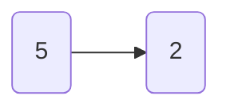
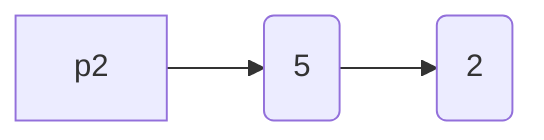
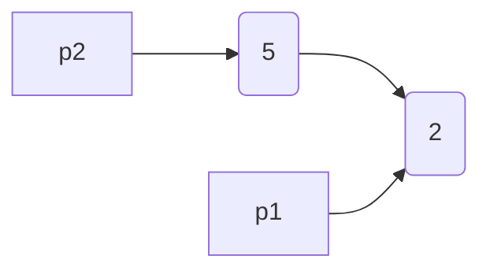
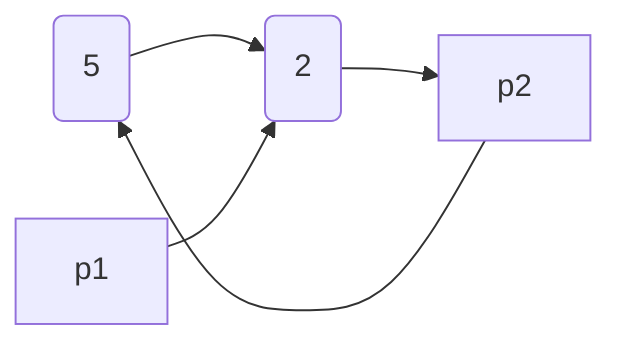
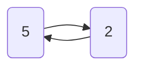

# 链表


## 什么是链表

链表是一种通过指针串联的线性结构(在物理存储单元上是非连续的)，每个节点主要包含 2 部分

1. 数据域，节点中实际有意义的部分
2. 指针域，指向相邻节点的指针


例如 C 中定义一个链表节点(Node)如下

```
struct ListNode {
    int val;
    ListNode *next;
    ListNode(int x) : val(x), next(NULL) {}
};
```

## 为什么需要链表

存储数据我们同样也可以使用数组，为什么需要链表呢？从几个方面

1. 查询
2. 插入
3. 删除

### 查询元素

因为数组是一段连续的内存地址，以首地址赋值给变量,所以数组查询的时间复杂度为 O(1)


对比链表，随机存储，通过指针将节点串起来，所以要想知道一个元素所在的位置，就需要遍历链表，所以链路查询的时间复杂度为 O(n)

### 插入元素

### 删除元素

假设现在有一个数组 `["C","O","D","E","R"]`，你现在需要删除索引 1 位置的元素，数组就需要将索引 1 后所有的元素前移一个单位


```
String[] nums = new String[]{"C","O","D","E","R"};
for(int i = 1;i < nums.length - 1;i++){
	nums[i] = nums[i+1];
}
Arrays.asList(nums).forEach(System.out::print);// CDERR
```

当数组的长度为 n 时，最坏情况下，我们删除第一个元素，共需要的步骤数为 1 + (n - 1) = n 步，其中，1 为删除操作，n - 1 为移动其余元素的步骤数。删除操作具有线性时间复杂度，即时间复杂度为 O(N)

而在链表中删除一个元素非常简单，假设我们想要删除节点 `cur`

1. 找到 cur 的上一个结点 `prev` 及其下一个结点 `next` ；
   
2. 接下来链接 `prev` 到 cur 的下一个节点 `next` 。
   

在我们的第一步中，我们需要找出 prev 和 next。使用 cur 的参考字段很容易找出 next，但是，我们必须从头结点遍历链表，以找出 prev，它的平均时间是 O(N)，其中 N 是链表的长度。因此，删除结点的时间复杂度将是 O(N)。


> 

## 链表的类型

按照指针的指向可以分为如下几大类链表

1. 单链表
2. 双链表
3. 循环链表
4. 双端链表

### [单链表](https://leetcode.cn/leetbook/read/linked-list/jsumh/)


[707. 设计链表](https://leetcode.cn/problems/design-linked-list/)

看官方解答

```

```

## 双链表

https://leetcode.cn/leetbook/read/linked-list/fpr8s/

[707. 设计链表](https://leetcode.cn/problems/design-linked-list/)

看官方解答

## 循环链表


### ListNode dummy = new ListNode(-1)

为什么需要创建一个 dummy 节点呢？

为什么使用 `new ListNode(-1)` 而不直接使用 `new ListNode()` 呢？ 

因为实际 `dummy` 第一个 Node 是没有意义的，我们是从 `dummy.next` 开始赋值

## 例题

### 0x01 [21. 合并两个有序链表](https://leetcode.cn/problems/merge-two-sorted-lists/)

将两个升序链表合并为一个新的 **升序** 链表并返回。新链表是通过拼接给定的两个链表的所有节点组成的。 

**示例 1：**


```
输入：l1 = [1,2,4], l2 = [1,3,4]
输出：[1,1,2,3,4,4]
```

**示例 2：**

```
输入：l1 = [], l2 = []
输出：[]
```

这里比较简单，只需看代码即可

```
/**
 * Definition for singly-linked list.
 * public class ListNode {
 *     int val;
 *     ListNode next;
 *     ListNode() {}
 *     ListNode(int val) { this.val = val; }
 *     ListNode(int val, ListNode next) { this.val = val; this.next = next; }
 * }
 */
class Solution {
    public ListNode mergeTwoLists(ListNode list1, ListNode list2) {
        ListNode dummy = new ListNode(-1),p = d,p1 = list1,p2 = list2;
        if(list1 == null)return list2;
        if(list2 == null)return list1;
        while(list1 != null && list2 != null){
            if(list1.val < list2.val){
                p.next = list1;
                list1 = list1.next;
            }else{
                p.next = list2;
                list2 = list2.next;
            }
            p = p.next;
            if(list1 == null){
                p.next = list2;
            }
            if(list2 == null){
                p.next = list1;
            }
        }
        return dummy.next;
    }
}
```

### 0x02 [86. 分隔链表](https://leetcode.cn/problems/partition-list/)

给你一个链表的头节点 `head` 和一个特定值 `x` ，请你对链表进行分隔，使得所有 **小于** `x` 的节点都出现在 **大于或等于** `x` 的节点之前。

你应当 **保留** 两个分区中每个节点的初始相对位置。

 

**示例 1：**


```
输入：head = [1,4,3,2,5,2], x = 3
输出：[1,2,2,4,3,5]
```

**示例 2：**

```
输入：head = [2,1], x = 2
输出：[1,2]
```

核心思路就是将原链表拆分成 2 条，然后重新拼接

```
/**
 * Definition for singly-linked list.
 * public class ListNode {
 *     int val;
 *     ListNode next;
 *     ListNode() {}
 *     ListNode(int val) { this.val = val; }
 *     ListNode(int val, ListNode next) { this.val = val; this.next = next; }
 * }
 */
class Solution {
    public ListNode partition(ListNode head, int x) {
        // if(head == null)return head;
        ListNode d1 = new ListNode(-1),p1 = d1;
        ListNode d2 = new ListNode(-1),p2 = d2;
        while(head != null){
            if(head.val < x){
                p1.next = head;
                p1 = p1.next;
            }else{
                p2.next = head;
                p2 = p2.next;
            }
            head = head.next;
        }
        p2.next = null;
        p1.next = d2.next;
        return d1.next;
    }
}
```

#### p2.next = null

这里为什么需要使用 `p2.next = null`?

假设链表为 5 -> 2







如果这时使用 `p1.next = d2.next` 就会出现如下




清理一下关系就会发现这时链表成环了




为了避免这种情况，最佳的方案是创建一个临时指针指向原链表，直接将原链表拆除

```
/**
 * Definition for singly-linked list.
 * public class ListNode {
 *     int val;
 *     ListNode next;
 *     ListNode() {}
 *     ListNode(int val) { this.val = val; }
 *     ListNode(int val, ListNode next) { this.val = val; this.next = next; }
 * }
 */
class Solution {
    public ListNode partition(ListNode head, int x) {
        // if(head == null)return head;
        ListNode d1 = new ListNode(-1),p1 = d1;
        ListNode d2 = new ListNode(-1),p2 = d2;
        ListNode p = head;
        while(p != null){
            if(p.val < x){
                p1.next = p;
                p1 = p1.next;
            }else{
                p2.next = p;
                p2 = p2.next;
            }
            ListNode t = p.next;
            p.next = null;
            p = t;
        }
        p1.next = d2.next;
        return d1.next;
    }
}
```

**references**

1. [^https://leetcode.cn/leetbook/read/linked-list/x6ybqh/]
2. [^https://leetcode.cn/leetbook/read/array-and-string/yjcir/]
3. [^https://m.imooc.com/wiki/datalesson-list4]
4. [^https://mp.weixin.qq.com/s?src=11&timestamp=1690859428&ver=4685&signature=kaLD-bvsdBHLv2dLBE7d5yu**Lh4uQWMVWQ*FaM*RckDtXUVs66iRvXcpjuJDMfPkdoUUtG3IT5aLEjJ2jPpNHbKgPuMCHgC5eiF*CY7XTHOineQ2AHxUy-ifpaiO8QN&new=1]
5. [^https://www.eet-china.com/mp/a32180.html]