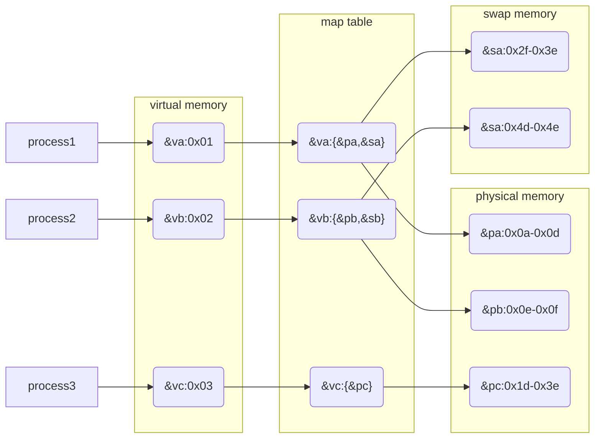
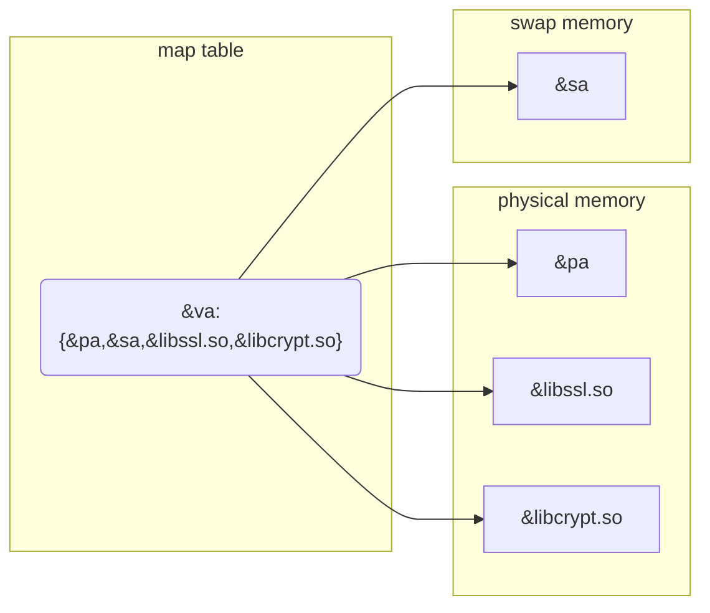
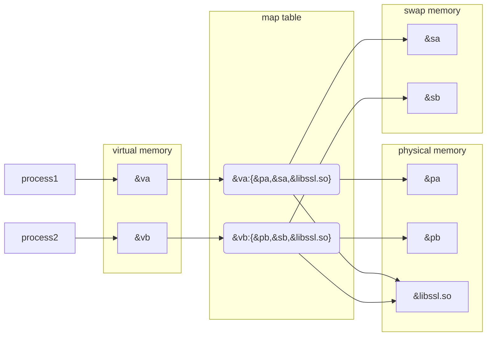

# top

## 0x01 Preface

`top` 是一个查看系统资源(主要是 CPU/MEM)使用率以及 processes 或者是 threads (统称为 tasks)占用系统资源的工具，默认会以 interactive mode 运行

## 0x02 Memory[^1]

我们都知道进程的运行依赖于内存，那么在详细介绍 `top` 前，还需要了解 Linux 是怎么管理和使用内存的

> 假设 Linux 允许进程自己分配需要的内存

例如

Photoshop 声明自己需要使用 1GB 内存，而 Chrome 声明自己需要使用 2GB 内存

那么会有几个问题

1. 如果进程 A 声明自己需要 2GB 的内存，但是 RAM 只有 1GB，这时进程 A 就会启动失败
2. 如果进程 A 声明自己使用 0 - 1023 地址的内存，但是进程 B 声明自己使用 1000 - 1676 地址的内存。那么进程 B 就可以读取操作 1000 - 1023 地址的内存

> [!NOTE]
> 显然进程需要的内存应该由 Linux 分配

> 假设 Linux 以顺序的形式分配进程需要的内存

例如

假设 RAM 为 4GB，刚开机使用率为 0

你打开了 Photoshop 占用了 1GB 内存，然后又运行了 VLC 占用了 600MB 内存，Firefox 占用了 2GB 内存，Telegram 占用了 300MB 内存，Notepad 占用了 100MB 内存，很快 RAM 就用完了

<table>
<tr>
<td>Photoshop 1GB</td>
</tr>
<tr>
<td>VLC 600MB</td>
</tr>
<tr>
<td>Firefox 2GB</td>
</tr>
<tr>
<td>Telegram 300MB</td>
</tr>
<tr>
<td>Notepad 100MB</td>
</tr>
</table>

这时想要运行其他的进程，就需要将之前运行的进程关闭。你现在决定关闭 VLC 和 Telegram，释放了 900MB 内存

<table>
<tr>
<td>Photoshop 1GB</td>
</tr>
<tr>
<td>Available 600MB</td>
</tr>
<tr>
<td>Firefox 2GB</td>
</tr>
<tr>
<td>Available 300MB</td>
</tr>
<tr>
<td>Notepad 100MB</td>
</tr>
</table>

打开 Blender 占用 800MB，假设 Blender 的数据顺序填入空闲的内存块

<table>
<tr>
<td>Photoshop 1GB</td>
</tr>
<tr>
<td>Blender 600MB</td>
</tr>
<tr>
<td>Firefox 2GB</td>
</tr>
<tr>
<td>Blender 200MB</td>
</tr>
<tr>
<td>Available 100MB</td>
</tr>
<tr>
<td>Notepad 100MB</td>
</tr>
</table>

那么会有几个问题

1. 如果进程 A 声明了一个范围非常大的数组，一块内存块不够分配，数组中的数据被分配到了不同的内存块，如果要获取数组中数据那开销会非常大
2. 如果进程 A/B/C 分别占用了 50%/30%/20% 内存，现在关闭进程 B/C，打开进程 D 占用 10%，打开进程 E 占用 5%，关闭进程 E，打开进程 F 占用 30%，关闭进程 A，打开进程 G 占用 49%。随着时间的推移，不同位置都出现了空余的内存块，无限接近于 1byte，而进程 Z 需要的内存正好等于这些空余的内存块总和大概 10GB，那么进程 Z 获取数据开销会非常大

> [!NOTE]
> 显然 Linux 需要将分散空闲的内存块压缩成完整空闲的内存块

> 假设 Linux 将分散空闲的内存块压缩成完整空闲的内存块

回溯到打开关闭 VLC 和 Telegram 的部分，现在将分散空闲的内存块压缩成完整空闲的内存块

<table>
<tr>
<td>Photoshop 1GB</td>
</tr>
<tr>
<td>Firefox 2GB</td>
</tr>
<tr>
<td>Notepad 100MB</td>
</tr>
<tr>
<td>Available 900MB</td>
</tr>
</table>

打开 Blender

<table>
<tr>
<td>Photoshop 1GB</td>
</tr>
<tr>
<td>Firefox 2GB</td>
</tr>
<tr>
<td>Notepad 100MB</td>
</tr>
<tr>
<td>Blender 800MB</td>
</tr>
<tr>
<td>Available 100MB</td>
</tr>
</table>

那么会有几个问题

### 0x02a Memory Types

Linux 上有 3 种类型的内存

- Physical memory
- Virtual memory
- Swap memory(file)

逻辑上只有 2 种，swap memory 只能通过 virtual memory 被调用

#### Physical Memory

*Physical memory, a limited resource where code and data must reside when executed or referenced.*

物理内存，也被称为 RAM，数据必须被载入到 RAM 中才可以被进程获取。其容量由内存颗粒决定。可以通过 `dmidecode -t memory` 来查其看容量

```
$ sudo dmidecode -t memory
...
Memory Device
...
        Size: 32 GB
Memory Device
...
        Size: 32 GB
```

#### Swap Memory(File)

*Swap memory(file), where modified(dirty) memory can be saved and later retrieved if too many demands are made on physical memory.*

交换内存，以文件形式存在的内存，在 Windows 上称为 page memory(file)

内存中 inactive 的数据会以文件的形式存储，这个过程被称为 swap out；如果后续需要这部分的数据，系统会将文件载入到物理内存中，这个过程被称为 swap in。其容量由 swap partition 决定。可以通过 `lsblk` 来查看

```
$ lsblk
NAME        MAJ:MIN RM   SIZE RO TYPE MOUNTPOINTS
nvme0n1     259:0    0   1.8T  0 disk
├─nvme0n1p1 259:2    0   300M  0 part /boot/efi
├─nvme0n1p2 259:3    0   1.8T  0 part /
└─nvme0n1p3 259:4    0    10G  0 part [SWAP]
```

> [!important] 
> 进程只有通过 virtual memory 才可以间接使用 swap memory，可以通过 `vm.swapnniess` 来设置倾向使用交换内存的程度，值越大越可能使用交换内存

#### Virtual Memory

*Virtual memory, a nearly unlimited resource serving the following*

虚拟内存，可以看作 physical memory 和 swap memory 的结合（将其想象成 LVM 中 volume group）。进程通过虚拟内存提供的地址来调用物理内存和交换内存，更像是一种机制



其容量由 CPU 架构决定（虚拟内存需要提供一个地址）。例如 32bit CPU 可以支持 $2^{32}bit = 4GB$ 的虚拟内存，而 64bit CPU 可以支持 $2^{64}bit = 2^{31}GB$ 的虚拟内存

可以通过 `dmidecode -t processor` 来查看 CPU 架构

```
$ sudo dmidecode -t processor
...
       Characteristics:
                64-bit capable
                Multi-Core
                Hardware Thread
                Execute Protection
                Enhanced Virtualization
                Power/Performance Control
```

但是实际能够的虚拟内存为 $physical\ memory + swap\ memory$ 可以通过 `free -t` 来查看

```
$ \free -t
               total        used        free      shared  buff/cache   available
Mem:        64987180     9599916    51159008      429632     5378416    55387264
Swap:       10485756       34816    10450940
Total:      75472936     9634732    61609948
```

> [!note]
> 实际上现今的操作系统都会使用虚拟内存来管理物理内存以及交换内存(如果 swap on)，这么做有几个好处

**1. abstraction, free from physical memory addresses/limits**

虚拟内存摆脱了物理内存的限制，进程能够使用更多的内存，总量为 $physical\ memory + swap\ memory$

**2. sharing, a single mapping can serve multiple needs**

虚拟内存的一个 map 可以提供多个物理地址内存，提供多种服务



**3. isolation, every process in a separate address space**

虚拟内存让每个进程使用的地址范围都不同，其他进程不能访问，更安全

不同的进程可能会使用相同的 shared object(so/ldd)，物理内存的地址相同，但是进程指向的虚拟内存地址不同

例如



**4. flexibility, assign a virtual address to a file**

针对一个文件可以只分配一个地址，而不是地址范围，参考开头的部分

### 0x02b Page


假设进程可以直接获取物理内存


我们都知道进程是通过 SDK 提供的 API(例如 `malloc()`)来获取内存的

既然 modern system 都会使用 virtual memory 来管理 physical memory 以及 swap memory，那么他是通过什么来管理的呢？

答案是 page（中文也叫分页） —— *is a fixed-length contiguous block*


实际上进程并不能直接调用内存，需要通过系统提供的 API 来间接调用，而内存分配由 OS 决定。这也是符合逻辑的，如果任意进程都可以随意调用内存，那系统也就不存稳定这一说法了，当然类似 DMA 外挂另说。

OS 为了高效地管理 memory，将其按照固定

而 OS 是通过 pages 来管理 memory 的，

- pages 长度固定(通常是 4096 bytes)

实际上 OS 会将所有类型的 memory 按照 page(中文叫作分页) 划分

同时进程是不能直接调用内存的，需要通过系统提供的 API 寻址(mapping)来调用内存。API 能够寻址的内存类型严格按照如下 4 象限

> Both physical memory and virtual memory can include any of the four, while the swap file only includes #1 through #3.  The memory in quadrant #4, when modified, acts as its own dedicated swap file.

```
                                     Private | Shared
                                 1           |          2
            Anonymous  . stack               |
                       . malloc()            |
                       . brk()/sbrk()        | . POSIX shm*
                       . mmap(PRIVATE, ANON) | . mmap(SHARED, ANON)
                      -----------------------+----------------------
                       . mmap(PRIVATE, fd)   | . mmap(SHARED, fd)
          File-backed  . pgms/shared libs    |
                                 3           |          4
```

系统的有些 API 存在于多个象限，那么什么情况下使用 physical memory/swap memory/virtual memory


## 0x03 Display Area

Display Area 由 4 部分组成

- Summary Area
- Fields/Columns Header
- Task Area
- Input/Message Line

例如

```
# Summary Area
top - 17:55:06 up 10 days,  3:28,  1 user,  load average: 0.00, 0.01, 0.05
Tasks: 221 total,   1 running, 220 sleeping,   0 stopped,   0 zombie
%Cpu(s):  0.0 us,  0.0 sy,  0.0 ni, 99.9 id,  0.0 wa,  0.0 hi,  0.0 si,  0.0 st
KiB Mem : 32779900 total, 31618788 free,   733032 used,   428080 buff/cache
KiB Swap:  2097148 total,  2097148 free,        0 used. 31646984 avail Mem

# Input/Message Line
Locate string

# Fields/Columns Header
  PID USER      PR  NI    VIRT    RES    SHR S  %CPU %MEM     TIME+ COMMAND
  
# Task Area
 1803 mysql     20   0 2250968 399904  16284 S   0.7  1.2  83:03.81 mysqld
 1195 root      20   0  210648   8932   5508 S   0.3  0.0  11:16.35 vmtoolsd
25502 root      20   0  162064   2348   1584 R   0.3  0.0   0:00.06 top
    1 root      20   0  191404   4452   2600 S   0.0  0.0   0:06.46 systemd
    2 root      20   0       0      0      0 S   0.0  0.0   0:00.09 kthreadd
```

### 0x03a Summary Area

展示一些资源的总使用率或者是总量，可以通过 [Summary Area Command](#Summary%20Area%20Command) 修改显示的方式

例如

```
top - 17:55:06 up 10 days,  3:28,  1 user,  load average: 0.00, 0.01, 0.05
Tasks: 221 total,   1 running, 220 sleeping,   0 stopped,   0 zombie
%Cpu(s):  0.0 us,  0.0 sy,  0.0 ni, 99.9 id,  0.0 wa,  0.0 hi,  0.0 si,  0.0 st
KiB Mem : 32779900 total, 31618788 free,   733032 used,   428080 buff/cache
KiB Swap:  2097148 total,  2097148 free,        0 used. 31646984 avail Mem
```

> [!note] 
> 这里以 `top` 默认显示的内容介绍

#### Line 1

`top - 17:55:06 up 10 days,  3:28,  1 user,  load average: 0.00, 0.01, 0.05`

输出 uptime 以及 load average 等价于 `uptime`

#### Line 2

`Tasks: 221 total,   1 running, 220 sleeping,   0 stopped,   0 zombie`

输出正在运行的进程数，不同状态的进程数(即 `task = processes | threads`)。可以通过 `H` 将进程数转为线程数

有 4 种状态

- running

	当前占用 CPU 资源的进程数

	task area `S` 字段会以 `R` 标示 running 进程

- sleeping

	当前没有使用 CPU 资源或者等待 I/O 的进程数

	task area `S` 字段会以 `S` 标示 sleeping 进程

- stopped

	暂时停止的进程，通常是 `ctrl + z` 或者是 `kill -STOP` 触发的进程

	task area `S` 字段会以 `T` 标示 stopped 进程

- zombie

	通常是子进程已经退出了，但是父进程并没有通过 `wait()` 来读取子进程的状态导致的

	task area `S` 字段会以 `Z` 标示 zombie 进程

#### Line 3

`%Cpu(s):  0.0 us,  0.0 sy,  0.0 ni, 99.9 id,  0.0 wa,  0.0 hi,  0.0 si,  0.0 st`

所有 tasks 从 last delay 开始占用 CPU 不同类型资源时间的平均值。根据 Thread mode on/off Irix mode on/off

计算公式为 

%% TODO %%

主要分为如下几种 CPU 资源

- us(user space)

	time running un-niced user processes

	未使用 `nice` 调整优先级的 tasks 占用 CPU 的时间，通常就是 tasks 默认的状态

- sy(system space)

	time running kernel processes

	系统 tasks 占用 CPU 的时间 

- ni(nice)

	time running niced user processes

	通过 `nice` 调整优先级的 tasks 占用 CPU 的时间

- id(idle)

	time spent in the kernel idle handler

	CPU 没有处理任何 tasks 的时间

- wa(I/O wait)

	time waiting for I/O completion

	CPU 处于 I/O wati 的时间

- hi(hardware interrupts)

	time spent servicing hardware interrupts

	CPU 处理硬件中断的时间。比如 keyboards, mice 发送的信号

- si(software interrupts)

	time spent servicing software interrupts

	CPU 处理软件中断的时间。比如 drivers 发送的信号

- st(steal time)

	time stolen from this vm by the hypervisor

	CPU 用于 virtualization 的时间

#### Line 4

`KiB Mem : 32779900 total, 31618788 free,   733032 used,   428080 buff/cache`

physical memory 的使用情况

#### Line 5

`KiB Swap:  2097148 total,  2097148 free,        0 used. 31646984 avail Mem`

swap memory 的使用情况

### 0x03b Input/Message Line

一些 interactive command prompt 输入的地方

例如

```
KiB Swap:  2097148 total,  2097148 free,        0 used. 31652288 avail Mem
Locate string
  PID USER      PR  NI    VIRT    RES    SHR S  %CPU %MEM     TIME+ COMMAND
```

### 0x03c Fields/Columns Header

task area 显示的字段，可以通过 `f` interacrive command 来设置显示的字段

例如

```
PID USER      PR  NI    VIRT    RES    SHR S  %CPU %MEM     TIME+ COMMAND
```

常见的字段有

#### %CPU -- CPU Usage

> [!important]
> 千万不要将 `%CPU` 和 `%CPU(s)` 搞混，两者计算方式不同

*The task's share of the elapsed CPU  time  since the  last  screen  update,  expressed  as  a percentage of total CPU time.*

单 task 从 last delay 开始占用 CPU 时间的均值，没有做任何配置的情况下 task 指 process(可能由多个 threads 组成)

计算公式为 $elasped\ CPU\ time \div total\ CPU\ time$

elasped CPU time 会根据 thread mode on/off 来取值

total CPU time 会根据 Irix mode on/off 来取值

> [!note]
> 通过 interactive command `H` 设置 thread mode
> 
> 通过 interactive command `I` 设置 Irix mode

定义如下 EBNF

```
task = process with one thread | process with multiple threads | thread

elasped CPU time = sum(one task's us,sy,ni,wa,hi,si,st) since the last delay

total CPU time = time of delay [multily the number of cores]
```

如果 thread mode on

```
elasped CPU time = sum(one thread's us,sy,ni,wa,hi,si,st) since the last delay
```

如果 thread mode off(缺省值)

```
elasped CPU time = sum(one task's thread's us,sy,ni,wa,hi,si,st[,...]) since the last delay
```

如果 Irix mode on(缺省值)

```
total CPU time = time of delay
```

如果 Irix mode off

```
total CPU time = time of delay multily the number of cores
```

假设有一个 4 core server，delay time 为 3s，一个进程有 2 个线程，从 last delay 开始计算分别占用了 0.5s/1s

- 如果 thread mode on，Irix mode on，那么可以得出这 2 个 task $CPU\% = 0.5 \div 3$，$CPU\% = 1 \div 3$
- 如果 thread mode on，Irix mode off，那么可以得出这 2 个 task $CPU\% = 0.5 \div (3 \times 4)$，$CPU\% = 1 \div (3 \times 4)$
- 如果 thread mode off，Irix mode on，那么可以得出 $CPU\% = (0.5 + 1)\div 3$
- 如果 thread mode off，Irix mode off，那么可以得出 $CPU\% = (0.5 + 1) \div (3 \times 4)$

**需要注意的是在 thread mode off，Irix mode on，multi-core 的场景下(即缺省) CPU% 是有可能大于 100%**

假设一个 4 core server，delay time 为 3s，一个进程有 3 个线程，thread mode off，从 last delay 开始计算 3 个线程分别占用了不同 cores 1s 1.5s 1s，那么可以得出 $CPU\% = (1 + 1.5 + 1)\div 3 \gt 1$

可以得出如下结论

- thread mode on，Irix mode on

	CPU% = 进程每个线程每秒占用 CPU 的时间比率

- thread mode on，Irix mode off

	CPU% = 进程每个线程每秒占用每 Core 的时间比率

- thread mode off，Irix mode on

	CPU% = 进程每秒占用 CPU 的时间比率

- thread mode off，Irix mode off

	CPU% = 进程每秒占用每 Core 的时间比率

#### %MEM -- Memory Usage

*A task's currently resident share of available physical memory.*

#### CGROUPS -- Control Groups


#### CODE -- Code Size(KiB)


#### COMMAND -- Command Name or Command Line

#### DATA -- Data + Stack Size(KiB)

#### ENVIRON -- Environment Variables

#### Flags -- Task Flags

#### GID -- Group Id

#### GROUP -- Group Name

#### NI -- Nice Value

#### PGRP -- Process Group Id

#### PID -- Process Id

#### PPID -- Process Id

#### PR -- Priority

#### RES -- Resident Memory Size(KiB)

*A subset of the virtual address space (VIRT) representing the non-swapped physical memory a task is currently using.  It is also the sum of the ‘RSan', ‘RSfd' and ‘RSsh' fields.*

virtual memory 中 non-swapped physical 占用的部分，这里不直接使用 physical memory 是因为 RES 会计算 private anonymous pages 以及 private pages mapped to file(shared libraries 使用的内存)

等价于 $Rsan+RSfd+RSsh$

#### RSS -- Residient Memory, smaps(KiB)

*Another, more precise view of process non-swapped physical memory.  It is obtained from the ‘smaps_rollup' file and is generally slightly larger than that shown for ‘RES'.*

#### Rsan -- Resident Anonymous Memory Size(KiB)

*A subset of resident memory (RES) representing private pages not mapped to a file.*


#### Rsfd -- Resident File-Backed Memory Size(KiB)

#### RSlk -- Resident Lock-Memory Size(KiB)

#### RSsh -- Resident Shared Memory Size(KiB)


### 0x03d Task Area

```
 1803 mysql     20   0 2250968 399904  16284 S   0.7  1.2  83:03.81 mysqld
 1195 root      20   0  210648   8932   5508 S   0.3  0.0  11:16.35 vmtoolsd
```


## 0x04 Interactive Mode

在没有使用任何参数的情况下 `top` 会进入 interactive mode，用户可以通过 keystrokes 来修改/增加/删除显示的一些选项

keystrokes 按照组成的部分分类

### Global Command

- `Enter | Space`

	refresh-display

	刷新 Summary Area/Task Area

- `? | h`

	help

	显示帮助信息

- `=`

	exit-display-limits

	主要用于清空 `L` 过滤的条件

- `0`

	zero-suppress

	0 值是否显示，UID/GID/NI/PR/P 不受影响

- `A`

	alternate-display-mode

- `B`

	bold-disable/enable

	summary area 和 task area 部分字体是否加粗

- `d | s`

	change-delay-time-interval

	修改 refresh delay，默认 3s，可以通过 `? | h` 来查看当前的 delay 值

- `H`

	threads-mode

	以 thread 展示 tasks，而不是默认的 processes

- `I`

	Irix-mods

	规定了 CPU% 的计算方式，是否将 number of cores 作为分母因子，具体看 [%CPU -- CPU Usage](#%CPU%20--%20CPU%20Usage)

- `k`

	kill-a-task

	kill 掉指定 PID 的进程

- `q`

	quit

	退出 `top` interactive mode

- `W`

	write-the-configuration-file

	持久化当前在 `top` 中修改的设置，默认存储在 `~/.topcrc` 中

- `Z`

	change-color-mapping

	修改 current window 颜色，使用 `w` 来选择 window，使用 [RGB 256](https://www.ditig.com/256-colors-cheat-sheet)


### Summary Area Command

- `E`

	enforce-summary-memory-scale

	调整 summary area memory 显示的单位，KiB - EiB

- `l`

	load-average/uptime

	summary area 是否显示 `uptime` 相关的信息

- `t`

	task/cpu-state

	修改 summary area line 3 的显示方式

	- detailed percentages by category

	```
	%Cpu(s):  0.0 us,  0.1 sy,  0.0 ni, 99.9 id,  0.0 wa,  0.0 hi,  0.0 si,  0.0 st	
	```

	- abbreviated user/system and total % + bar graph

	```
	%Cpu(s):  45.7/1.7    47[|||||||||||||||||||||||||||||||||||||                                          ]
	```

	- abbreviated user/system and total % + block graph
	- turn off task and cpu states display

- `m`

	memory/swap-usage 

	修改 summary area line 4/5 的显示方式

	- detailed percentages by memory type

	```
	KiB Mem : 16266228 total,  3610032 free,   443064 used, 12213132 buff/cache
	KiB Swap:        0 total,        0 free,        0 used. 15355500 avail Mem	
	```

	- abbreviated % used/total available + bar graph

	```
	KiB Mem : 26.9/16266228 [|||||||||||||||||||||                                                          ]
	```

	- abbreviated % used/total available + block graph
	- turn off memory display

- `1`

	single/seperate-cpu-states

	按照每 Cores 显示 CPU 使用率

- `2`

	NUMA-nodes/cpu-summary

	显示 NUMA Node 的使用率

### Input/Message Line

- `r`

	renice-a-task

	%% TODO %%

- `X`

	extra-fixed-width

	一些 fields 会使用固定宽度(具体看 man page)，如果 fields 值大于宽度就会以 `+` truncate

- `Y`

	%% TODO %%

### Fileds/Columns Header Area

### Task Aread Command

- `J | j`

	justify-numeric-columns

	字段左对齐/右对齐

- `b`

	bold/reverse

- `x`

	column-highlight

- `y`

	row-highlight

- `z`

	color/monochrome

- `c`

	command-line/program-name

- `F`

	maintain-parent-focus

- `f`

	fields-management

- `O | o`

	other-filtering

- `S`

	cumulative-time-mode

- `U | u`

	show-specific-user-only

- `V`

	forest-view-mode

- `v`

	hide/show-children

- `i`

	idle-process

- `n | #`

	set-maximum-tasks

- `e`

	enforce-task-memory-scale

	调整 task area memory 显示的单位，KiB - PiB

- `g`

	choose-another-window/field-group

	选择面板，不做任何配置不同面板 task area 字段不同，1 - 4

## Non-interactive Mode

### Optional Args


## The CPU% shows greater than 100%

---
*Value your freedom or you will lose it, teaches history. Don't bother us with politics, respond those who don't want to learn.*

***See also***

- `man top.1`
- [operating system - What are the differences between virtual memory and physical memory? - Stack Overflow](https://stackoverflow.com/questions/14347206/what-are-the-differences-between-virtual-memory-and-physical-memory)
- [Virtual memory - Wikipedia](https://en.wikipedia.org/wiki/Virtual_memory)
- [operating system - What's the difference between "virtual memory" and "swap space"? - Stack Overflow](https://stackoverflow.com/questions/4970421/whats-the-difference-between-virtual-memory-and-swap-space)
- [Virtual Memory | Baeldung on Computer Science](https://www.baeldung.com/cs/virtual-memory)

***References***

[^1]:[operating system - What are the differences between virtual memory and physical memory? - Stack Overflow](https://stackoverflow.com/questions/14347206/what-are-the-differences-between-virtual-memory-and-physical-memory)


