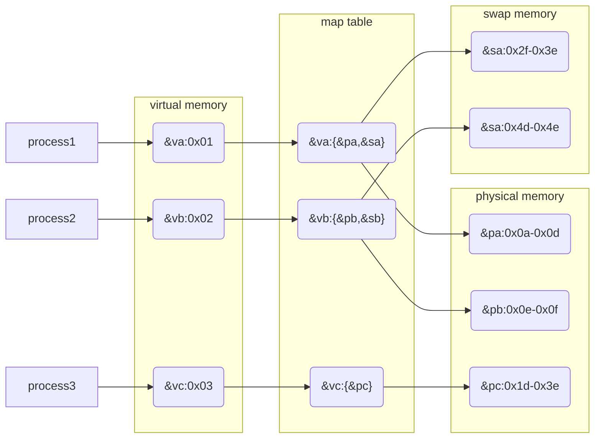
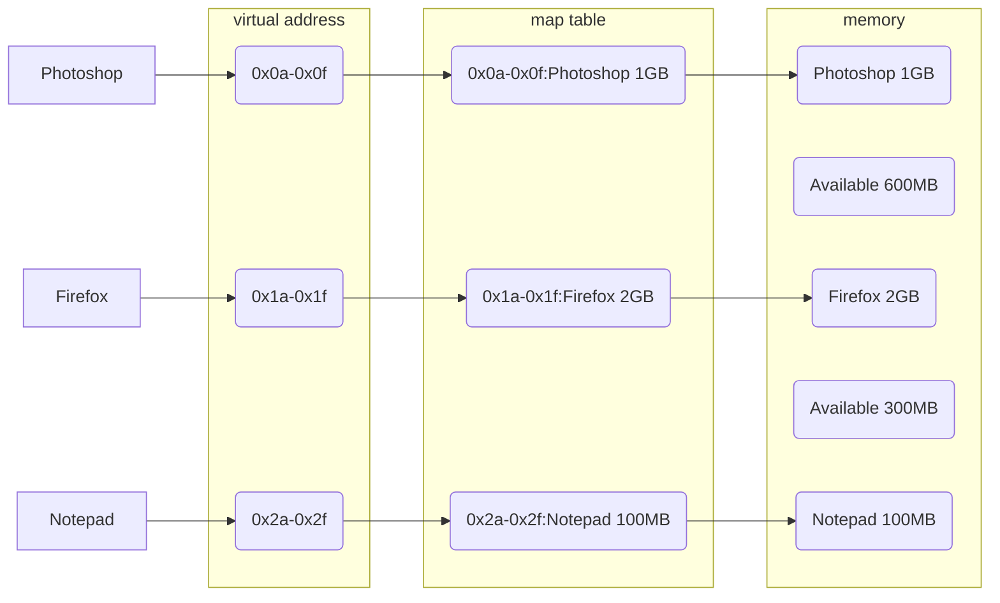
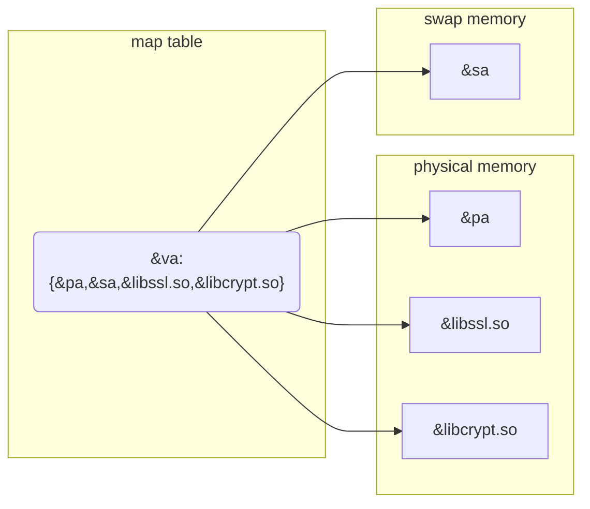
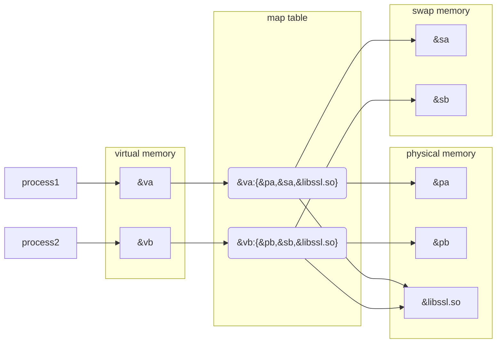

# Linux Memory

## 0x01 Preface

我们都知道进程的运行依赖于内存，那么 Linux 是如何管理和使用内存的？

## 0x02 Memory Types

Linux 上有 3 种类型的内存

- Physical memory
- Virtual memory
- Swap memory(file)

逻辑上只有 2 种，swap memory 只能通过 virtual memory 被调用

#### Physical Memory

*Physical memory, a limited resource where code and data must reside when executed or referenced.*

物理内存，也被称为 RAM，数据必须被载入到 RAM 中才可以被进程获取

其容量由硬件内存颗粒决定，可以通过 `dmidecode -t memory` 来查其看容量

```
$ sudo dmidecode -t memory
...
Memory Device
...
        Size: 32 GB
Memory Device
...
        Size: 32 GB
```

#### Swap Memory(File)

*Swap memory(file), where modified(dirty) memory can be saved and later retrieved if too many demands are made on physical memory.*

交换内存，以文件形式存在的内存，在 Windows 上被称为 page memory(file)。内存中 inactive 的数据按照 LRU 算法以文件的形式存储在硬盘上（这个过程被称为 swap out）；如果后续需要这部分的数据，系统会将文件载入到物理内存中（这个过程被称为 swap in）

其容量由 swap partition 决定，可以通过 `lsblk` 来查看

```
$ lsblk
NAME        MAJ:MIN RM   SIZE RO TYPE MOUNTPOINTS
nvme0n1     259:0    0   1.8T  0 disk
├─nvme0n1p1 259:2    0   300M  0 part /boot/efi
├─nvme0n1p2 259:3    0   1.8T  0 part /
└─nvme0n1p3 259:4    0    10G  0 part [SWAP]
```

> [!important] 
> 进程只有通过 virtual memory 才可以间接使用 swap memory，可以通过 `vm.swapnniess` 来设置倾向使用交换内存的程度，值越大越可能使用交换内存

#### Virtual Memory

*Virtual memory, a nearly unlimited resource serving the following*

虚拟内存，可以看作 physical memory 和 swap memory 的结合（将其想象成 LVM 中 volume group）。进程通过虚拟内存提供的地址来调用物理内存和交换内存，更像是一种机制



其容量由 CPU 架构决定（虚拟内存需要提供一个地址）。例如 32bit CPU 可以支持 $2^{32}bit = 4GB$ 的虚拟内存，而 64bit CPU 可以支持 $2^{64}bit = 2^{31}GB$ 的虚拟内存

可以通过 `dmidecode -t processor` 来查看 CPU 架构

```
$ sudo dmidecode -t processor
...
       Characteristics:
                64-bit capable
                Multi-Core
                Hardware Thread
                Execute Protection
                Enhanced Virtualization
                Power/Performance Control
```

但是实际能够使用的虚拟内存为 $physical\ memory + swap\ memory$ 可以通过 `free -t` 来查看

```
$ \free -t
               total        used        free      shared  buff/cache   available
Mem:        64987180     9599916    51159008      429632     5378416    55387264
Swap:       10485756       34816    10450940
Total:      75472936     9634732    61609948
```

> [!note]
> 实际上现今的操作系统都会使用虚拟内存来管理物理内存以及交换内存

## 0x03 Why Virtual Memory Indeed?

让我们来推演一下为什么操作系统需要使用虚拟内存

假设现在有一台主机的 RAM 为 4GB，CPU 只能够处理 4GB RAM，刚开机内存使用率为 0

### 0x03a Assumption 1 

> 操作系统允许进程自己分配需要的内存

例如

Chrome 声明自己需要使用 2GB 内存，而 Firefox 也声明自己需要使用 2GB 内存

<table>
<tr>
<td>Chrome 2GB</td>
</tr>
<tr>
<td>Firefox 2GB</td>
</tr>
</table>

那么会有几个问题

1. 如果进程 A 最大理论需要 5GB 内存，所以开发直接声明进程 A 启动就需要 5GB 内存，这时进程 A 就会启动失败，但是启动进程 A 实际上并不需要这么多内存
2. 如果进程 A 声明自己使用 0 - 1023 地址的内存，但是进程 B 声明自己使用 1000 - 1676 地址的内存。那么进程 B 就可以读取(写入) 1000 - 1023 地址的内存

显然进程自己分配内存不方便管理也不安全，应该由操作系统为进程分配内存

### 0x03b Assumption 2 

> 假设操作系统以顺序的形式为进程分配内存

例如

你打开了 Photoshop 占用了 1GB 内存，然后又运行了 VLC 占用了 600MB 内存，Firefox 占用了 2GB 内存，Telegram 占用了 300MB 内存，Notepad 占用了 100MB 内存，很快 RAM 就用完了

<table>
<tr>
<td>Photoshop 1GB</td>
</tr>
<tr>
<td>VLC 600MB</td>
</tr>
<tr>
<td>Firefox 2GB</td>
</tr>
<tr>
<td>Telegram 300MB</td>
</tr>
<tr>
<td>Notepad 100MB</td>
</tr>
</table>

这时想要运行其他的进程，就需要将之前运行的进程关闭。你现在决定关闭 VLC 和 Telegram，释放了 900MB 内存

<table>
<tr>
<td>Photoshop 1GB</td>
</tr>
<tr>
<td>Available 600MB</td>
</tr>
<tr>
<td>Firefox 2GB</td>
</tr>
<tr>
<td>Available 300MB</td>
</tr>
<tr>
<td>Notepad 100MB</td>
</tr>
</table>

打开 Blender 占用 800MB，假设 Blender 的数据顺序填入空闲的内存块

<table>
<tr>
<td>Photoshop 1GB</td>
</tr>
<tr>
<td>Blender 600MB</td>
</tr>
<tr>
<td>Firefox 2GB</td>
</tr>
<tr>
<td>Blender 200MB</td>
</tr>
<tr>
<td>Available 100MB</td>
</tr>
<tr>
<td>Notepad 100MB</td>
</tr>
</table>

但是还会有几个问题

1. 如果进程 A 声明了一个范围非常大的数组，任意一块空闲的内存块都不够分配，数组中的数据被分配到了不同的内存块，如果进程 A 要获取数组中数据那开销会非常大
2. 如果进程 A/B/C 分别占用了 50%/30%/20% 内存，现在关闭进程 B/C，打开进程 D 占用 10%，打开进程 E 占用 5%，关闭进程 E，打开进程 F 占用 30%，关闭进程 A，打开进程 G 占用 49%。随着时间的推移，不同位置都出现了空余的内存块，无限接近于 1byte，而进程 Z 需要的内存正好等于这些空余的内存块总和大概 10GB，那么进程 Z 获取数据开销会非常大

显然顺序存储并不是一个好办法，我们应该将分散空闲的内存块压缩成完整空闲的内存块

### 0x03c Assumption 3

> 假设操作系统将分散空闲的内存块压缩成完整空闲的内存块

回溯到 Assumption 2 关闭 VLC 和 Telegram 的部分，现在将分散空闲的内存块压缩成完整空闲的内存块

<table>
<tr>
<td>Photoshop 1GB</td>
</tr>
<tr>
<td>Firefox 2GB</td>
</tr>
<tr>
<td>Notepad 100MB</td>
</tr>
<tr>
<td>Available 900MB</td>
</tr>
</table>

打开 Blender

<table>
<tr>
<td>Photoshop 1GB</td>
</tr>
<tr>
<td>Firefox 2GB</td>
</tr>
<tr>
<td>Notepad 100MB</td>
</tr>
<tr>
<td>Blender 800MB</td>
</tr>
<tr>
<td>Available 100MB</td>
</tr>
</table>

但是还会有几个问题

1. 如果进程 A 变量 var 的值被存储在地址 45，现在内存块移动了，存储 var 值的地址变成了 120，那么进程 A 就不能通过地址 45 获取到变量 var 的值
2. 进程需要的内存由系统决定，是一个动态的值，所以需要经常移动内存块，消耗大

显然操作系统应该为进程提供固定的内存地址

### 0x03d Assumption 4

> 假设操作系统为进程提供一个固定的虚拟内存地址，然后通过 map table（就好比字典的目录）获取实际对应的内存块；实际内存块无需移动

回溯到 Assumption 2 关闭 VLC 和 Telegram 的部分，无需移动内存块，同时操作系统为进程提供 map table



打开 Blender

> [!note]
> mermaid js 不支持 flowchart nodes order，所以使用 excalidraw 替代


但是还会有几个问题

1. 进程 A - Y 已经在运行且没有多余的物理内存，这时需要打开进程 Z 就需要用户手动关闭 A - Y 进程直到有多余的物理内存能够运行进程 Z

进程是否能正常运行受限于 RAM，显然这在用户体验上极差

### 0x03e Assumption 5

> 假设通过某种途径操作系统将磁盘也模拟成内存，部分进程长时间没有使用的数据被置换到磁盘

回溯到 Assumption 4 关闭 VLC 和 Telegram 打开 Blender 的部分，现在要打开 Spotify 占用 400MB 内存。Photoshop 部分数据(500MB)因为长时间没有使用，被操作系统置换到磁盘


这也是虚拟内存的基本形式，但是实际远比这个要复杂

## 0x04 Page

在 [0x03d Assumption 4](#0x03d%20Assumption%204) 和 [0x03e Assumption 5](#0x03e%20Assumption%205) 中假设操作系统使用 map table 来获取物理内存。事实上虚拟内存确实有这种机制，但是更为复杂，通过 page（中文也叫分页） 实现


我们都知道进程是通过 SDK 提供的 API(例如 `malloc()`)来获取内存的

既然 modern system 都会使用 virtual memory 来管理 physical memory 以及 swap memory，那么他是通过什么来管理的呢？

答案是 page（中文也叫分页） —— *is a fixed-length contiguous block*


实际上进程并不能直接调用内存，需要通过系统提供的 API 来间接调用，而内存分配由 OS 决定。这也是符合逻辑的，如果任意进程都可以随意调用内存，那系统也就不存稳定这一说法了，当然类似 DMA 外挂另说。

OS 为了高效地管理 memory，将其按照固定

而 OS 是通过 pages 来管理 memory 的，

- pages 长度固定(通常是 4096 bytes)

实际上 OS 会将所有类型的 memory 按照 page(中文叫作分页) 划分

同时进程是不能直接调用内存的，需要通过系统提供的 API 寻址(mapping)来调用内存。API 能够寻址的内存类型严格按照如下 4 象限

> Both physical memory and virtual memory can include any of the four, while the swap file only includes #1 through #3.  The memory in quadrant #4, when modified, acts as its own dedicated swap file.

```
                                     Private | Shared
                                 1           |          2
            Anonymous  . stack               |
                       . malloc()            |
                       . brk()/sbrk()        | . POSIX shm*
                       . mmap(PRIVATE, ANON) | . mmap(SHARED, ANON)
                      -----------------------+----------------------
                       . mmap(PRIVATE, fd)   | . mmap(SHARED, fd)
          File-backed  . pgms/shared libs    |
                                 3           |          4
```

系统的有些 API 存在于多个象限，那么什么情况下使用 physical memory/swap memory/virtual memory


> [!note]
> 实际上现今的操作系统都会使用虚拟内存来管理物理内存以及交换内存(如果 swap on)，这么做有几个好处

**1. abstraction, free from physical memory addresses/limits**

虚拟内存摆脱了物理内存的限制，进程能够使用更多的内存，总量为 $physical\ memory + swap\ memory$

**2. sharing, a single mapping can serve multiple needs**

虚拟内存的一个 map 可以提供多个物理地址内存，提供多种服务



**3. isolation, every process in a separate address space**

虚拟内存让每个进程使用的地址范围都不同，其他进程不能访问，更安全

不同的进程可能会使用相同的 shared object(so/ldd)，物理内存的地址相同，但是进程指向的虚拟内存地址不同

例如



**4. flexibility, assign a virtual address to a file**

针对一个文件可以只分配一个地址，而不是地址范围，参考开头的部分


## Buff/Cache

---
*Value your freedom or you will lose it, teaches history. Don't bother us with politics, respond those who don't want to learn.*

***See also***

- [operating system - What are the differences between virtual memory and physical memory? - Stack Overflow](https://stackoverflow.com/questions/14347206/what-are-the-differences-between-virtual-memory-and-physical-memory)
- [Virtual memory - Wikipedia](https://en.wikipedia.org/wiki/Virtual_memory)
- [operating system - What's the difference between "virtual memory" and "swap space"? - Stack Overflow](https://stackoverflow.com/questions/4970421/whats-the-difference-between-virtual-memory-and-swap-space)
- [Virtual Memory | Baeldung on Computer Science](https://www.baeldung.com/cs/virtual-memory)


***References***

[^1]:[operating system - What are the differences between virtual memory and physical memory? - Stack Overflow](https://stackoverflow.com/questions/14347206/what-are-the-differences-between-virtual-memory-and-physical-memory)

