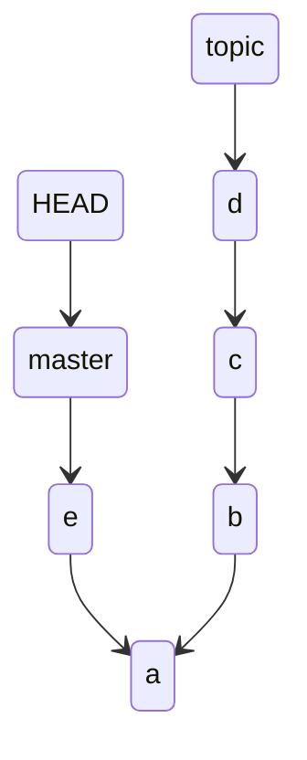
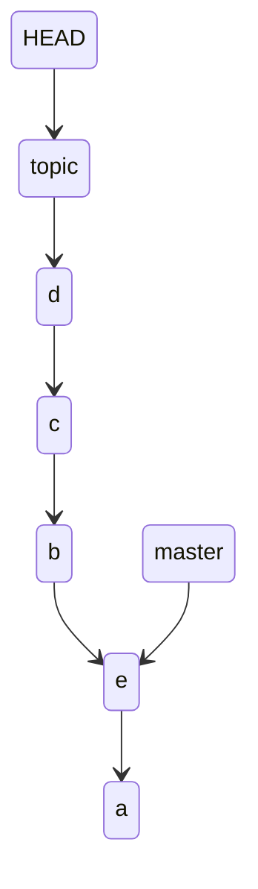

# git rebase

ref

https://git-scm.com/docs/git-rebase

https://git-scm.com/book/en/v2/Git-Branching-Rebasing

## Digest

syntax

```
git rebase [options] [base_branch]
```

rebase 顾名思义就是重新选择基准，即将出现 divergence 到当前 branch pointer 指向的所有 commit object 接入到 base_branch 之后

假设当前状态如下

```
(base) cpl in /tmp/test on master λ git lg1
* 09676dc - (3 seconds ago)  (HEAD -> master)
| e - 4liceh
| * 6e963f3 - (26 seconds ago)  (topic)
| | d - 4liceh
| * e52d680 - (45 seconds ago) 
| | c - 4liceh
| * f811c71 - (60 seconds ago) 
|/  b - 4liceh
* 209b7bf - (77 seconds ago) 
  a - 4liceh%
```



执行如下命令

```
(base) cpl in /tmp/test on master λ git sw topic 
Switched to branch 'topic'
(base) cpl in /tmp/test on topic λ git rebase master
Successfully rebased and updated refs/heads/topic.
```

查看日志

```
(base) cpl in /tmp/test on topic λ git lg1          
* f0a2aa8 - (4 minutes ago)  (HEAD -> topic)
| d - 4liceh
* 4761e68 - (4 minutes ago) 
| c - 4liceh
* caac40c - (4 minutes ago) 
| b - 4liceh
* 09676dc - (3 minutes ago)  (master)
| e - 4liceh
* 209b7bf - (5 minutes ago) 
  a - 4liceh%         
```




这样看 abcde 就在一条线上了，这时我们就可以使用 Fast-Forward merge 来进行分支整合

```
(base) cpl in /tmp/test on topic λ git sw -
Switched to branch 'master'
(base) cpl in /tmp/test on master λ git merge topic 
Updating 09676dc..f0a2aa8
Fast-forward
 b | 1 +
 c | 1 +
 d | 1 +
 3 files changed, 3 insertions(+)
 create mode 100644 b
 create mode 100644 c
 create mode 100644 d
```

日志如下

```
(base) cpl in /tmp/test on master λ git lg1
* f0a2aa8 - (15 minutes ago)  (HEAD -> master, topic)
| d - 4liceh
* 4761e68 - (15 minutes ago) 
| c - 4liceh
* caac40c - (15 minutes ago) 
| b - 4liceh
* 09676dc - (14 minutes ago) 
| e - 4liceh
* 209b7bf - (16 minutes ago) 
  a - 4liceh%   
```

## merge vs rebase

在 Git 中有两种方式将一个 branch 和另外一个 branch 整合：merge 和 rebase

假设现在有两个分支 master 和 experiment, 当前在 experiment 分支


现在通过最基础 merge 的方式将 experiment 整合到 master 

```
$ git checkout master
$ git merge experiment
```

因为 merge 会 commit 一次, 所以 master branch 指针会向前移动到对应的 commit object


但是还有另外一种方式，直接将 C4 接到 C3 后面，然后 merge

```
$ git checkout experiment
$ git rebase master
```

执行完后会将 experiment branch 指针执指向的 commit object 接到 master branch 指针指向的 commit object 之后，即完成一次以 master branch 指针为基础的 rebase


然后你可以通过 Fast-Forward 方式来合并 master 和 experiment 分支

```
$ git checkout master
$ git merge experiment
```

合并和状态如下


两种方式并没有本质的上区别，但是使用第二种 rebase 的方式  `git log` 记录更加简洁

但是 rebase 不是安全的操作，在生产中应该尽量避免，具体参考

[https://git-scm.com/book/en/v2/Git-Branching-Rebasing#The Perils of Rebasing](https://git-scm.com/book/en/v2/Git-Branching-Rebasing#The Perils of Rebasing) 