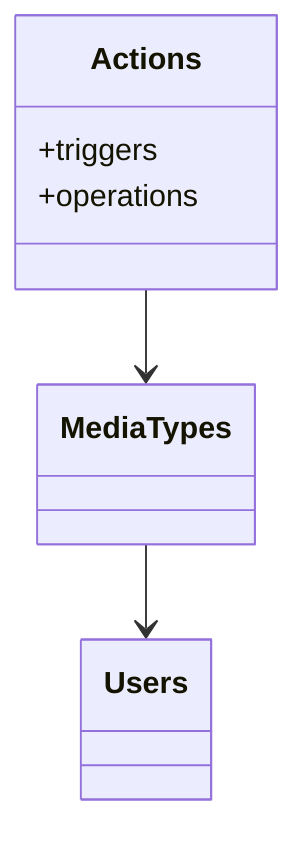

ab# Zabbix action

参考：

https://www.zabbix.com/documentation/5.0/manual/config/notifications/action

http://www.zsythink.net/archives/768

## 概述

If you want some operations taking place as a result of events (for example, notifications sent), you need to configure actions.

发送notification也是一种action，所以我们定义 media type 后还需配置action来实现发送邮件

## 创建

configuration → **action**

> 至少需要使用一个operation

- name：该action的标识符

- type or caculation：conditions之间的逻辑关系

- Conditions：符合条件时触发action，具体参考：https://www.zabbix.com/documentation/5.0/manual/config/notifications/action/conditions

  ==如果没有指定condition，那么当前的action会在任意一个trigger状态从ok到problem触发==

  - type：condition类型
  - operator：与当前type的关系

  > 如上所示condition，表示当前被触发的trigger是RootPartitionUsed，且问题为解决（==处于problem状态==）

- enabled：激活该action

configuration → **operations**

> ==operation可以有一个，也可以有多个，以step分隔==
>
> 你可以通过operations发送信息或是执行远程命令；如果用户没有权限访问主机，zabbix不会警告，而是通过action来实现

==这里使用send message==

参考：https://www.zabbix.com/documentation/5.0/manual/config/notifications/action/operation

- default operation step duration：定义operation one step所需的时间（从start in 开始算），可以使用时间单位最为suffix，支持macros

- pasuse opertions for suppressed problems：维护期间是否使用该operation

- operations

  - operation type：选择operation type，可以是send message 或 remote command

  - steps：指定执行完当前operation需要多少step

    例如：

    1-1：表示第1步持续时长为1步

    2-2：表示第2步持续时长为1步

    3-4：表示第三步持续时长为2步的时长，换句话说，第三大步需要由3、4两个小步组成。

    5-7：表示第四步持续时长为3步的时长，换句话说，第四大步需要有5、6、7三个小步组成。

  - step duration：特定当前operation step duration，如果为0默认为default operation step duration

  > user groups 或 users 必须指定一个

  - send to user groups：发送消息给特定的user groups
  - send to users ：发送给特定的users、
  - send only to：选择发送的media type
  - custom message：是否使用客制化信息
  - conditions：事件是否被接受，==problem ack 需要与该值相同才能执行==

- recovery operations
- update operations

