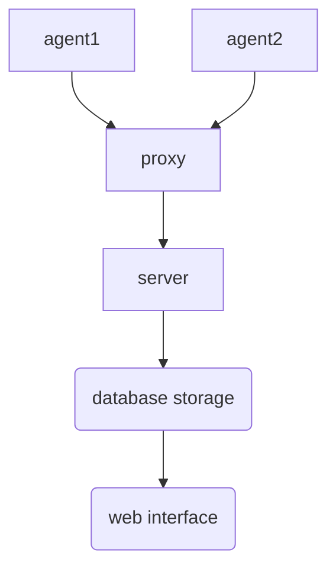

# Zabbix 概念

参考：

http://www.zsythink.net/archives/447

https://www.zabbix.com/documentation/5.0/manual/introduction/about

> zabbix 日志存储在`/var/log/zabbix/zabbix_server.log`

## Architecture/架构

- server：中心组件，agent将信息传送给server
- database storage：zabbix收集的所有信息存储的地方
- web interface：前端图形化界面
- proxy：管理一群monitor devices ，将信息传送给server。proxy可以不存在
- agent：安装在被监控的主机，将信息回报给server
- sender：将数据发送给sever或proxy

## Data gathering/通讯

- server/agent：服务端server，客户端agent

- ssh/telent：通过远程控制协议进行通讯

- SNMP(Simple Network Management Protocol)：简单网络管理协议。

  我们无法在硬件上安装agent，但是这些硬件都支持SNMP协议。我们可以通过SNMP协议来监控这些硬件

- IPMI：通过IPMI接口进行监控，我们通过IPMI硬件接口，监控被对象的物理特征，比如电压、温度、风扇的状态
- JMX(Java Management Extensions)：监控JVM虚拟机

## Passive and Active checks/工作模式

- passive；agent主动将信息汇报给server
- active：agent等待server polling

## Definitions/定义

- host：被监控的主机

- host group：主机群，只有通过group才能分配权限

- item：想要监控主机上的某个项目

- value preprocessing：存入数据库之前的数据

- trigger：item的阈值，阈值以下ok，阈值以上problem

- problem：处于problem状态下的trigger

- event：值得关注的东西，例如trigger改变了状态

- problem update：更新了trigger的行为

- action：对event做出的一系列operations

- escalation：执行operations中的特殊场景

- media：传递消息的方式

- notifation：通过media传递的消息

- template：模板，可以包括items，triggers，etc

- applications：一组items

- encryption：支持zabbix各组件之间的加密

- network discovery：自动主机发现

  
