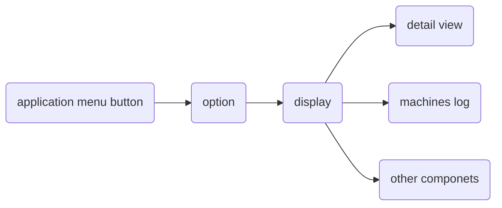

# maltego

[TOC]

参考:

https://docs.maltego.com/support/solutions/articles/

首先进入界面调整字体大小

## Terms

- Entity

  实体做为图中的结点，实体可以是DNS name，Person name, Phone number 等等

  Entity有三个属性

  Type指的是Entity是什么类型

  Value指的Entity最主要的信息

  

  Properties额外的信息

- Transform

  ==会自动通过DNS获取IP, 然后将IP反向解析成域名==

  递推出结点信息的抽象名词

  

- Machine

  可以将多种Transform结合, 查询结果

- Hub Item

  可以从三方服务器上安装一些其他的Transform

## 应用界面

通过`ctrl + T`新建一个tab, 要打开Entity details界面, Entity图标, 除Value以外

添加了attchments的Entity会有一个回形针样式的图标, 添加了notes会有一个便签的标志

## 菜单

## 视图栏

可以改变拓扑图的类型, 双机Link可以添加label

