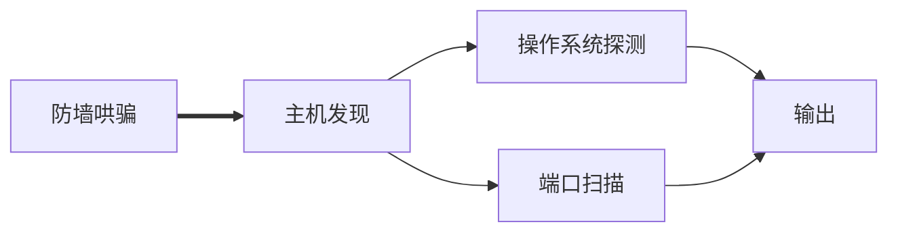

# Nmap入门

参考:

https://nmap.org/man/zh/index.html

[TOC]




在已有的参数上加上哄骗或是使用文件

```shell
nmap -iL data.txt
-------
nmap -PS -PA -O -ttl 200 -F -n -D dcay1, dcay2,dcay3...
-vv  1.1.1.0/24 -oN data.txt
```

`-vv`输出信息更加详细

## Nmap端口的6个状态

- open

  应用程序正在该端口接收TCP或UDP报文

- closed

  ==关闭的端口对于Nmap也是可访问的(它接受*Nmap*的探测报文并作出响应)==，没有应用程在其上监听

- filtered

  包过滤阻止探测报文到达端口，Nmap无法确定端口是否开放。==过滤可能来自防火墙==，路由器规则，主机软件

- unfiltered

  未被过滤意味着端口可以访问，但Nmap不能确定它是开放（open）还是关闭（close）。只有用于映射防火墙规则集的ACK扫描才会把端口分类到这种状态。 用其它类型的扫描如窗口扫描，SYN扫描，或者FIN扫描来扫描未被过滤的端口可以帮助确定 端口是否开放。

- open|filtered

  无法确定端口是开放的还是被过滤的，Nmap就把该端口划分为这种状态

- closed|filtered

  无法确定端口是关闭的还是被过滤的

## 目标说明

https://svn.nmap.org/nmap/docs/nmap.usage.txt

Nmap支持CIDR风格

`nmap 192.168.10.0/24`

支持主机名

`nmap scanme.nmap.org`

可以使用逗号分开的数字或范围列表

`192.168.0-255.1-254 `将略过0和255，第三段0-255，第四段1-254

支持组合

`nmap scanme.nmap.org 192.168.0.0/8 10.0.0，1，3-7.0-255`

- `-iL <inputfilename>` (从列表中输入)

  从 *`<inputfilename>`*中读取目标说明。在命令行输入 一堆主机名显得很笨拙，然而经常需要这样。 例如，您的DHCP服务器可能导出10,000个当前租约的列表，而您希望对它们进行 扫描。如果您*不是*使用未授权的静态IP来定位主机，或许您想要扫描所有IP地址。 只要生成要扫描的主机的列表，用`-iL` 把文件名作为选项传给Nmap。列表中的项可以是Nmap在 命令行上接受的任何格式(IP地址，主机名，CIDR，IPv6，或者八位字节范围)。 每一项必须以一个或多个空格，制表符或换行符分开。 如果您希望Nmap从标准输入而不是实际文件读取列表， 您可以用一个连字符(`-`)作为文件名。

- `--exclude <host1[，host2][，host3]，...>` (排除主机/网络)

  如果在您指定的扫描范围有一些主机或网络不是您的目标， 那就用该选项加上以逗号分隔的列表排除它们。该列表用正常的Nmap语法， 因此它可以包括主机名，CIDR，八位字节范围等等。 当您希望扫描的网络包含执行关键任务的服务器，已知的对端口扫描反应强烈的 系统或者被其它人看管的子网时，这也许有用。

- `--excludefile <excludefile>` (排除文件中的列表)

  这和`--exclude` 选项的功能一样，只是所排除的目标是用以 换行符，空格，或者制表符分隔的 *`<excludefile>`*提供的，而不是在命令行上输入的。

## 主机发现

> 这里默认使用 -sS所以会扫描端口, 除-sn外

参考:

https://www.cnblogs.com/st-leslie/p/5115280.html

- `nmap <HOSTID>`

  返回时延和开放的端口，以及运输层的协议


- `-sn`

  该选项告诉Nmap仅仅 进行ping扫描 (主机发现)，然后打印出对扫描做出响应的那些主机。没有进一步的测试 (如端口扫描或者操作系统探测)。==Ping扫描的优点是不会返回太多的信息，只显示在线的主机，且是一种非常高效的扫描方式。==


- `-Pn`Treat all hosts as online -- skip host discovery

  ==只扫描常见端口，如果某些服务改变了端口将扫描不到==
  
  默认情况下，Nmap只对正在运行的主机进行高强度的探测如 端口扫描，版本探测，或者操作系统探测。用`-Pn`==禁止主机发现==会使Nmap对*每一个*指定的目标IP地址 进行所要求的扫描。它可以得到些许目标网络的信息而不被特别注意到。==这可以穿透防火墙，也可以避免被防火墙发现。==


> sn和Pn的区别
>
> sn无法扫描到被防火墙拦截下来的主机，但是速度快
>
> Pn可以扫描到有防火墙的主机，但是速度慢
>

- `-PS[portlist]` TCP SYN ping

  发送一个SYN标志位的空TCP报文。默认目的端口为80和443 (可以通过改变`nmap.h`) 文件中的DEFAULT-TCP-PROBE-PORT值进行配置，但不同的端口也可以作为选项指定。 甚至可以指定一个以逗号分隔的端口列表(如 `-PS22，23，25，80，113，1050，35000`)， 在这种情况下，每个端口会被并发地扫描。

  SYN标志位告诉对方您正试图建立一个连接。 ==通常目标端口是关闭的，一个RST (复位) 包会发回来。 如果碰巧端口是开放的，目标会进行TCP三步握手的第二步，回应 一个SYN/ACK TCP报文。然后运行Nmap的机器则会扼杀这个正在建立的连接， 发送一个RST而非ACK报文，否则，一个完全的连接将会建立==。 RST报文是运行Nmap的机器而不是Nmap本身响应的，因为它对收到 的SYN/ACK感到很意外。

  Nmap并不关心端口开放还是关闭。 无论RST还是SYN/ACK响应都告诉Nmap该主机正在运行。

- `-PA[portlist]` (TCP ACK Ping)

  TCP ACK ping和刚才讨论的SYN ping相当类似。 也许您已经猜到了，区别就是设置TCP的ACK标志位而不是SYN标志位。 ACK报文表示确认一个建立连接的尝试，但该连接尚未完全建立。 所以远程主机应该总是回应一个RST报文， 因为它们并没有发出过连接请求到运行Nmap的机器，如果它们正在运行的话。

  ==提供SYN和ACK两种ping探测的原因是使通过防火墙的机会尽可能大。== 许多管理员会配置他们的路由器或者其它简单的防火墙来封锁SYN报文，除非 连接目标是那些公开的服务器像公司网站或者邮件服务器。 这可以阻止其它进入组织的连接，同时也允许用户访问互联网。 这种无状态的方法几乎不占用防火墙/路由器的资源，因而被硬件和软件过滤器 广泛支持。Linux Netfilter/iptables 防火墙软件提供方便的 `--syn`选项来实现这种无状态的方法。 当这样的无状态防火墙规则存在时，发送到关闭目标端口的SYN ping探测 (`-PS`) 很可能被封锁。这种情况下，ACK探测格外有闪光点，因为它正好利用了 这样的规则。

  另外一种常用的防火墙用有状态的规则来封锁非预期的报文。 这一特性已开始只存在于高端防火墙，但是这些年类它越来越普遍了。 Linux Netfilter/iptables 通过 `--state`选项支持这一特性，它根据连接状态把报文 进行分类。SYN探测更有可能用于这样的系统，由于没头没脑的ACK报文 通常会被识别成伪造的而丢弃。==解决这个两难的方法是通过即指定 `-PS`又指定`-PA`来即发送SYN又发送ACK。==

- `-PR`(ARP Ping)

   当Nmap试图发送一个原始IP报文如ICMP回声请求时， 操作系统必须确定对应于目标IP的MAC地址(ARP)

  当进行ARP扫描时，Nmap用它优化的算法管理ARP请求。 当它收到响应时， Nmap甚至不需要担心基于IP的ping报文，==既然它已经知道该主机正在运行了。 这使得ARP扫描比基于IP的扫描更快更可靠。 所以默认情况下，如果Nmap发现目标主机就在它所在的局域网上，它会进行ARP扫描。== 即使指定了不同的ping类型(如 `-PI`或者 `-PS`) ，Nmap也会对任何相同局域网上的目标机使用ARP。

## 端口扫描

 默认情况下，Nmap用指定的协议对端口1到1024以及`nmap-services` 文件中列出的更高的端口在扫描。

- `-sS`(TCP SYN扫描)

  ==SYN扫描作为默认的也是最受欢迎的扫描选项，==是有充分理由的。 它执行得很快，在一个没有入侵防火墙的快速网络上，每秒钟可以扫描数千个 端口。 SYN扫描相对来说不张扬，不易被注意到，因为它从来不完成TCP连接。 它也不像Fin/Null/Xmas，Maimon和Idle扫描依赖于特定平台，而可以应对任何兼容的 TCP协议栈。 它还可以明确可靠地区分`open`(开放的)， `closed`(关闭的)，和`filtered`(被过滤的) 状态

  它常常被称为半开放扫描， 因为它不打开一个完全的TCP连接。它发送一个SYN报文， 就像您真的要打开一个连接，然后等待响应。 ==SYN/ACK表示端口在监听 (开放)，而 RST (复位)表示没有监听者。如果数次重发后仍没响应， 该端口就被标记为被过滤。==如果收到ICMP不可到达错误 (类型3，代码1，2，3，9，10，或者13)，该端口也被标记为被过滤。

- `-sT` (TCP connect()扫描)

  当SYN扫描不能用时，CP Connect()扫描就是默认的TCP扫描。 当用户没有权限发送原始报文或者扫描IPv6网络时，就是这种情况。 Instead of writing raw packets as most other scan types do，Nmap通过创建`connect()` 系统调用要求操作系统和目标机以及端口建立连接，而不像其它扫描类型直接发送原始报文。 这是和Web浏览器，P2P客户端以及大多数其它网络应用程序用以建立连接一样的 高层系统调用。它是叫做Berkeley Sockets API编程接口的一部分。Nmap用 该API获得每个连接尝试的状态信息，而不是读取响应的原始报文。

  当SYN扫描可用时，它通常是更好的选择。因为Nmap对高层的 `connect()`调用比对原始报文控制更少， 所以前者效率较低。 该系统调用完全连接到开放的目标端口而不是像SYN扫描进行 半开放的复位。这不仅花更长时间，需要更多报文得到同样信息，目标机也更可能 记录下连接。IDS(入侵检测系统)可以捕获两者，但大部分机器没有这样的警报系统。 当Nmap连接，然后不发送数据又关闭连接， 许多普通UNIX系统上的服务会在syslog留下记录，有时候是一条加密的错误消息。 此时，有些真正可怜的服务会崩溃，虽然这不常发生。如果管理员在日志里看到来自同一系统的 一堆连接尝试，她应该知道她的系统被扫描了。

- `-sI <zombie host[:probeport]>`

  具体参考：https://nmap.org/book/idlescan.html

  对目标进行盲扫描（意味着没有报文从您的真实IP地址发送到目标，而是使用一台肉鸡）

  

- `-b <ftp relay host>` (FTP弹跳扫描)

  FTP协议的一个有趣特征(RFC 959) 是支持所谓代理ftp连接。==它允许用户连接到一台FTP服务器，然后要求文件送到一台第三方服务器==。 这个特性在很多层次上被滥用，所以许多服务器已经停止支持它了。其中一种就是导致FTP服务器对其它主机端口扫描。 只要请求FTP服务器轮流发送一个文件到目标主机上的所感兴趣的端口。 错误消息会描述端口是开放还是关闭的。 这是绕过防火墙的好方法，因为==FTP服务器常常被置于可以访问比Web主机更多其它内部主机的位置。== Nmap用-b选项支持ftp弹跳扫描。参数格式是` <username>:<password>@<server>:<port>`。 `<Server> `是某个脆弱的FTP服务器的名字或者IP地址。 您也许可以省略`<username>:<password>`， 如果服务器上开放了匿名用户(user:anonymous password:-wwwuser@)。 端口号(以及前面的冒号) 也可以省略，如果`<server>`使用默认的FTP端口(21)。

- `-p <port ranges> `(只扫描指定的端口)
  该选项指明您想扫描的端口，覆盖默认值。 单个端口和用连字符表示的端口范围(如 1-1023)都可以。 范围的开始以及/或者结束值可以被省略， 分别导致Nmap使用1和65535。所以您可以指定 -p-从端口1扫描到65535。 如果您特别指定，也可以扫描端口0。 对于IP协议扫描(-sO)，该选项指定您希望扫描的协议号 (0-255)。`nmap -P1-100 192.168.10.0/24`

  当既扫描TCP端口又扫描UDP端口时，您可以通过在端口号前加上T: 或者U:指定协议。 协议限定符一直有效您直到指定另一个。 例如，==参数 -p U:53，111，137，T:21-25，80，139，8080 将扫描UDP 端口53，111，和137，同时扫描列出的TCP端口==。注意，要既扫描 UDP又扫描TCP，您必须指定 -sU ，以及至少一个TCP扫描类型(如 -sS，-sF，或者 -sT)。如果没有给定协议限定符， 端口号会被加到所有协议列表。

- `-F` (快速 (有限的端口) 扫描)
  在nmap的nmap-services 文件中(对于-sO，是协议文件)指定您想要扫描的端口。 这比扫描所有65535个端口快得多。 因为该列表包含如此多的TCP端口(1200多)，这和默认的TCP扫描 scan (大约1600个端口)速度差别不是很大。如果您用--datadir选项指定您自己的 小小的nmap-services文件 ，差别会很惊人。该参数不能于`-p`参数共存。
  
- `-n`

  不适用DNS解析，如果给出的是一个具体的IP地址，使用该参数可以加快扫描速度

## 服务和版本探测

- `-sV` (版本探测)

  打开版本探测。 您也可以用`-A`同时打开操作系统探测和版本探测。
  
  ```
  root in ~ λ nmap -p 22 localhost -sV
  
  Starting Nmap 7.60 ( https://nmap.org ) at 2021-03-12 19:49 HKT
  Nmap scan report for localhost (127.0.0.1)
  Host is up (0.000074s latency).
  Other addresses for localhost (not scanned): ::1
  
  PORT   STATE SERVICE VERSION
  22/tcp open  ssh     OpenSSH 7.6p1 Ubuntu 4ubuntu0.3 (Ubuntu Linux; protocol 2.0)
  Service Info: OS: Linux; CPE: cpe:/o:linux:linux_kernel
  
  Service detection performed. Please report any incorrect results at https://nmap.org/submit/ .
  Nmap done: 1 IP address (1 host up) scanned in 0.64 seconds
  
  ```


## 操作系统探测

用于找出服务器

- `-O`启用操作系统检测

  必须使用端口扫描，因为`-sn`不扫描端口所以不能使用,输出结果显示在OS details中,`-A`输出更详细

## 时间和性能

- `-T <Paranoid|Sneaky|Polite|Normal|Aggressive|Insane>`(设置时间模板)

  上述优化时间控制选项的功能很强大也很有效，但有些用户会被迷惑。此外， 往往选择合适参数的时间超过了所需优化的扫描时间。因此，Nmap提供了一些简单的 方法，使用6个时间模板，使用时采用`-T`选项及数字(0 - 5) 或名称。模板名称有paranoid (0)、sneaky (1)、polite (2)、normal(3)、 aggressive (4)和insane (5)。前两种模式用于IDS躲避，Polite模式降低了扫描 速度以使用更少的带宽和目标主机资源。默认模式为Normal，因此`-T3` 实际上是未做任何优化。Aggressive模式假设用户具有合适及可靠的网络从而加速 扫描。Insane模式假设用户具有特别快的网络或者愿意为获得速度而牺牲准确性。

  如果用于有足够的带宽或以太网连接，仍然建议使用-T4选项。 有些用户喜欢-T5选项，但这个过于强烈。有时用户考虑到避免使主机 崩溃或者希望更礼貌一些会采用-T2选项。他们并没意识到-T Polite选项是如何的慢，这种模式的扫描比默认方式实际上要多花10倍的时间。默认时间 选项(-T3)很少有主机崩溃和带宽问题，比较适合于谨慎的用户。不进行 版本检测比进行时间调整能更有效地解决这些问题。

  ==虽然-T0和-T1选项可能有助于避免IDS告警==，但 在进行上千个主机或端口扫描时，会显著增加时间。对于这种长时间的扫描，宁可设定确切的时间 值，而不要去依赖封装的-T0和-T1选项。

  ==T0选项的主要影响是对于连续扫描，在一个时间只能扫描一个端口， 每个探测报文的发送间隔为5分钟。T1和T2选项比较类似， 探测报文间隔分别为15秒和0.4秒。T3是Nmap的默认选项，包含了并行扫描。== T4选项与 --max-rtt-timeout 1250 --initial-rtt-timeout 500 等价，最大TCP扫描延迟为10ms。T5等价于 --max-rtt-timeout 300 --min-rtt-timeout 50 --initial-rtt-timeout 250 --host-timeout 900000，最大TCP扫描延迟为5ms。

- `--host-timeout <milliseconds>` (放弃低速目标主机)

  由于性能较差或不可靠的网络硬件或软件、带宽限制、严格的防火墙等原因， 一些主机需要*很长*的时间扫描。这些极少数的主机扫描往往占 据了大部分的扫描时间。因此，最好的办法是减少时间消耗并且忽略这些主机，使用 `--host-timeout`选项来说明等待的时间(毫秒)。==通常使用1800000 来保证Nmap不会在单个主机上使用超过半小时的时间。==需要注意的是，Nmap在这半小时中可以 同时扫描其它主机，因此并不是完全放弃扫描。超时的主机被忽略，因此也没有针对该主机的 端口表、操作系统检测或版本检测结果的输出。

- `--scan-delay <milliseconds>`; `--max-scan-delay <milliseconds>` (调整探测报文的时间间隔)

  ==这个选项用于Nmap控制针对一个主机发送探测报文的等待时间(毫秒)，==在带宽 控制的情况下这个选项非常有效。Solaris主机在响应UDP扫描探测报文报文时，每秒 只发送一个ICMP消息，因此Nmap发送的很多数探测报文是浪费的。`--scan-delay` 设为1000，使Nmap低速运行。Nmap尝试检测带宽控制并相应地调整扫描的延迟，但 并不影响明确说明何种速度工作最佳。

  ==`--scan-delay`的另一个用途是躲闭基于阈值的入侵检测和预防 系统(IDS/IPS)。==

- `--min-parallelism <numprobes>`; `--max-parallelism <numprobes>` (调整探测报文的并行度)

  这些选项控制用于主机组的探测报文数量，可用于端口扫描和主机发现。默认状态下， Nmap基于网络性能计算一个理想的并行度，这个值经常改变。如果报文被丢弃， Nmap降低速度，探测报文数量减少。随着网络性能的改善，理想的探测报文数量会缓慢增加。 这些选项确定这个变量的大小范围。默认状态下，当网络不可靠时，理想的并行度值 可能为1，在好的条件下，可能会增长至几百。

  最常见的应用是`--min-parallelism`值大于1，以加快 性能不佳的主机或网络的扫描。这个选项具有风险，如果过高则影响准确度，同时 也会降低Nmap基于网络条件动态控制并行度的能力。这个值设为10较为合适， 这个值的调整往往作为最后的手段。

  ==`--max-parallelism`选项通常设为1，以防止Nmap在同一时间 向主机发送多个探测报文，和选择`--scan-delay`同时使用非常有用，虽然 这个选项本身的用途已经很好。==

## 防火墙/IDS躲避和哄骗

参考：

https://www.cnblogs.com/st-leslie/p/5118112.html

- `-f`报文分段，--mtu（使用指定的MTU）

-f选项要求扫描时(包括ping扫描)使用 小的IP包分段。其思路是将TCP头分段在几个包中，使得包过滤器、 IDS以及其它工具的检测更加困难。必须小心使用这个选项，有些系 统在处理这些小包时存在问题，例如旧的网络嗅探器Sniffit在接收 到第一个分段时会立刻出现分段错误。该选项使用一次，Nmap在IP 头后将包分成8个字节或更小。因此，一个20字节的TCP头会被分成3个 包，其中2个包分别有TCP头的8个字节，另1个包有TCP头的剩下4个字 节。当然，每个包都有一个IP头。再次使用-f可使用 16字节的分段(减少分段数量)。使用==--mtu选项可 以自定义偏移的大小，使用时不需要-f，偏移量必须 是8的倍数。==包过滤器和防火墙对所有的IP分段排队，如Linux核心中的 CONFIG-IP-ALWAYS-DEFRAG配置项，分段包不会直接使用。一些网络无法 承受这样所带来的性能冲击，会将这个配置禁止。其它禁止的原因有分段 包会通过不同的路由进入网络。一些源系统在内核中对发送的报文进行 分段，使用iptables连接跟踪模块的Linux就是一个例子。当使用类似Ethereal 的嗅探器时，扫描必须保证发送的报文要分段。如果主机操作系统会产 生问题，尝试使用--send-eth选项以避开IP层而直接 发送原始的以太网帧。


- `-D <decoy1, decoy2, me>`使用诱饵隐藏扫描

  为使诱饵扫描起作用，需要使远程主机认为是诱饵在扫描目标网络。 IDS可能会报个某个IP的5-10个端口扫描，但并不知道哪个IP在扫描以及 哪些不是诱饵。但这种方式可以通过路由跟踪、响应丢弃以及其它主动 机制在解决。这是一种常用的隐藏自身IP地址的有效技术。

  使用逗号分隔每个诱饵主机，==也可用自己的真实IP作为诱饵，这时可使用 ME选项说明。==如果在第6个位置或 更后的位置使用ME选项，一些常用 端口扫描检测器(如Solar Designer's excellent scanlogd)就不会报告 这个真实IP。如果不使用ME选项，Nmap 将真实IP放在一个随机的位置

  

  注意，作为诱饵的主机须在工作状态，否则会导致目标主机的SYN洪水攻击。 如果在网络中只有一个主机在工作，那就很容易确定哪个主机在扫描。也可 使用IP地址代替主机名(被诱骗的网络就不可能在名字服务器日志中发现)。

  ==诱饵可用在初始的ping扫描(ICMP、SYN、ACK等)阶段或真正的端口扫描 阶段。诱饵也可以用于远程操作系统检测(-O)。在进行版 本检测或TCP连接扫描时，诱饵无效。==

  使用过多的诱饵没有任何价值，反而导致扫描变慢并且结果不准确。 此外，一些ISP会过滤哄骗的报文，但很多对欺骗IP包没有任何限制。


> 要找到开启的目标主机理论上是没有什么要求的，但是为了节约时间，我建议是直接使用某个网站的IP地址
>
> 1. IP地址容易获得，一般的网站是通过ping参数就可以直接获取该网站的IP地址，除了一些不让进行Ping操作的网站除外
> 2. 容易保证IP的正常开启，因为谁家的网站会经常关闭服务器，服务器一般是总是开启的

- `-S <IP_Address>` (源地址哄骗)

  在某些情况下，Nmap可能无法确定你的源地址(如果这样，Nmap会给出 提示)。此时，使用`-S`选项并说明所需发送包的接口IP地址。

  这个标志的另一个用处是哄骗性的扫描，使得目标认为是*另 一个地址*在进行扫描。可以想象某一个竞争对手在不断扫描某个公司！ `-e`选项常在这种情况下使用，也可采用`-Pn`选项。


- `-e <interface>` (使用指定的接口)

  告诉Nmap使用哪个接口发送和接收报文，Nmap可以进行自动检测， 如果检测不出会给出提示。

- `--ttl <value>` (设置IP time-to-live域)

  设置IPv4报文的time-to-live域为指定的值。

- `--source-port <portnumber>;` `-g <portnumber>` (源端口哄骗)

  仅依赖于源端口号就信任数据流是一种常见的错误配置，这个问题非常 好理解。例如一个管理员部署了一个新的防火墙，但招来了很多用户的不满，因为 他们的应用停止工作了。可能是由于外部的UDP DNS服务器响应无法进入网络，而导致 DNS的崩溃。FTP是另一个常见的例子，在FTP传输时，远程服务器尝试和内部用 建立连接以传输数据。

  对这些问题有安全解决方案，通常是应用级代理或协议分析防火墙模块。 但也存在一些不安全的方案。注意到DNS响应来自于53端口，FTP连接 来自于20端口，很多管理员会掉入一个陷阱，即允许来自于这些端口的数据进入 网络。他们认为这些端口里不会有值得注意的攻击和漏洞利用。此外，管理员 或许认为这是一个短期的措施，直至他们采取更安全的方案。但他们忽视了安全的 升级。

  不仅仅是工作量过多的网络管理员掉入这种陷阱，很多产品本身也会有这类 不安全的隐患，甚至是微软的产品。Windows 2000和Windows XP中包含的IPsec过滤 器也包含了一些隐含规则，允许所有来自88端口(Kerberos)的TCP和UDP数据流。另 一个常见的例子是Zone Alarm个人防火墙到2.1.25版本仍然允许源端口53(DNS)或 67(DHCP)的UDP包进入。

  Nmap提供了`-g`和`--source-port`选项(它们是 等价的)，用于利用上述弱点。==只需要提供一个端口号，Nmap就可以从这些 端口发送数据。==为使特定的操作系统正常工作，Nmap必须使用不同的端口号。 DNS请求会忽略`--source-port`选项，这是因为Nmap依靠系 统库来处理。大部分TCP扫描，包括SYN扫描，可以完全支持这些选项，UDP扫 描同样如此。

- `--spoof-mac <mac address，prefix，or vendor name>` (MAC地址哄骗)
  要求Nmap在发送原以太网帧时使用指定的MAC地址，这个选项隐含了 --send-eth选项，以保证Nmap真正发送以太网包。MAC地址有几 种格式。如果简单地使用字符串“0”，Nmap选择一个完全随机的MAC 地址。如果给定的字符品是一个16进制偶数(使用:分隔)，Nmap将使用这个MAC地址。 如果是小于12的16进制数字，Nmap会随机填充剩下的6个字节。如果参数不是0或16进 制字符串，Nmap将通过nmap-mac-prefixes查找 厂商的名称(大小写区分)，如果找到匹配，Nmap将使用厂商的OUI(3字节前缀)，然后 随机填充剩余的3个节字。正确的--spoof-mac参数有， Apple， 0，01:02:03:04:05:06， deadbeefcafe，0020F2， 和Cisco.

## 输出

- `-oN <filespec>` (标准输出)

  要求将`标准输出`直接写入指定 的文件

  

  使用`--apend-output`追加输出内容到指定文件,默认覆盖原文件


  > 也可以使用 > 或>>写入

- `-oX <filespec>` (XML输出)

  要求`XML输出`直接写入指定 的文件。Nmap包含了一个文档类型定义(DTD)，使XML解析器有效地 进行XML输出。这主要是为了程序应用，同时也可以协助人工解释 Nmap的XML输出。DTD定义了合法的格式元素，列举可使用的属性和 值。最新的版本可在 https://nmap.org/data/nmap.dtd获取。

  XML提供了可供软件解析的稳定格式输出，主要的计算机 语言都提供了免费的XML解析器，如C/C++，Perl，Python和Java。 针对这些语言有一些捆绑代码用于处理Nmap的输出和特定的执行程序。 例如perl CPAN中的[Nmap::Scanner](http://sourceforge.net/projects/nmap-scanner/) 和[Nmap::Parser](http://www.nmapparser.com/)。 对几乎所有与Nmap有接口的主要应用来说，XML是首选的格式。

  XML输出引用了一个XSL样式表，用于格式化输出结果，类似于 HTML。最方便的方法是将XML输出加载到一个Web浏览器，如Firefox 或IE。由于`nmap.xsl`文件的绝对 路径，因此通常只能在运行了Nmap的机器上工作(或类似配置的机器)。 类似于任何支持Web机器的HTML文件，`--stylesheet` 选项可用于建立可移植的XML文件。

- `--iflist` (列举接口和路由)

  输出Nmap检测到的接口列表和系统路由, ==后面带有网关的是当前使用的网卡==

  

- `-v` (提高输出信息的详细度)

  通过提高详细度，Nmap可以输出扫描过程的更多信息。 输出发现的打开端口，若Nmap认为扫描需要更多时间会显示估计 的结束时间。这个选项使用两次，会提供更详细的信息。这个选 项使用两次以上不起作用。

  大部分的变化仅影响交互式输出，也有一些影响标准和脚本 小子输出。其它输出类型由机器处理，此时Nmap默认提供详细的信 息，不需要人工干预。然而，其它模式也会有一些变化，省略一些 细节可以减小输出大小。例如，Grep输出中的注释行提供所有扫描 端口列表，但由于这些信息过长，因此只能在细节模式中输出。

- `-A` (激烈扫描模式选项)

  目的是启用一个全面的扫描选项集合，不需要用户记忆大量的 选项。这个选项仅仅启用功能，不包含用于可能所需要的 时间选项(如`-T4`)或细节选项(`-v`)。

## 脚本引擎

`Nmap`脚本引擎（`NSE`）是`Nmap`最强大和最灵活的特性之一，它可以将`Nmap`转为漏洞扫描器使用。`NSE`有超过600个脚本，分为好几类，有非侵入式的，也有侵入式的，比如暴力破解，漏洞利用和拒绝服务攻击。你可以在`Kali`的`/usr/share/nmap/scripts`目录中找到这些脚本。或者用`locate`搜索`*.nse`也可以找到。


用法如下：`nmap --script<scriptname><host ip>`


