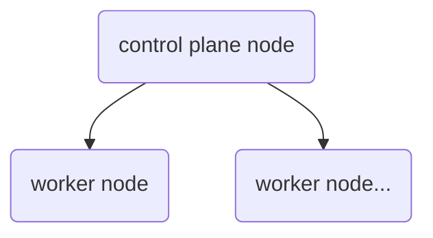

# k8s 入门

参考:

https://kubernetes.io/docs/setup/production-environment/tools/kubeadm/create-cluster-kubeadm/

https://sanyuesha.com/2019/05/17/kubernetes-tutorial-for-beginner/

> all commands can check with `kubectl help <command>` and check the detail of command with `kubectl <command> --help`




## control plane node

### init control-plane node

> read `kubeadm help` and `kubeadm init --help` before
>
> 如果想要重新安装使用`kubeadm reset`
>
> 重启后init control-plane 任然会继续运行，只是有一点慢。

`kubeadm init`会从指定的镜像仓库下载control plane components

```
[root@k8smaster etc]# kubeadm init --v--image-repository registry.aliyuncs.com/google_containers --pod-network-cidr 192.168.0.0/16 
[init] Using Kubernetes version: v1.20.4
[preflight] Running pre-flight checks
	[WARNING Firewalld]: firewalld is active, please ensure ports [6443 10250] are open or your cluster may not function correctly
	[WARNING Hostname]: hostname "k8smaster" could not be reached
	[WARNING Hostname]: hostname "k8smaster": lookup k8smaster on 8.8.8.8:53: no such host
[preflight] Pulling images required for setting up a Kubernetes cluster
[preflight] This might take a minute or two, depending on the speed of your internet connection
[preflight] You can also perform this action in beforehand using 'kubeadm config images pull'
[certs] Using certificateDir folder "/etc/kubernetes/pki"
[certs] Generating "ca" certificate and key
[certs] Generating "apiserver" certificate and key
[certs] apiserver serving cert is signed for DNS names [k8smaster kubernetes kubernetes.default kubernetes.default.svc kubernetes.default.svc.cluster.local] and IPs [10.96.0.1 192.168.80.201]
[certs] Generating "apiserver-kubelet-client" certificate and key
[certs] Generating "front-proxy-ca" certificate and key
[certs] Generating "front-proxy-client" certificate and key
[certs] Generating "etcd/ca" certificate and key
[certs] Generating "etcd/server" certificate and key
[certs] etcd/server serving cert is signed for DNS names [k8smaster localhost] and IPs [192.168.80.201 127.0.0.1 ::1]
[certs] Generating "etcd/peer" certificate and key
[certs] etcd/peer serving cert is signed for DNS names [k8smaster localhost] and IPs [192.168.80.201 127.0.0.1 ::1]
[certs] Generating "etcd/healthcheck-client" certificate and key
[certs] Generating "apiserver-etcd-client" certificate and key
[certs] Generating "sa" key and public key
[kubeconfig] Using kubeconfig folder "/etc/kubernetes"
[kubeconfig] Writing "admin.conf" kubeconfig file
[kubeconfig] Writing "kubelet.conf" kubeconfig file
[kubeconfig] Writing "controller-manager.conf" kubeconfig file
[kubeconfig] Writing "scheduler.conf" kubeconfig file
[kubelet-start] Writing kubelet environment file with flags to file "/var/lib/kubelet/kubeadm-flags.env"
[kubelet-start] Writing kubelet configuration to file "/var/lib/kubelet/config.yaml"
[kubelet-start] Starting the kubelet
[control-plane] Using manifest folder "/etc/kubernetes/manifests"
[control-plane] Creating static Pod manifest for "kube-apiserver"
[control-plane] Creating static Pod manifest for "kube-controller-manager"
[control-plane] Creating static Pod manifest for "kube-scheduler"
[etcd] Creating static Pod manifest for local etcd in "/etc/kubernetes/manifests"
[wait-control-plane] Waiting for the kubelet to boot up the control plane as static Pods from directory "/etc/kubernetes/manifests". This can take up to 4m0s
[kubelet-check] Initial timeout of 40s passed.
[apiclient] All control plane components are healthy after 101.004816 seconds
[upload-config] Storing the configuration used in ConfigMap "kubeadm-config" in the "kube-system" Namespace
[kubelet] Creating a ConfigMap "kubelet-config-1.20" in namespace kube-system with the configuration for the kubelets in the cluster
[upload-certs] Skipping phase. Please see --upload-certs
[mark-control-plane] Marking the node k8smaster as control-plane by adding the labels "node-role.kubernetes.io/master=''" and "node-role.kubernetes.io/control-plane='' (deprecated)"
[mark-control-plane] Marking the node k8smaster as control-plane by adding the taints [node-role.kubernetes.io/master:NoSchedule]
[bootstrap-token] Using token: iz8l89.3mnfq86pmsyay567
[bootstrap-token] Configuring bootstrap tokens, cluster-info ConfigMap, RBAC Roles
[bootstrap-token] configured RBAC rules to allow Node Bootstrap tokens to get nodes
[bootstrap-token] configured RBAC rules to allow Node Bootstrap tokens to post CSRs in order for nodes to get long term certificate credentials
[bootstrap-token] configured RBAC rules to allow the csrapprover controller automatically approve CSRs from a Node Bootstrap Token
[bootstrap-token] configured RBAC rules to allow certificate rotation for all node client certificates in the cluster
[bootstrap-token] Creating the "cluster-info" ConfigMap in the "kube-public" namespace
[kubelet-finalize] Updating "/etc/kubernetes/kubelet.conf" to point to a rotatable kubelet client certificate and key
[addons] Applied essential addon: CoreDNS
[addons] Applied essential addon: kube-proxy

Your Kubernetes control-plane has initialized successfully!

To start using your cluster, you need to run the following as a regular user:

  mkdir -p $HOME/.kube
  sudo cp -i /etc/kubernetes/admin.conf $HOME/.kube/config
  sudo chown $(id -u):$(id -g) $HOME/.kube/config

Alternatively, if you are the root user, you can run:

  export KUBECONFIG=/etc/kubernetes/admin.conf

You should now deploy a pod network to the cluster.
Run "kubectl apply -f [podnetwork].yaml" with one of the options listed at:
  https://kubernetes.io/docs/concepts/cluster-administration/addons/

Then you can join any number of worker nodes by running the following on each as root:

kubeadm join 192.168.80.201:6443 --token iz8l89.3mnfq86pmsyay567 \
    --discovery-token-ca-cert-hash sha256:08133c31f03b656c06057dac5b682312f06c8bd19cdfab3d2c735755073fd841 
```

- `--image-repository <string>`

  Choose a container registry to pull control plane images from (default "k8s.gcr.io")

  这里使用了阿里云的镜像

  参考：https://xuxinkun.github.io/2019/06/11/cn-registry/

- `--pod-network-cidr <string>`

  Specify range of IP addresses for the pod network. If set, the control plane will automatically allocate CIDRs for every node.
  
  这里为了使用calio指定默认IP为`192.168.0.0/16`

安装后可以通过docker查看

```
[root@k8smaster ~]# docker images
REPOSITORY                                                        TAG                 IMAGE ID            CREATED             SIZE
registry.aliyuncs.com/google_containers/kube-proxy                v1.20.4             c29e6c583067        3 weeks ago         118 MB
registry.aliyuncs.com/google_containers/kube-apiserver            v1.20.4             ae5eb22e4a9d        3 weeks ago         122 MB
registry.aliyuncs.com/google_containers/kube-controller-manager   v1.20.4             0a41a1414c53        3 weeks ago         116 MB
registry.aliyuncs.com/google_containers/kube-scheduler            v1.20.4             5f8cb769bd73        3 weeks ago         47.3 MB
docker.io/busybox                                                 latest              b97242f89c8a        2 months ago        1.23 MB
registry.aliyuncs.com/google_containers/etcd                      3.4.13-0            0369cf4303ff        6 months ago        253 MB
registry.aliyuncs.com/google_containers/coredns                   1.7.0               bfe3a36ebd25        9 months ago        45.2 MB
registry.aliyuncs.com/google_containers/pause                     3.2                 80d28bedfe5d        13 months ago       683 kB
```

### 查看默认init 配置

`kubeadm config print --help`

这里可以看到init调用的默认配置

```
[root@k8smaster ~]# kubeadm config print init-defaults | more
apiVersion: kubeadm.k8s.io/v1beta2
bootstrapTokens:
- groups:
  - system:bootstrappers:kubeadm:default-node-token
  token: abcdef.0123456789abcdef
  ttl: 24h0m0s
  usages:
  - signing
  - authentication
kind: InitConfiguration
localAPIEndpoint:
  advertiseAddress: 1.2.3.4
  bindPort: 6443
nodeRegistration:
  criSocket: /var/run/dockershim.sock
  name: k8smaster
  taints:
  - effect: NoSchedule
    key: node-role.kubernetes.io/master
---
apiServer:
  timeoutForControlPlane: 4m0s
apiVersion: kubeadm.k8s.io/v1beta2
certificatesDir: /etc/kubernetes/pki
clusterName: kubernetes
controllerManager: {}
dns:
  type: CoreDNS
etcd:
  local:
    dataDir: /var/lib/etcd
imageRepository: k8s.gcr.io
kind: ClusterConfiguration
[root@k8smaster ~]# kubeadm config print init-defaults | more
apiVersion: kubeadm.k8s.io/v1beta2
bootstrapTokens:
- groups:
  - system:bootstrappers:kubeadm:default-node-token
  token: abcdef.0123456789abcdef
  ttl: 24h0m0s
  usages:
  - signing
  - authentication
kind: InitConfiguration
localAPIEndpoint:
  advertiseAddress: 1.2.3.4
  bindPort: 6443
nodeRegistration:
  criSocket: /var/run/dockershim.sock
  name: k8smaster
  taints:
  - effect: NoSchedule
    key: node-role.kubernetes.io/master
---
apiServer:
  timeoutForControlPlane: 4m0s
apiVersion: kubeadm.k8s.io/v1beta2
certificatesDir: /etc/kubernetes/pki
clusterName: kubernetes
controllerManager: {}
dns:
  type: CoreDNS
etcd:
  local:
    dataDir: /var/lib/etcd
imageRepository: k8s.gcr.io
kind: ClusterConfiguration
kubernetesVersion: v1.20.0
networking:
  dnsDomain: cluster.local
  serviceSubnet: 10.96.0.0/12
scheduler: {}
```

## install pod networking

这是一种网络解决方式。可以在下面的链接点击查看

https://kubernetes.io/docs/concepts/cluster-administration/networking/#how-to-implement-the-kubernetes-networking-model

https://kubernetes.io/docs/concepts/cluster-administration/addons/

https://docs.projectcalico.org/getting-started/kubernetes/quickstart

这里使用[calico](https://docs.projectcalico.org/getting-started/kubernetes/quickstart)

一个cluster只能安装一个pod networking，pod networking可以安装在control-plane node or a node that has the kubeconfig credentials。

安装成功后可以通过`kubectl get pods --all-namespaces`来校验，如果所有的状态都显示Running表示contorl plane node配置成功

```
[root@k8smaster ~]# kubectl get pods --all-namespaces 
NAMESPACE         NAME                                      READY   STATUS    RESTARTS   AGE
calico-system     calico-kube-controllers-f95867bfb-9f8tz   1/1     Running   0          103s
calico-system     calico-node-mq4vm                         1/1     Running   0          103s
calico-system     calico-typha-64b8cc7cb-hknps              1/1     Running   0          103s
kube-system       coredns-7f89b7bc75-j9v4h                  1/1     Running   0          6m57s
kube-system       coredns-7f89b7bc75-vcwcj                  1/1     Running   0          6m57s
kube-system       etcd-k8smaster                            1/1     Running   0          7m13s
kube-system       kube-apiserver-k8smaster                  1/1     Running   0          7m13s
kube-system       kube-controller-manager-k8smaster         1/1     Running   0          7m13s
kube-system       kube-proxy-qcmfw                          1/1     Running   0          6m58s
kube-system       kube-scheduler-k8smaster                  1/1     Running   0          7m13s
tigera-operator   tigera-operator-675ccbb69c-xt7qm          1/1     Running   0          111s
```

## worker node

### join  cluster

可以重复这一步

如果忘记了可以通过`kubeadm config print init-defaults`或是`kubeadm token list`获取token

```
[root@k8smaster ~]# kubeadm config print init-defaults | grep token:
  token: abcdef.0123456789abcdef
  
[root@k8smaster ~]# kubeadm token list
TOKEN                     TTL         EXPIRES                     USAGES                   DESCRIPTION                                                EXTRA GROUPS
0spxq7.96c96tsb2p3p45ay   23h         2021-03-19T15:26:29+08:00   authentication,signing   The default bootstrap token generated by 'kubeadm init'.   system:bootstrappers:kubeadm:default-node-token
```

如果忘记了sha256 digest，可以使用如下命令

```
openssl x509 -pubkey -in /etc/kubernetes/pki/ca.crt | openssl rsa -pubin -outform der 2>/dev/null | \
   openssl dgst -sha256 -hex | sed 's/^.* //'
```

加入node到cluster

```
[root@k8snode01 ~]# kubeadm join 192.168.80.201:6443 --token lptcjk.vwxgvfinnloi3kqe \
>     --discovery-token-ca-cert-hash sha256:a8c81f7a5be7efcebea1d397ba57f0776487a6c31653eb84320767a21ce88a1d
[preflight] Running pre-flight checks
	[WARNING Hostname]: hostname "k8snode01" could not be reached
	[WARNING Hostname]: hostname "k8snode01": lookup k8snode01 on 8.8.8.8:53: no such host
[preflight] Reading configuration from the cluster...
[preflight] FYI: You can look at this config file with 'kubectl -n kube-system get cm kubeadm-config -o yaml'
[kubelet-start] Writing kubelet configuration to file "/var/lib/kubelet/config.yaml"
[kubelet-start] Writing kubelet environment file with flags to file "/var/lib/kubelet/kubeadm-flags.env"
[kubelet-start] Starting the kubelet
[kubelet-start] Waiting for the kubelet to perform the TLS Bootstrap...

This node has joined the cluster:
* Certificate signing request was sent to apiserver and a response was received.
* The Kubelet was informed of the new secure connection details.

Run 'kubectl get nodes' on the control-plane to see this node join the cluster.
```

我们可以在control plane node 中查看

```
[root@k8snode01 ~]# kubeadm join 192.168.80.201:6443 --token lptcjk.vwxgvfinnloi3kqe \
>     --discovery-token-ca-cert-hash sha256:a8c81f7a5be7efcebea1d397ba57f0776487a6c31653eb84320767a21ce88a1d
[preflight] Running pre-flight checks
	[WARNING Hostname]: hostname "k8snode01" could not be reached
	[WARNING Hostname]: hostname "k8snode01": lookup k8snode01 on 8.8.8.8:53: no such host
[preflight] Reading configuration from the cluster...
[preflight] FYI: You can look at this config file with 'kubectl -n kube-system get cm kubeadm-config -o yaml'
[kubelet-start] Writing kubelet configuration to file "/var/lib/kubelet/config.yaml"
[kubelet-start] Writing kubelet environment file with flags to file "/var/lib/kubelet/kubeadm-flags.env"
[kubelet-start] Starting the kubelet
[kubelet-start] Waiting for the kubelet to perform the TLS Bootstrap...

This node has joined the cluster:
* Certificate signing request was sent to apiserver and a response was received.
* The Kubelet was informed of the new secure connection details.

Run 'kubectl get nodes' on the control-plane to see this node join the cluster.

```

### 可能出现的问题

参考：

https://blog.csdn.net/m0_46343314/article/details/109280598

kubeadm init 核 kubeadm join 的 kubeadm 版本不同

```
error execution phase preflight: unable to fetch the kubeadm-config ConfigMap: failed to decode cluster configuration data: no kind "ClusterConfiguration" is registered for version "kubeadm.k8s.io/v1beta2" in scheme "k8s.io/kubernetes/cmd/kubeadm/app/apis/kubeadm/scheme/scheme.go:31"
```

## remove node

参考：

https://kubernetes.io/docs/setup/production-environment/tools/kubeadm/create-cluster-kubeadm/#remove-the-node

在control plane node 操作

```
[root@k8smaster ~]# kubectl get nodes
NAME        STATUS   ROLES                  AGE    VERSION
k8smaster   Ready    control-plane,master   21m    v1.20.4
k8snode01   Ready    <none>                 9m2s   v1.20.4

[root@k8smaster ~]# kubectl drain k8snode01 --delete-local-data --force  --ignore-daemonsets 
Flag --delete-local-data has been deprecated, This option is deprecated and will be deleted. Use --delete-emptydir-data.
node/k8snode01 cordoned
WARNING: ignoring DaemonSet-managed Pods: calico-system/calico-node-9qqwm, kube-system/kube-proxy-f8p2p
evicting pod calico-system/calico-typha-688ffd7bc9-5rscq
pod/calico-typha-688ffd7bc9-5rscq evicted
node/k8snode01 evicted

[root@k8smaster ~]# kubectl get nodes
NAME        STATUS                     ROLES                  AGE     VERSION
k8smaster   Ready                      control-plane,master   22m     v1.20.4
k8snode01   Ready,SchedulingDisabled   <none>                 9m51s   v1.20.4
```


