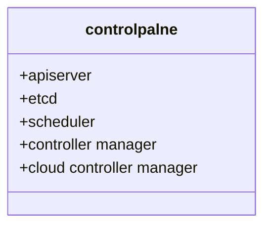
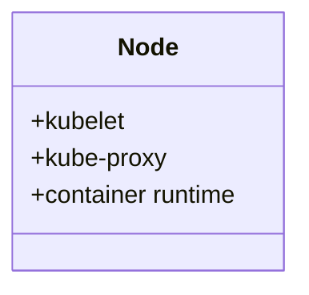

# Kubernetes 架构

参考：

https://www.redhat.com/zh/topics/containers/kubernetes-architecture

https://kubernetes.io/docs/concepts/overview/components/

### control plane

control plane为k8s集群做全局控制，包含api-server，cloud controller，controller manager，etcd，scheduler

- **apiserver**

  > apiserver可以和control plane node不在同一个node中

  如果需要与kubernetes集群进行交互，就要通过Kube-apiserver(control plane的前端)，来调用API。可以通过REST调用，==kubectl 命令行界面或其他命令行工具来访问 API。==

- **etcd**

  持久层，键值型数据库，存储所有集群的信息

- **scheduler**

  您的集群是否状况良好？如果需要新的容器，要将它们放在哪里？这些是scheduler所要关注的问题。

- **controller manager**

  运行controller的管理器，被编译成一个进程但是由几个不同的进程组成。由以下几种进程。

  1. Node controller：Responsible for noticing and responding when nodes go down
  2. Job controller: Watches for Job objects that represent one-off tasks, then creates Pods to run those tasks to completion.
  3. Endpoints controller: Populates the Endpoints object (that is, joins Services & Pods).
  4. Service Account & Token controllers: Create default accounts and API access tokens for new namespaces.

- **cloud controller manager**

  The cloud controller manager lets you link your cluster into your cloud provider's API

### Node

可以是一台虚拟机或是物理机，为运行在pod中的container提供运行环境

- **kubelet**

  An agent that runs on each node in the cluster. It makes sure that containers are running and check health in a Pod.

  kubelet不会管理不是由k8产生的容器

- **kube proxy**

  kube-proxy is a network proxy that runs on each node in your cluster

- **container runtime**

  container runtime 是一个软件为container提供运行环境

  k8s支持Docker，containerd，CRI-O，etc..这几种container runtime
  
  ==CRI表示contianer runtime interface==

### Addons

扩展

- DNS
- Dashboard

- Container Resource Monitoring
- Cluster-level Logging

## 配置文件

https://kubernetes.io/docs/reference/setup-tools/kubeadm/kubeadm-init/#init-workflow

### control plane

- CA cert and key 

  `/etc/kubernetes/pki`

- kubelet

  `/etc/kubernetes/`

- Pod manifests for the API server

  `/etc/kubernetes/mainfests`

  ==the kubelet watches this directory for Pods to create on startup.==

