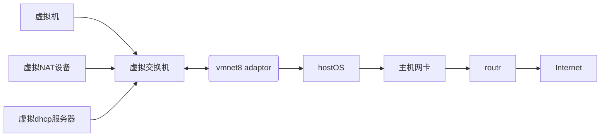

# NAT（地址转换模式）

> 外部网络对虚拟系统的网卡是可见的；虚拟系统的网卡对外部网络是**不可见**的。
> 换句话说，NAT 模式可以起到【**单向**】防火墙的效果。这种模式用得最多。

参考:

https://www.linuxidc.com/Linux/2016-09/135521p2.htm

刚刚我们说到，如果你的网络ip资源紧缺，但是你又希望你的虚拟机能够联网，这时候NAT模式是最好的选择。NAT模式借助虚拟NAT设备和虚拟DHCP服务器，使得虚拟机可以联网。其网络结构如下图所示：

在NAT模式中，主机网卡直接与虚拟NAT设备相连，然后虚拟NAT设备与虚拟DHCP服务器一起连接在虚拟交换机VMnet8上，这样就实现了虚拟机联网。那么我们会觉得很奇怪，为什么需要虚拟网卡VMware Network Adapter VMnet8呢？原来我们的VMware Network Adapter VMnet8虚拟网卡主要是为了实现主机与虚拟机之间的通信。在之后的设置步骤中，我们可以加以验证。

首先，设置虚拟机中NAT模式的选项，打开vmware，点击“编辑”下的“虚拟网络编辑器”，设置NAT参数及DHCP参数。

将虚拟机的网络连接模式修改成NAT模式，点击“编辑虚拟机设置”。

点击“网络适配器”，选择“NAT模式”

然后开机启动系统，编辑网卡配置文件，命令为vi /etc/sysconfig/network-scripts/ifcfg-eth0

具体配置如下：

编辑完成，保存退出，然后重启虚拟机网卡，动态获取ip地址，使用ping命令ping外网ip，测试能否联网。

之前，我们说过VMware Network Adapter VMnet8虚拟网卡的作用，那我们现在就来测试一下。

如此看来，虚拟机能联通外网，确实不是通过VMware Network Adapter VMnet8虚拟网卡，那么为什么要有这块虚拟网卡呢？

之前我们就说VMware Network Adapter VMnet8的作用是主机与虚拟机之间的通信，接下来，我们就用远程连接工具来测试一下。

然后，将VMware Network Adapter VMnet8启用之后，发现远程工具可以连接上虚拟机了。

那么，这就是NAT模式，利用虚拟的NAT设备以及虚拟DHCP服务器来使虚拟机连接外网，而VMware Network Adapter VMnet8虚拟网卡是用来与虚拟机通信的
