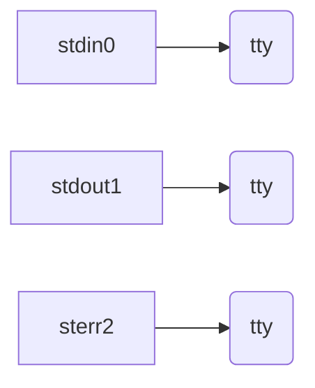
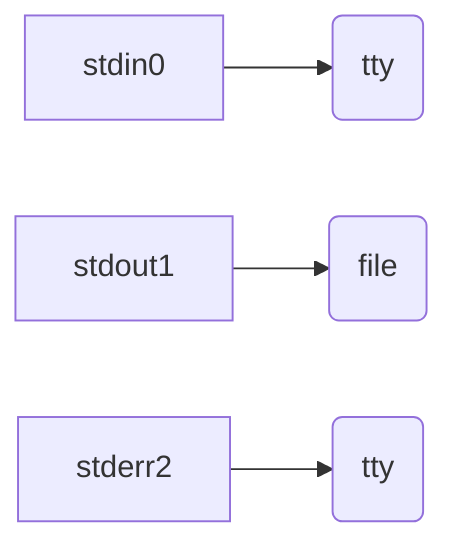
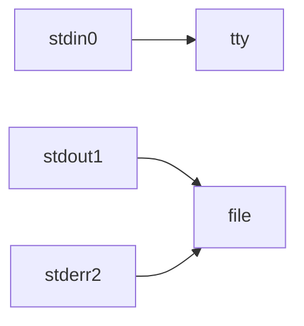
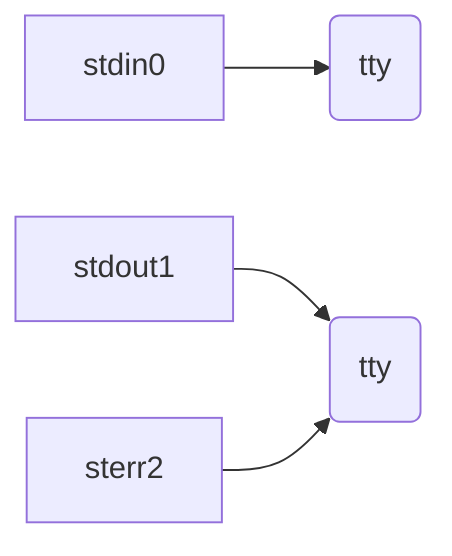
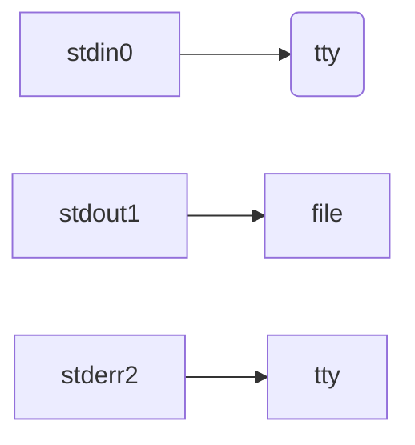

# 重定向

参考：

https://program-think.blogspot.com/2019/11/POSIX-TUI-from-TTY-to-Shell-Programming.html?q=bash&scope=all

https://xz.aliyun.com/t/2548

## 文件描述符

POSIX 操作系统会分配一个数字用于跟踪打开的文件，这个数字就叫做文件描述符。Linux 启动时会默认打开三个文件描述符：

1. 标准输入stdin 0
2. 标准输出 stdout 1 
3. 错误输出 stderr 2 

一条shell命令，都会继承其父进程的文件描述符，因此所有的shell命令，都会默认有三个文件描述符。


我们可以在linux上查看流对应文件

```
root in /dev λ ll std*
lrwxrwxrwx root root 15 B Tue Mar 16 19:29:08 2021  stderr ⇒ /proc/self/fd/2
lrwxrwxrwx root root 15 B Tue Mar 16 19:29:08 2021  stdin ⇒ /proc/self/fd/0
lrwxrwxrwx root root 15 B Tue Mar 16 19:29:08 2021  stdout ⇒ /proc/self/fd/1
root in /dev λ cd /proc/self/fd
root in /proc/self/fd λ ls
 0   1   10   2
root in /proc/self/fd λ ll
lrwx------ root root 64 B Wed Mar 24 09:31:25 2021  0 ⇒ /dev/pts/0
lrwx------ root root 64 B Wed Mar 24 09:31:25 2021  1 ⇒ /dev/pts/0
lrwx------ root root 64 B Wed Mar 24 09:31:40 2021  10 ⇒ /dev/pts/0
lrwx------ root root 64 B Wed Mar 24 09:31:25 2021  2 ⇒ /dev/pts/0
```

## 重定向

**注意点**

1. shell在执行一条指令时，==先检查命令中是否存在重定向符==，如果存在先从左至右将文件描述符重定向。然后再执行命令。
2. 重定向符左侧的是文件描述符
3. `<`默认省略0即`0< file `，`>`默认省略1即`1> file`，==文件描述符与箭头之间不能有空格==

### 输入重定向

syntax：`[n]< file | [n]<< file`

将文件描述符n重定向到word指代的文件(以只读方式打开)，如果n是0可以省略，`0< file`

```
root in /opt λ cat 0< /etc/hostname
ubuntu18.04
#等价
root in /opt λ cat < /etc/hostname
ubuntu18.04
```

解析器先处理`<`将stdin重定向`/etc/hostname`。当`cat`去读取stdin是就会从`/etc/hostname`中读取。

### 输出重定向

syntax：`[n]> file | [n]>> file`

将文件描述符重定向到word指定的文件(以写方式打开)，如果n是1可以省略，`1> file`

```
root in /opt λ cat /etc/hostname 1> t;cat t
ubuntu18.04
#等价
root in /opt λ cat /etc/hostname > t;cat t
ubuntu18.04
```

syntax：`&> file  | >& file`

两者相同都是将 stdin 和 stderr 都定向到file中。等价`2&>1 | 2>&1`

```
root in /opt λ cat /etc/hostnamet >& t
root in /opt λ cat t
cat: /etc/hostnamet: No such file or directory

#等价
root in /opt λ cat /etc/hostnamex 1> t 2> t
root in /opt λ cat t
cat: /etc/hostnamex: No such file or directory

#等价，&是为了区分文件和文件描述符
root in /opt λ cat /etc/hostnamey >t 2>&1
root in /opt λ cat t
cat: /etc/hostnamey: No such file or directory
```

## 文件描述符的复制

syntax：`n<&m | n>&m`

1. 这两者没有实质上的区别，都是将文件描述符n复制到文件描述符m。
2. 重定向符号和文件描述符直接不能有空格

3. ==&是为了区分文件和文件描述符==。如果没有这个符号会被认为是文件

## 重定向执行顺序

==默认情况下stdin，stdout，stderr都会显示在tty上==

### cmd > file 2>&1

扩展成cmd 1> file 2>&1

1. 原始状态



2. stdout以写的方式重定向到file



3. stderr复制到stdout



### cmd 2>&1 > file

扩展成cmd 2>&1 1>file

1. 原始状态


2. stderr复制到stdout



3. stderr复制到stdout



## 特殊重定向

### >|

https://unix.stackexchange.com/questions/45201/bash-what-does-do

在一些shell中有一个noclobber选项，保护文件因为重定向而被覆盖或销毁。

如果noclobber设置为true，并且`/tmp/output.txt`文件存在，那么下面的命令将会失败

```
some-command > /tmp/output.txt
```

但是你能使用`>|`符号，表示强制重定向

### <>

双向重定向，会导致阻塞，可以通过`timeout`命令来终止

```
[root@8d3d229c-4aab-4812-96b9-37c8bc47a1d8 opt]# timeout 2s  cat <> /dev/zero
```

### exec 绑定重定向

参考[exec](../../Shell/Shell exec.md)

syntax：`exec [n]</> file`

==如果exec没有指定command，表示指定的重定向对当前shell的subshell都生效==。

```
#file的内容为空
root in /opt λ exec 3>file
#等价ls >&3 3>file
root in /opt λ ls >&3
#等价 cat file 3> file
root in /opt λ cat file
alibabacloud
Blasting_dictionary-master
containerd
DNSLog-master
DNSLog-master.zip
Dockerfile
Dockerfile.hex
etc
file
jobfile.fio
lsd-0.18.0-x86_64-unknown-linux-gnu
main.go
ossman
shebang.sh
ssl
t
```


