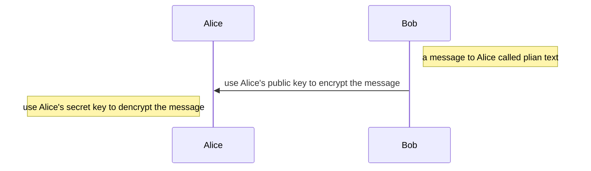
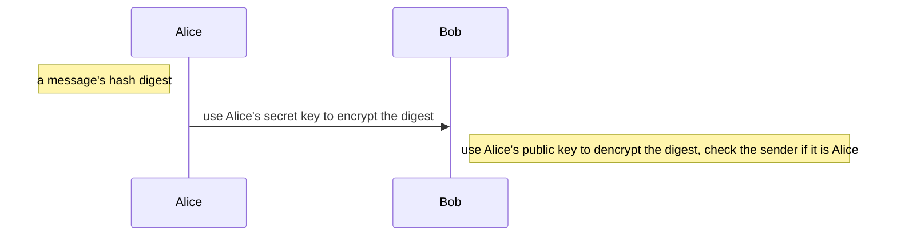

# symmetric and asymmetric encryption

## key

加密和解密用的密钥K (key) 是一串秘密的字符串（即比特串）。
明文通过加密算法 E  和加密密钥 K  变成密文：
$$
Y=E_k(X)
$$
接收端利用解密算法 D 运算和解密密钥 K 解出明文 X。解密算法是加密算法的逆运算。
$$
D_k(E_k(X))=X
$$

> 加密密钥和解密密钥可以一样，也可以不一样。
> 密钥通常是由密钥中心提供。
> 当密钥需要向远地传送时，一定要通过另一个安全信道。

## Symmetric encryption

对称密钥系统，常规密钥密码体制。即==加密密钥与解密密钥是相同的密码体制。==

常见的Cipher（加密算法）有ASE，DES，Twofish，Blowfish等

## Asymmetric encryption

公钥密码体制（又称为公开密钥密码体制）使用不同的加密密钥与解密密钥，是一种“由已知加密密钥推导出解密密钥在计算上是不可行的”密码体制。 ==私钥可以在多台主机之间共享==

> 公钥密码体制产生的主要原因：
> 常规密钥密码体制的密钥分配问题。
> 对数字签名的需求。

在公钥密码体制中，加密密钥(即公钥) PK 是公开信息，而解密密钥(即私钥或秘钥) SK 是需要保密的。
加密算法 E 和解密算法 D 也都是公开的。
==虽然秘钥 SK 是由公钥 PK 决定的，但却不能根据 PK 计算出 SK==

算法特点

加密密钥 PKB 就是接收者B的==公钥，它向公众公开。==
解密密钥 SKB 就是接收者B的==私钥，对其他人都保密。==

发送者 A 用 B 的公钥 PKB 对明文 X 加密（E 运算）后，在接收者 B 用自己的私钥 SKB 解密（D 运算），即可恢复出明文：
$$
E_{PK_B}(X)= Y
$$

$$
D_{SK_B}(Y) = X
$$

$$
D_{SK_B}(E_{PK_B}) = X
$$

加密和解密可以==对调==, 即加密和解密是互逆的
$$
E_{PK_B}(D_{SK_B}(X)) = X
$$

==如果某一信息用私有密钥加密，那么，它必须用公开密钥解密。这就是实现数字签名的方法==

常见的Cipher有rsa,dsa等

### Digital signing

数字签名必须保证以下三点

(1) 报文鉴别——接收者能够核实发送者对报文的签名（证明来源）；
(2) 报文的完整性——发送者事后不能抵赖对报文的签名（防否认）；
(3) 不可否认——接收者不能伪造对报文的签名（防伪造）。

基于非对称加密的数字签名实现

- 因为除 A 外没有别人能具有 A 的私钥，所以除 A 外没有别人能产生这个密文。因此 B 相信报文 X 是 A 签名发送的。
- 若 A 要抵赖曾发送报文给 B，B 可将明文和对应的密文出示给第三者。第三者很容易用 A 的公钥去证实 A 确实发送 X 给 B。
- 反之，若 B 将 X 伪造成 X‘，则 B 不能在第三者前出示对应的密文。这样就证明了 B 伪造了报文。  

> 非对称加密和解密是对称的，私钥和公钥可以加密也可以解密，==但是根据内容和方向分为加密和签名。==

加密：所有人都可以通过Alice’s publick key向Alice发送信息

==人们也可以使用secret key对plain text加密，但是这一般没有意义，等于持有对方publick key的都可以获知plain text==

签名：Alice 使用Alice’s secret key给出一段hash digest，接受方使用Alice’s public key校验是不是Alice本人发出的

