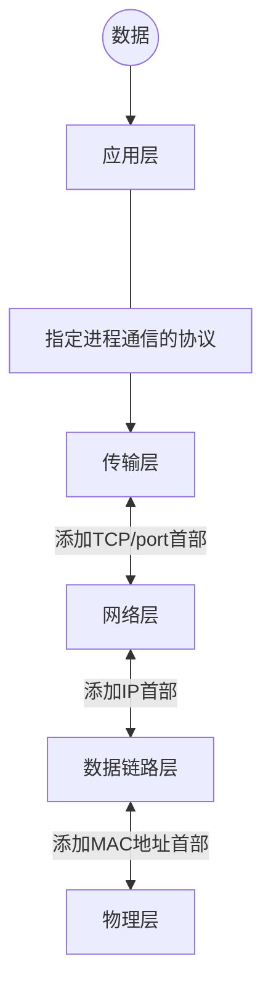

# 计算机网络概述

[TOC]

## 基础概念

==网络==把许多计算机连接在一起。

==互连网==则把许多网络通过路由器连接在一起。局部范围

==互联网==特指Internet，起源于美国，现已发展成为世界上==最大的、覆盖全球的计算机网络。==

==以太网==，可以将局域网简称为“以太网”，“以太网”应当是指符合 DIX Ethernet V2 标准的局域网 

与网络相连的计算机常称为==主机==

## 互联网基础结构发展的三个阶段

1. 使用 ==TCP/IP== 协议，通过该协议计算机都能利用互连网相互通信。

2. 构成三级结构

3. 逐渐形成了多层次 ISP 结构的互联网。 出现了互联网服务提供者 ISP (Internet Service Provider)。任何机构和个人只要向某个 ISP 交纳规定的费用，就可从该 ISP 获取所需 IP 地址的使用权，并可通过该 ISP 接入到互联网。

## 不同种类的网络

> 局域网：指在局部范围互相连起来的计算机网络。局域网是封闭型的。
>
> 互联网：指当今世界上最大的计算机网络。是网络与网络之间所串连成的庞大网络

### 按照作用范围

- 广域网 WAN (Wide Area Network)：作用范围通常为几十到几千公里。
- 城域网 MAN (Metropolitan Area Network)：作用距离约为  5 ~ 50 公里。
- 局域网 LAN (Local Area Network) ：局限在较小的范围（如 1 公里左右）。
- 无线局域网WLAN(wireless Local Area Network)：俗称WIFI
- 个人区域网 PAN (Personal Area Network) ：范围很小，大约在 10 米左右。蓝牙

### 按照网络的使用者

- 公用网 (public network) ：按规定交纳费用的人都可以使用的网络。因此也可称为公众网。
- 专用网 (private network)：为特殊业务工作的需要而建造的网络。

## 端系统之间的两种通信方式

### C/S 方式

客户端--服务端方式，即 Client/Server 方式，简称为 C/S 方式。

 客户 (client) 和服务器 (server) 都是指通信中所涉及的两个应用进程。客户是服务的请求方，服务器是服务的提供方。

被用户调用后运行，在打算通信时主动向远地服务器发起通信（请求服务）。因此，==客户程序必须知道服务器程序的地址。==

> 客户与服务器的通信关系建立后，通信可以是双向的，客户和服务器都可发送和接收数据。

### P2P

对等方式，即Peer-to-Peer，简称P2P

指两个主机在通信时并不区分哪一个是服务请求方还是服务提供方，==对等连接中的每一个主机既是客户又是服务器。==双方都可以下载对方已经存储在硬盘中的共享文档。 

## 互联网核心部分

- 互联网的核心部分是由许多网络和把它们互连起来的==路由器==组成，而主机处在互联网的边缘部分。
- 互联网核心部分中的路由器之间一般都用高速链路相连接，而在网络边缘的主机接入到核心部分则通常以相对较低速率的链路相连接。
- 主机的用途是为用户进行信息处理的，并且可以和其他主机通过网络交换信息。==路由器的用途则是用来转发分组的，即进行分组交换的==。 

- 路由器是实现**==分组交换==** (packet switching) 的关键构件，其任务是转发收到的分组，==这是网络核心部分最重要的功能==。

  

### 分组交换的主要特点

- 分组交换则采用存储转发技术。

- 在发送端，先把较长的报文**划分成较短的、固定长度的数据段**。 

  

- 添加首部构成分组

  

- 分组交换网以“分组”作为数据传输单元。

- 依次把各分组发送到接收端（假定接收端在左边）。

  

- 接收端收到分组后剥去首部还原成报文。

- 最后，在接收端把收到的数据恢复成为原来的报文

  

  这里我们假定分组在传输过程中没有出现差错，在转发时也没有被丢弃。

### 分组首部的重要性

1. 每一个分组的首部都含有==地址==（诸如目的地址和源地址）等控制信息。
2. 分组交换网中的结点交换机根据收到的分组首部中的地址信息，把分组转发到下一个结点交换机。
3. 每个分组在互联网中独立地选择传输路径。
4. 用这样的存储转发方式，最后分组就能到达最终目的地。

### 路由器

- 在路由器中的输入和输出端口之间没有直接连线。
- 路由器处理分组的过程是：
  - 把收到的分组先放入缓存（==暂时存储==）；
  - 查找转发表，找出到某个目的地址应从哪个端口转发；
  - 把分组送到适当的端口转发出去。

## 协议体系

### 实体/协议/对等层/服务

- 实体：表示任何可发送或接收信息的硬件或软件进程。 

- 协议：是控制两个对等实体进行通信的规则的集合。 

  协议是“水平的”，即协议是控制对等实体之间通信的规则。

- 服务：服务是“垂直的”，即服务是由下层向上层通过层间接口提供的。

- 对等层：任何两个同样的层次把数据（即数据单元加上控制信息）通过水平虚线直接（==逻辑上==）传递给对方。这就是所谓的“对等层”(peer layers)之间的通信。

  

> OSI 的七层协议体系结构的概念清楚，理论也较完整，但它既复杂又不实用。
> TCP/IP 是四层体系结构：应用层、运输层、网际层和网络接口层。
> 但最下面的网络接口层并没有具体内容。
> 因此往往采取折中的办法，即综合 OSI 和 TCP/IP 的优点，**采用一种只有五层协议的体系结构** 。 

- 应用层：所有能产生网络流量的程序
- 表示层：在传输之前是否进行加密 或 压缩 处理，二进制或ASCII码表示
- 会话层：查木马，看需求端和网站之间的连接
- 传输层：可靠传输，流量控制，不可靠传输(一个数据包即可，不需要建立会话，例如向DNS查询网站IP地址)
- 网络层：负责选择最佳路径，规划IP地址(ipv4和ipv6变化只会影响网络层)
- 数据链路层：帧的开始和结束，还有透明传输，差错校验(纠错由传输层解决)
- 物理层：定义网络设备接口标准，电气标准(电压)，如何在物理链路上传输的更快

### 五层协议发送数据过程

横向：==对等层次之间传送的数据单位称为该层的协议数据单元 PDU (Protocol Data Unit)==

纵向：==层与层之间交换的数据的单位称为服务数据单元 SDU (Service Data Unit)==

## 计算机网络的性能指标

### 速率/ bit rate

- 比特（bit）是计算机中数据量的单位，也是信息论中使用的信息量的单位。
- 比特（bit）来源于 binary digit，意思是一个“二进制数字”，因此一个比特就是二进制数字中的一个 1 或 0。
- 速率是计算机网络中最重要的一个性能指标，指的是==数据的传送速率==，它也称为数据率 (data rate)或比特率 (bit rate)。
- 速率的单位是 bit/s，或 kbit/s、Mbit/s、 Gbit/s 等。例如 4  1010 bit/s 的数据率就记为 40 Gbit/s。
- 速率往往是指额定速率或标称速率，非实际运行速率。  

### 带宽/ bandwidth

**两种不同意义：**

- “带宽”(bandwidth) 本来是指信号具有的频带宽度，其单位是赫（或千赫、兆赫、吉赫等）。
- 在计算机网络中，带宽用来表示网络中某通道传送数据的能力。==表示在单位时间内网络中的某信道所能通过的“最高数据率”==。单位是 bit/s ，即 “比特每秒”。    

在“带宽”的上述两种表述中，前者为频域称谓，而后者为时域称谓，其本质是相同的。也就是说，一条通信链路的“带宽”越宽，其所能传输的“最高数据率”也越高

### 吞吐量/ throughtput

- 吞吐量 (throughput) 表示在==单位时间内通过某个网络（或信道、接口）的数据量==。
- 吞吐量更经常地用于对现实世界中的网络的一种测量，以便知道实际上到底有多少数据量能够通过网络。
- ==吞吐量受网络的带宽或网络的额定速率的限制。==

### 时延/ latency

- 时延 (delay 或 latency) 是指==数据（一个报文或分组，甚至比特）从网络（或链路）的一端传送到另一端所需的时间==。
- 有时也称为延迟或迟延。
- 网络中的时延由以下几个不同的部分组成：
  (1) 发送时延
  (2) 传播时延
  (3) 处理时延
  (4) 排队时延

#### 容易产生的错误概念

- 对于高速网络链路，==我们提高的仅仅是数据的发送速率而不是比特在链路上的传播速率。==

- 提高链路带宽，减小了数据的发送时延。 

  > 以下说法是错误的：
  > “在高速链路（或高带宽链路）上，比特会传送得更快些”。

### 往返时间/RTT

- 互联网上的信息不仅仅单方向传输，而是双向交互的。因此，有时很需要知道双向交互一次所需的时间。
- 往返时间表示从发送方发送数据开始，到发送方收到来自接收方的确认，总共经历的时间。
- 在互联网中，往返时间还包括各中间结点的处理时延、排队时延以及转发数据时的发送时延。
- 当使用卫星通信时，往返时间 RTT 相对较长，==是很重要的一个性能指标。==

### 利用率

- 分为**信道利用率**和**网络利用率**。
- 信道利用率指出某信道有百分之几的时间是被利用的（有数据通过）。完全空闲的信道的利用率是零。
- 网络利用率则是全网络的信道利用率的加权平均值。
- 信道利用率并非越高越好。==当某信道的利用率增大时，该信道引起的时延也就迅速增加==。

