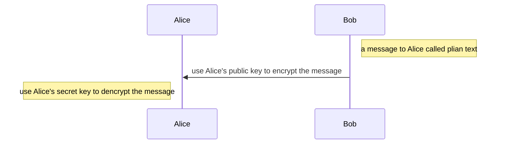
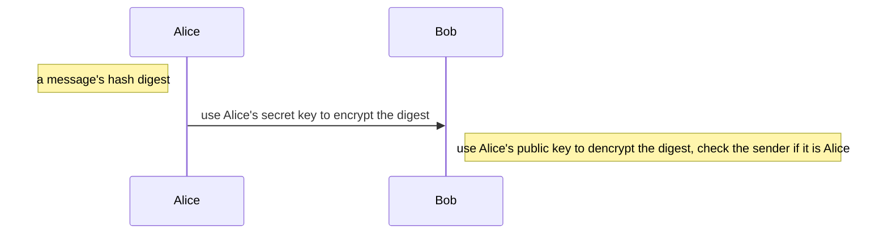

# 网络安全

[TOC]

计算机网络上的通信面临以下两大类威胁：被动攻击和主动攻击。

## 网络攻击

### 被动攻击

指攻击者从网络上窃听他人的通信内容。通常把这类攻击称为==截获。==
在被动攻击中，攻击者只是观察和分析某一个协议数据单元 PDU，以便了解所交换的数据的某种性质。但不干扰信息流。
这种被动攻击又称为==流量分析 (traffic analysis)。==

### 主动攻击

(1) 篡改——故意篡改网络上传送的报文。这种攻击方式有时也称为更改报文流。
(2) 恶意程序——种类繁多，对网络安全威胁较大的主要包括：计算机病毒、计算机蠕虫、特洛伊木马、逻辑炸弹、后门入侵、流氓软件等。
(3) 拒绝服务——==指攻击者向互联网上的某个服务器不停地发送大量分组，使该服务器无法提供正常服务==，甚至完全瘫痪。

### 分布式拒绝服务/DDoS

若从互联网上的成百上千的网站集中攻击一个网站，则称为==分布式拒绝服务 DDoS (Distributed Denial of Service)。==有时也把这种攻击称为网络带宽攻击或连通性攻击。

> 对付被动攻击可采用各种数据加密技术。
> 对付主动攻击则需将加密技术与适当的鉴别技术相结合。

## 防火墙

==防火墙是由软件、硬件构成的系统，==是一种特殊编程的路由器，用来在两个网络之间实施访问控制策略

防火墙内的网络称为“可信的网络”(trusted network)，而将外部的因特网称为“不可信的网络”(untrusted network)。
防火墙可用来解决内联网和外联网的安全问题

“阻止”就是阻止某种类型的通信量通过防火墙（从外部网络到内部网络，或反过来）。
“允许”的功能与“阻止”恰好相反。

## 密钥

加密和解密用的密钥K (key) 是一串秘密的字符串（即比特串）。
明文通过加密算法 E  和加密密钥 K  变成密文：
$$
Y=E_k(X)
$$
接收端利用解密算法 D 运算和解密密钥 K 解出明文 X。解密算法是加密算法的逆运算。
$$
D_k(E_k(X))=X
$$

> 加密密钥和解密密钥可以一样，也可以不一样。
> 密钥通常是由密钥中心提供。
> 当密钥需要向远地传送时，一定要通过另一个安全信道。

### 对称加密

- 所谓常规密钥密码体制，即==加密密钥与解密密钥是相同的密码体制。==

- 这种加密系统又称为对称密钥系统。

### 非对称加密

公钥密码体制（又称为公开密钥密码体制）使用不同的加密密钥与解密密钥，是一种“由已知加密密钥推导出解密密钥在计算上是不可行的”密码体制。 ==私钥可以在多台主机之间共享==

> 公钥密码体制产生的主要原因：
> 常规密钥密码体制的密钥分配问题。
> 对数字签名的需求。

在公钥密码体制中，加密密钥(即公钥) PK 是公开信息，而解密密钥(即私钥或秘钥) SK 是需要保密的。
加密算法 E 和解密算法 D 也都是公开的。
==虽然秘钥 SK 是由公钥 PK 决定的，但却不能根据 PK 计算出 SK==

算法特点

加密密钥 PKB 就是接收者B的==公钥，它向公众公开。==
解密密钥 SKB 就是接收者B的==私钥，对其他人都保密。==

发送者 A 用 B 的公钥 PKB 对明文 X 加密（E 运算）后，在接收者 B 用自己的私钥 SKB 解密（D 运算），即可恢复出明文：
$$
E_{PK_B}(X)= Y
$$

$$
D_{SK_B}(Y) = X
$$

$$
D_{SK_B}(E_{PK_B}) = X
$$

加密和解密可以==对调==, 即加密和解密是互逆的
$$
E_{PK_B}(D_{SK_B}(X)) = X
$$

==如果某一信息用私有密钥加密，那么，它必须用公开密钥解密。这就是实现数字签名的方法==

## 数字签名

数字签名必须保证以下三点

(1) 报文鉴别——接收者能够核实发送者对报文的签名（证明来源）；
(2) 报文的完整性——发送者事后不能抵赖对报文的签名（防否认）；
(3) 不可否认——接收者不能伪造对报文的签名（防伪造）。

基于非对称加密的数字签名实现

- 因为除 A 外没有别人能具有 A 的私钥，所以除 A 外没有别人能产生这个密文。因此 B 相信报文 X 是 A 签名发送的。
- 若 A 要抵赖曾发送报文给 B，B 可将明文和对应的密文出示给第三者。第三者很容易用 A 的公钥去证实 A 确实发送 X 给 B。
- 反之，若 B 将 X 伪造成 X‘，则 B 不能在第三者前出示对应的密文。这样就证明了 B 伪造了报文。  

> 非对称加密和解密是对称的，私钥和公钥可以加密也可以解密，==但是根据内容和方向分为加密和签名。==

加密：所有人都可以通过Alice’s publick key向Alice发送信息

签名：Alice 使用Alice’s secret key给出一段hash digest，接受方使用Alice’s public key教研是不是Alice本人发出的

==人们也可以使用secret key对plain text加密，但是这一般没有意义，等于持有对方publick key的都可以获知plain text==

## 散列

### 特点

-  散列函数的输入长度可以很长，但其输出长度则是固定的，并且较短。散列函数的输出叫做散列值，或更简单些，称为散列。
-  不同的散列值肯定对应于不同的输入，但不同的输入却可能得出相同的散列值。这就是说，散列函数的==输入和输出并非一一对应的，而是多对一的==。

在密码学中使用的散列函数称为密码散列函数

特点：==单向性。==
要找到两个不同的报文，它们具有同样的密码散列函数输出，在计算上是不可行的。
也就是说，密码散列函数实际上是一种单向函数 (one-way function):

> 常见的安全散列算法
>
> MD5和SHA1

## 不重数

不重数(nonce)就是一个不重复使用的大随机数，即“一次一数”。由于不重数不能重复使用，所以 C 在进行重放攻击时无法重复使用所截获的不重数。

- ==B 用其私钥对不重数 RA 进行签名后发回给 A。A 用 B 的公钥核实签名。如能得出自己原来发送的不重数 RA，就核实了和自己通信的对方的确是 B。==
- 同样，A 也用自己的私钥对不重数 RB 进行签名后发送给 B。B 用 A 的公钥核实签名，鉴别了 A 的身份。

## 中间人攻击

- C拦截到A的消息，将消息转发给B

- B 选择一个不重数 RB，发送给 A，来确认A的身份。但被==C 截获RB==，C将RB转发给A

- A用自己的私钥SKA加密RB发送给B。C拦截到消息并将信息丢弃，用自己的私钥 SKC 冒充是A的私钥，对 RB 加密，并发送给 B。

- B收到消息请求A的公钥。但是被C拦截，C将消息转发给A

- A把自己的公钥PKA发送给B，但是被C拦截（==获取到A的公钥==），C用自己的公钥PKC发送给B。

- ==B用C的公钥解密，这样B就误以为C是A==

- 然后B用C的公钥发送消息给A，C用A的公钥转发给A

  
