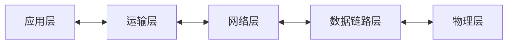

# TCP/UDP



[TOC]


网络层是为主机之间提供逻辑通信
而运输层为应用进程之间提供端到端的逻辑通信

从IP层来说，通信的两端是两台主机。但“两台主机之间的通信”这种说法还不够清楚。
严格地讲，两台主机进行通信就是两台主机中的应用进程互相通信。

==从运输层的角度看，通信的真正端点并不是主机而是主机中的进程==。也就是说，端到端的通信是应用进程之间的通信。


## 端口/port

运行在计算机中的进程是用进程标识符来标志的。

但运行在应用层的各种==应用进程却不应当让计算机操作系统指派它的进程标识符==。这是因为在互联网上使用的计算机的操作系统种类很多，==而不同操作系统右使用不同格式的进程标识符==。

为了使运行不同操作系统的计算机的应用进程能够互相通信，就必须使用统一的方法对TCP/IP体系的进程进行标志

==解决这个问题的方法就是在运输层使用协议端口号==(protocol port number)，或通常简称为端口 (port)

虽然通信的终点是应用进程，但我们可以把端口想象是通信的终点，因为我们只要把要传送的报文交到目的主机的某一个合适的目的端口，剩下的工作（即最后交付目的进程）就由 TCP 来完成。

### 两大类端口

- 服务端使用端口号

  熟知端口：0~1023

  登记端口号：数值为1024~49151，为没有熟知端口号的应用程序使用

- 客户端使用的端口号

  短暂端口号：数值为49152~65535，==留给客户进程选择短暂使用==。当服务器进程收到客户进程的报文时，就知道了客户进程所使用的动态端口号。通信结束后，这个端口号可供其他客户进程以后使用。 

### 常用的熟知端口


==注意如果连接的协议不同，端口是可以复用的==

```
cpl in /usr/local/etc λ netstat -lnp  | grep 1194
tcp        0      0 0.0.0.0:1194            0.0.0.0:*               LISTEN      -                   
tcp6       0      0 :::1194                 :::*                    LISTEN      -                   
udp        0      0 0.0.0.0:1194            0.0.0.0:*                           -    
```

## UDP

### 主要特点

1. 无连接，==发送数据之前不需要建立连接(QQ聊天)==，因此减少了开销和发送数据之前的时延
2. 尽最大努力交付，即不保证可靠交付(丢包不重传)，因此主机不需要维持复杂连接状态
3. 面向报文，UDP对应用层交下来的报文，==既不合并，也不拆分，而是保留这些报文的边界。UDP一次交付一个完整的报文==
4. 没有拥塞控制，因此网络出现的拥塞不会使源主机的发送速率降低。很适合多媒体通信
5. 支持一对一，一对多，多对一和多对多的交互通信
6. 首部开销小，只有8个字节，比TCP的20个字节的首部要段
7. UDP对应用层交下来的报文，在添加首部后就向下交付给网络层。

> 若报文太长，UDP把它交给IP层后，IP层在传送时可能要进行分片，这会降低网络层的效率
>
> 若报文太短，UDP把它交给IP层后，会使IP数据报的首部相对长度太长，这也降低了网络层效率


IP首部包含：源IP地址和目的IP地址


## TCP

### 主要特点

1. 面向连接的运输层协议，使用时需要建立连接

2. 每一条TCP连接只能由两个端点（endpoint），每一条TCP连接只能是点对点的（一对一）

3. TCP提供可靠交付的服务(丢包重传)

4. TCP提供全双工通信

5. 面向字节流

   > “面向字节流”的含义是：虽然应用程序和 TCP 的交互是一次一个数据块，但 TCP 把应用程序交下来的数据看成仅仅是一连串无结构的字节流。


   6. TCP 根据对方给出的窗口值和当前网络拥塞的程度来决定一个报文段应包含多少个字节（UDP 发送的报文长度是应用进程给出的）。==TCP具有流量控制功能==
   7. TCP 可把太长的数据块划分短一些再传送。
   8. 同一IP地址可以有不同的TCP连接

### TCP首部格式


- ==源端口和目的端口字段==：各占2字节。端口是运输层与应用层的服务接口。运输的复用和分用功能都要通过端口才能时限
- 序号：占4字节。TCP连接中传送的数据流中的每一个字节都编上一个序号。序号字段的值则指的是本报文段所发送的数据的第一个字节的序号
- 确认号：占4字节，是期望收到对方的下一个报文段的数据的第一个字节的序号
- 数据偏移：占4字节，它指出TCP报文段的数据起始距离TCP报文段的起始处又多远。
- 保留：保留位今后使用，但目前置为0
- URG：当URG = 1时，表明紧急指针字段有效。它告诉系统此报文中有高优先级的数据，应尽快传送
- ACK（acknowledge）：确认，当只有ACK = 1时确认号字段才会有效，当ACK = 0 时，确认号无效
- PSH（push）：推送，接收TCP收到PSH = 1的报文段，就尽快交付接收应用程序，而不再等到整个缓存都填满了后再向上交付
- RST（reset）；复位，当RST = 1时，表明TCP连接中出现严重差错（如由于主机崩溃或其他原因），必须释放连接，然后再重新建立连接
- SYN（synchronize）：同步，SYN = 1表示这是一个请求或应答报文
- FIN（finish）：终止，用来释放一个连接。FIN = 1表明此报文段的发送端数据已发送完毕，要求释放连接
- 窗口：用来让对方设置发送窗口的依据
- 校验和：校验范围包括首部和数据
- 紧急指针：指出报文中紧急数据共有多少个字节
- 选项：长度可变。 

## TCP的连接建立

TCP建立连接的过程叫做握手

握手需要在客户端和服务端之间==交换三个TCP报文段==。称之为三报文握手

采用三报文握手主要是为了防止已失效的连接请求报文段又传送到了，因而产生错误

### TCP的三报文握手


### TCP四报文握手


> A必须等待2MSL的时间
>
> - 为了保证A发送的最后一个ACK报文段能够到达B
> - 防止 “已失效的连接请求报文段”出现在本连接中。A 在发送完最后一个 ACK 报文段后，再经过时间 2MSL，就可以使本连接持续的时间内所产生的所有报文段，都从网络中消失。这样就可以使下一个新的连接中不会出现这种旧的连接请求报文段。

## 套接字/Socket

**套接字 socket = （IP地址：端口号）**

每一条 TCP 连接唯一地被通信两端的两个端点（即两个套接字）所确定

**TCP 连接 ::= {socket1, socket2}** 
             	  **= {(IP1: port1)，(IP2: port2)}**