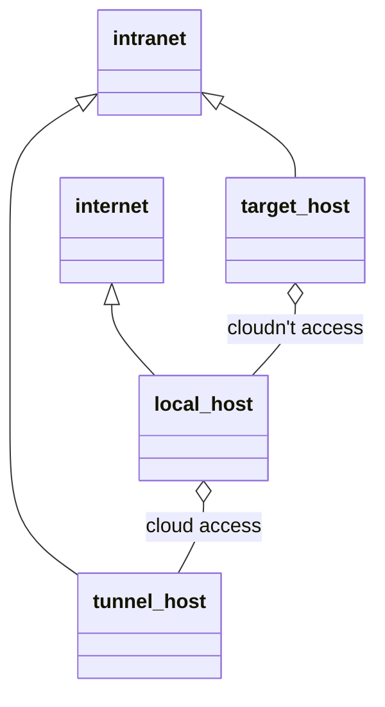

# SSH 端口转发

参考：https://wangdoc.com/ssh/port-forwarding.html

## 概述

SSH除了登入服务器，另外就是做加密通信的中介，充当两台服务器之间的通信跳板，使原本不加密的通信变成加密通信。这个功能称为端口转发(port forwarding)，又称SSH tunnel

端口转发有两个主要作用：

（1）将不加密的数据放在 SSH 安全连接里面传输，使得原本不安全的网络服务增加了安全性，比如通过端口转发访问 Telnet、FTP 等明文服务，数据传输就都会加密。

（2）作为数据通信的加密跳板，绕过网络防火墙。

端口转发有三种使用方法：动态转发，本地转发，远程转发

## 动态转发 D

pattern：`ssh -D [bind_address:]local-port tunnel-host`

默认监听本地回环地址(如果有多个IP地址需要指定)。

==发送SOCKS流量==，默认连接到目标主机的22端口，通过该通道发送信息

==可以使用`-N`参数表示只做转发，而不执行远程命令==。

```
 ┌─────( root)─────(~) 
 └> $ ssh -D 10086 192.168.80.143 -N
Host key fingerprint is SHA256:S6TRfoi/8wkrM74w95gjaTnPZApIKB3W2xJ9Pbghlyk
+---[ECDSA 256]---+
|                 |
|   . . . =       |
|  o o E X o      |
|.o . + @ + .     |
|o.. o + S .      |
|o.   . o o       |
|. . oo+ +        |
|   .*O=+.+ .     |
|   ..=B*+oo      |
+----[SHA256]-----+

┌─────( root)─────(~) 
└> $ curl -x socks5://localhost:10086 baidu.com
<html>
<meta http-equiv="refresh" content="0;url=http://www.baidu.com/">
</html>

```

访问本地10086端口都转发到192.168.80.143服务器上，我们可以在192.168.80.143上面用tcpdump抓包来校验。我们可以在这里很好的看到有host隐藏的功能(通过代理主机的host发出)。==两次在代理主机上建立的连接端口都不同，所以是动态转发==

```
root@chz network-scripts]# tcpdump -i ens33 host baidu.com
tcpdump: verbose output suppressed, use -v or -vv for full protocol decode
listening on ens33, link-type EN10MB (Ethernet), capture size 262144 bytes
11:42:55.276765 IP chz.34260 > 220.181.38.148.http: Flags [S], seq 4015976257, win 29200, options [mss 1460,sackOK,TS val 6653544 ecr 0,nop,wscale 7], length 0
11:42:55.311324 IP 220.181.38.148.http > chz.34260: Flags [S.], seq 1959210701, ack 4015976258, win 64240, options [mss 1460], length 0
11:42:55.311398 IP chz.34260 > 220.181.38.148.http: Flags [.], ack 1, win 29200, length 0
11:42:55.312077 IP chz.34260 > 220.181.38.148.http: Flags [P.], seq 1:74, ack 1, win 29200, length 73: HTTP: GET / HTTP/1.1
11:42:55.312356 IP 220.181.38.148.http > chz.34260: Flags [.], ack 74, win 64240, length 0
11:42:55.345348 IP 220.181.38.148.http > chz.34260: Flags [P.], seq 1:387, ack 74, win 64240, length 386: HTTP: HTTP/1.1 200 OK
11:42:55.345394 IP chz.34260 > 220.181.38.148.http: Flags [.], ack 387, win 30016, length 0
11:42:55.346910 IP chz.34260 > 220.181.38.148.http: Flags [F.], seq 74, ack 387, win 30016, length 0
11:42:55.347265 IP 220.181.38.148.http > chz.34260: Flags [.], ack 75, win 64239, length 0
11:42:55.377500 IP 220.181.38.148.http > chz.34260: Flags [FP.], seq 387, ack 75, win 64239, length 0
11:42:55.377575 IP chz.34260 > 220.181.38.148.http: Flags [.], ack 388, win 30016, length 0
11:46:06.083966 IP chz.53224 > 39.156.69.79.http: Flags [S], seq 1735545311, win 29200, options [mss 1460,sackOK,TS val 6844351 ecr 0,nop,wscale 7], length 0
11:46:06.125258 IP 39.156.69.79.http > chz.53224: Flags [S.], seq 1530884235, ack 1735545312, win 64240, options [mss 1460], length 0
11:46:06.125311 IP chz.53224 > 39.156.69.79.http: Flags [.], ack 1, win 29200, length 0
11:46:06.126250 IP chz.53224 > 39.156.69.79.http: Flags [P.], seq 1:74, ack 1, win 29200, length 73: HTTP: GET / HTTP/1.1
11:46:06.126475 IP 39.156.69.79.http > chz.53224: Flags [.], ack 74, win 64240, length 0
11:46:06.166856 IP 39.156.69.79.http > chz.53224: Flags [P.], seq 1:387, ack 74, win 64240, length 386: HTTP: HTTP/1.1 200 OK
11:46:06.166889 IP chz.53224 > 39.156.69.79.http: Flags [.], ack 387, win 30016, length 0
11:46:06.168055 IP chz.53224 > 39.156.69.79.http: Flags [F.], seq 74, ack 387, win 30016, length 0
11:46:06.168412 IP 39.156.69.79.http > chz.53224: Flags [.], ack 75, win 64239, length 0
11:46:06.208766 IP 39.156.69.79.http > chz.53224: Flags [FP.], seq 387, ack 75, win 64239, length 0
11:46:06.208799 IP chz.53224 > 39.156.69.79.http: Flags [.], ack 388, win 30016, length 0

```

可以使用持久化配置

```
DynamicForward local-port
```

## 本地转发 L

pattern：`ssh -L [bind_address:]local-port:target-host:target-port tunnel-host`

默认监听本地回环地址，==不使用socks协议发送流量，而是使用http协议==

tunnel-host 做为跳板机必须开启ssh服务器

```
┌─────( root)─────(~) 
└> $ ssh -L 10086:192.168.80.143:80 root@192.168.80.1

┌─────( root)─────(~) 
└> $ curl http://localhost:10086
```

访问本地10086端口都通过192.168.80.1 的SSH通道访问192.168.80.143:80

==tunnel-host可以是目标机，通过目标机的隧道转发到目标机的110端口==

```
ssh -L 1100:mail.example.com:110 mail.example.com
```

例如：

```
ssh -N -L 2121:www.example.com:80 tunnel-host 
```

当向本地2121端口发送请求，就会通过tunnel-host转发，目标主机的套接字为`www.example.com`，参数`-N`表示只做转发。

持久配置

```
Host test.example.com
LocalForward client-IP:client-port server-IP:server-port
```

## 远程转发 R

pattern：`ssh -R local-port:target-host:target-port -N local-host`

这种情况比较特殊，本地计算机在外网，SSH跳板机和目标服务器都在内网，而且本地计算机无法访问内网中的SSH跳板机，但是SSH跳板机可以访问本机(一般通过SNAT)。

由于本地计算机不能访问内网SSH跳板机，就无法从外网发起SSH隧道，建立端口转发。必须反过来，==从SSH跳板机发起隧道，建立端口转发，这时就形成了远程端口转发==




```
ssh -N -R local-port:target-host:target-port local-host
```

> 注意上面的命令，不是在本机执行，而在SSH跳板机上执行。
>
> local-port是本地机端口(即攻击机上建立于跳板机之间的端口)
>
> local-host是本地机host(即攻击机)
>
> target-port是目标机端口，target-host是目标机

```
#跳板机上执行，cpl@8.135.0.171 通过 1006端口，访问192.168.80.200:80
[root@chz network-scripts]# ssh -N -R 10086:192.168.80.200:80  cpl@8.135.0.171
cpl@8.135.0.171's password: 
#执行成功后不会有任何提示


---

#攻击机
root in ~ λ netstat -lnpt
Active Internet connections (only servers)
Proto Recv-Q Send-Q Local Address           Foreign Address         State       PID/Program name
tcp        0      0 0.0.0.0:22              0.0.0.0:*               LISTEN      12799/sshd
tcp        0      0 127.0.0.1:6010          0.0.0.0:*               LISTEN      10591/sshd: root@pt
tcp        0      0 127.0.0.1:6011          0.0.0.0:*               LISTEN      11478/sshd: root@pt
tcp        0      0 127.0.0.1:6012          0.0.0.0:*               LISTEN      12241/sshd: root@pt
tcp        0      0 127.0.0.1:6013          0.0.0.0:*               LISTEN      12648/sshd: root@pt
tcp        0      0 127.0.0.1:6014          0.0.0.0:*               LISTEN      13109/sshd: root@pt
tcp        0      0 127.0.0.1:10086         0.0.0.0:*               LISTEN      13393/sshd: cpl
tcp        0      0 127.0.0.53:53           0.0.0.0:*               LISTEN      601/systemd-resolve
tcp6       0      0 :::443                  :::*                    LISTEN      905/apache2
tcp6       0      0 :::80                   :::*                    LISTEN      905/apache2          

#这里访问了目标机的dvwa
root in /etc/ssh λ curl -fSsL localhost:10086/dvwa | more
<!DOCTYPE html>

<html lang="en-GB">

        <head>

                <meta http-equiv="Content-Type" content="text/html; charset=UTF-8" />

                <title>Login :: Damn Vulnerable Web Application (DVWA) v1.10 *Development*</title>

```

为了校验，我门同样可以通过tcpdump抓包

```
[root@chz network-scripts]# tcpdump -n -i ens33 host 8.135.0.171
tcpdump: verbose output suppressed, use -v or -vv for full protocol decode
listening on ens33, link-type EN10MB (Ethernet), capture size 262144 bytes
13:29:51.375486 IP 8.135.0.171.ssh > 192.168.80.139.37432: Flags [P.], seq 494943944:494944036, ack 3911295008, win 64240, length 92
13:29:51.375527 IP 192.168.80.139.37432 > 8.135.0.171.ssh: Flags [.], ack 92, win 42120, length 0
13:29:51.377142 IP 192.168.80.139.37432 > 8.135.0.171.ssh: Flags [P.], seq 1:45, ack 92, win 42120, length 44
13:29:51.377295 IP 8.135.0.171.ssh > 192.168.80.139.37432: Flags [.], ack 45, win 64240, length 0
```

如果需要经常执行远程端口诸法，可以将设置写入SSH客户端的个人配置文件`~/.ssh/config`

```
Host test.example.com
RemoteForward local-IP:local-port target-ip:target-port
```

## 案例

### 简易VPN

VPN 用来在外网与内网之间建立一条加密通道。内网的服务器不能从外网直接访问，必须通过一个跳板机，如果本机可以访问跳板机，就可以使用 SSH 本地转发，简单实现一个 VPN

```
ssh -N -L 2080:corp-server:80 -L 2443:corp-server:443 tunnel-host 
```

上面命令通过 SSH 跳板机，将本机的`2080`端口绑定内网服务器的`80`端口，本机的`2443`端口绑定内网服务器的`443`端口。

### 两级跳板

[](https://mermaid-js.github.io/mermaid-live-editor/#/edit/eyJjb2RlIjoiZ3JhcGggTFJcbmEoaG9zdDE6Nzk5OSktLT58dHVubmVsMS1ob3N0fGIodHVubmVsMS1ob3N0OjI5OTkpLS0-fHR1bm5lbDItaG9zdHxjKHRhcmdldC1ob3N0Ojc5OTkpIiwibWVybWFpZCI6eyJ0aGVtZSI6ImRlZmF1bHQifSwidXBkYXRlRWRpdG9yIjpmYWxzZX0)

端口转发可以有多级，比如新建两个SSH隧道，第一个隧道转发给第二个隧道，第二个隧道才能访问目标服务器。

```
$ ssh -L 7999:tunnel1-host:2999 tunnel1-host
```

发送到本机7999端口的流量会通过tunnel1-host转发到tunnel1-host的2999端口。

然后再第一台跳板机(tunnel1-host)执行下面的命令，新建第二条隧道

```
$ ssh -L 2999:target-host:7999 tunnel2-host -N
```

所有发送到tunnel1 2999端口的流量都通过tunnel2-host转发到target-host 7999端口上。