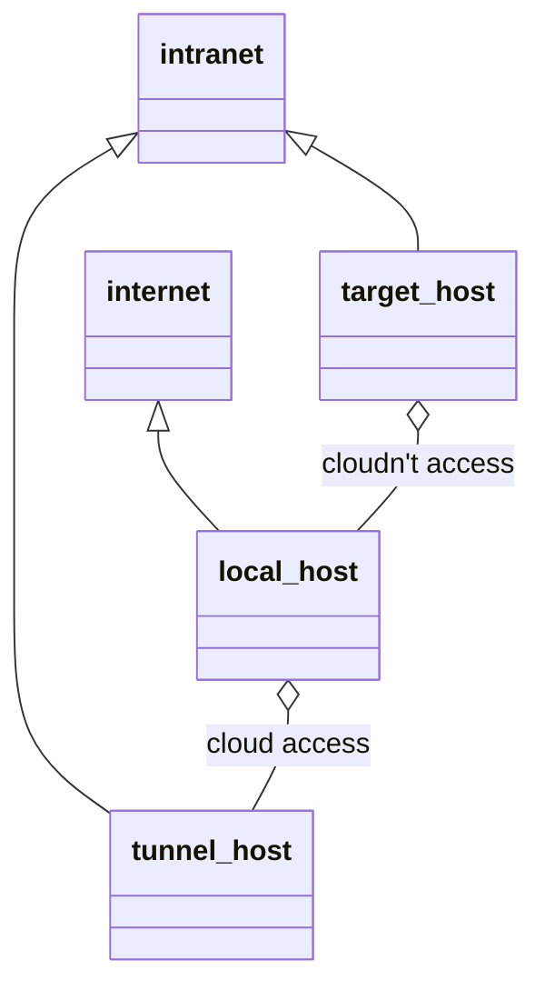

# SSH 端口转发

参考：https://wangdoc.com/ssh/port-forwarding.html

## 概述

SSH除了登入服务器，另外就是做加密通信的中介，充当两台服务器之间的通信跳板，使原本不加密的通信变成加密通信。这个功能称为端口转发(port forwarding)，又称SSH tunnel

端口转发有两个主要作用：

（1）将不加密的数据放在 SSH 安全连接里面传输，使得原本不安全的网络服务增加了安全性，比如通过端口转发访问 Telnet、FTP 等明文服务，数据传输就都会加密。

（2）作为数据通信的加密跳板，绕过网络防火墙。

端口转发有三种使用方法：动态转发，本地转发，远程转发

## 动态转发 D

pattern：`ssh -D [bind_address:]local-port tunnel-host`

默认监听本地回环地址(如果有多个IP地址需要指定)。

发送SOCKS流量，默认连接到目标主机的22端口，通过该通道发送信息

可以使用`-N`参数表示只做转发，而不执行远程命令。

```
 ┌─────( root)─────(~) 
 └> $ ssh -D 10086 192.168.80.143 -N
Host key fingerprint is SHA256:S6TRfoi/8wkrM74w95gjaTnPZApIKB3W2xJ9Pbghlyk
+---[ECDSA 256]---+
|                 |
|   . . . =       |
|  o o E X o      |
|.o . + @ + .     |
|o.. o + S .      |
|o.   . o o       |
|. . oo+ +        |
|   .*O=+.+ .     |
|   ..=B*+oo      |
+----[SHA256]-----+

┌─────( root)─────(~) 
└> $ curl -x socks5://localhost:10086 baidu.com
<html>
<meta http-equiv="refresh" content="0;url=http://www.baidu.com/">
</html>

```

访问本地10086端口都转发到192.168.80.143服务器上

可以使用持久化配置

```
DynamicForward local-port
```

## 本地转发 L

pattern：`ssh -L [bind_address:]local-port:target-host:target-port tunnel-host`

默认监听本地回环地址，==不使用socks协议发送流量，而是使用http协议==

tunnel-host 做为跳板机必须开启ssh服务器

```
┌─────( root)─────(~) 
└> $ ssh -L 10086:192.168.80.143:80 root@192.168.80.1

┌─────( root)─────(~) 
└> $ curl http://localhost:10086
```

访问本地10086端口都通过192.168.80.1 SSH通道访问192.168.80.143:80

==tunnel-host可以是目标机，通过目标机的隧道转发到目标机的110端口==

```
ssh -L 1100:mail.example.com:110 mail.example.com
```

例如：

```
ssh -L 2121:www.example.com:80 tunnel-host -N
```

当向本地2121端口发送请求，就会通过tunnel-host转发，目标主机的套接字为`www.example.com`，参数`-N`表示只做转发。

持久配置

```
Host test.example.com
LocalForward client-IP:client-port server-IP:server-port
```

## 远程转发 R

pattern：`ssh -R local-port:target-host:target-port -N local`

这种情况比较特殊，本地计算机在外网，SSH跳板机和目标服务器都在内网，而且本地计算机无法访问内网中的SSH跳板机，但是SSH跳板机可以访问本机。

由于本地计算机不能访问内网SSH跳板机，就无法从外网发起SSH隧道，建立端口转发。必须反过来，==从SSH跳板机发起隧道，建立端口转发，这时就形成了远程端口转发==




```
ssh -R local-port:target-host:target-port -N local
```

> 注意上面的命令，不是在本机执行，而在SSH跳板机上执行。
>
> local-port是本地机端口，local是本地机主机
>
> target-port是目标机端口，target-host是目标机

如果需要经常执行远程端口诸法，可以将设置写入SSH客户端的个人配置文件`~/.ssh/config`

```
Host test.example.com
RemoteForward local-IP:local-port target-ip:target-port
```

## 案例

### 简易VPN

VPN 用来在外网与内网之间建立一条加密通道。内网的服务器不能从外网直接访问，必须通过一个跳板机，如果本机可以访问跳板机，就可以使用 SSH 本地转发，简单实现一个 VPN

```
ssh -L 2080:corp-server:80 -L 2443:corp-server:443 tunnel-host -N
```

上面命令通过 SSH 跳板机，将本机的`2080`端口绑定内网服务器的`80`端口，本机的`2443`端口绑定内网服务器的`443`端口。

### 两级跳板

[](https://mermaid-js.github.io/mermaid-live-editor/#/edit/eyJjb2RlIjoiZ3JhcGggTFJcbmEoaG9zdDE6Nzk5OSktLT58dHVubmVsMS1ob3N0fGIodHVubmVsMS1ob3N0OjI5OTkpLS0-fHR1bm5lbDItaG9zdHxjKHRhcmdldC1ob3N0Ojc5OTkpIiwibWVybWFpZCI6eyJ0aGVtZSI6ImRlZmF1bHQifSwidXBkYXRlRWRpdG9yIjpmYWxzZX0)

端口转发可以有多级，比如新建两个SSH隧道，第一个隧道转发给第二个隧道，第二个隧道才能访问目标服务器。

```
$ ssh -L 7999:tunnel1-host:2999 tunnel1-host
```

发送到本机7999端口的流量会通过tunnel1-host转发到tunnel1-host的2999端口。

然后再第一台跳板机(tunnel1-host)执行下面的命令，新建第二条隧道

```
$ ssh -L 2999:target-host:7999 tunnel2-host -N
```

所有发送到tunnel1 2999端口的流量都通过tunnel2-host转发到target-host 7999端口上。